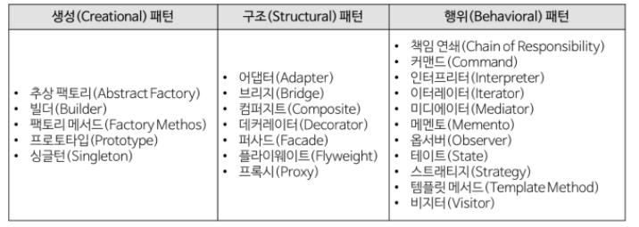

# GoF 디자인 패턴의 분류

1. 생성(Creational) 패턴

   객체 생성에 관련된 패턴

   객체의 생성과 조합을 캡슐화해 특정 객체가 생성되거나 변경되어도 프로그램 구조에 영향을 크게 받지 않도록 유연성을 제공한다.

2. 구조(Structural) 패턴

   클래스나 객체를 조합해 더 큰 구조를 만드는 패턴

   예를 들어 서로 다른 인터페이스를 지닌 2개의 객체를 묶어 단일 인터페이스를 제공하거나 객체들을 서로 묶어 새로운 기능을 제공하는 패턴이다.

3. 행위(Behavioral)

   객체나 클래스 사이의 알고리즘이나 책임 분배에 관련된 패턴

   한 객체가 혼자 수행할 수 없는 작업을 여러 개의 객체로 어떻게 분배하는지, 또 그렇게 하면서도 객체 사이의 결합도를 최소화하는 것에 중점을 둔다.

## GoF 디자인 패턴의 종류

1. 생성(Creational) 패턴

   - 추상 팩토리(Abstract Factory)

     구제적인 클래스에 의존하지 않고 서로 연관되거나 의존적인 객체들의 조합을 만드는 인터페이스를 제공하는 패턴

   - 팩토리 메서드(Factory Method)

     객체 생성 처리를 서브 클래스로 분리해 처리하도록 캡슐화하는 패턴

   - 싱글턴(Singleton)

     전역 변수를 사용하지 않고 객체를 하나만 생성하도록 하며, 생성된 객체를 어디에서든지 참조할 수 있도록 하는 패턴

2. 구조(Structural) 패턴

   - 컴퍼지트(Composite)

     여러 개의 객체들로 구성된 복합 객체와 단일 객체를 클라이언트에서 구별 없이 다루게 해주는 패턴

   - 데커레이터(Decorator)

     객체의 결합을 통해 기능을 동적으로 유연하게 확장할 수 있게 해주는 패턴

3. 행위(Behavioral) 패턴

   - 옵서버(Observer)

     한 객체의 상태 변화에 따라 다른 객체의 상태도 연동되도록 일대다 객체 의존 관계를 구성하는 패턴

   - 스테이트(State)

     객체의 상태에 따라 객체의 행위 내용을 변경해주는 패턴

   - 전략(Strategy)

     행위를 클래스로 캡슐화해 동적으로 행위를 자유롭게 바꿀 수 있게 해주는 패턴

   - 템플릿 메서드(Template Method)

     어떤 작업을 처리하는 일부분을 서브 클래스로 캡슐화해 전체 일을 수행하는 구조는 바꾸지 않으면서 특정 단계에서 수행하는 내역을 바꾸는 패턴

   - 커맨드(Command)

     실행될 기능을 캡슐화함으로써 주어진 여러 기능을 실행할 수 있는 재사용성이 높은 클래스를 설계하는 패턴