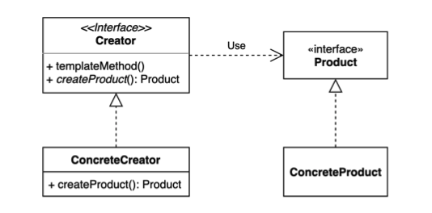
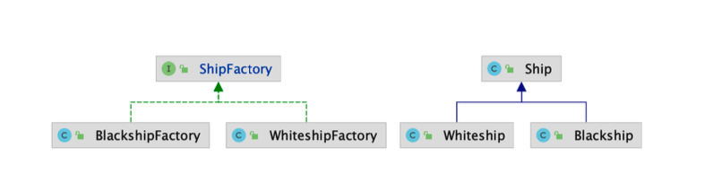
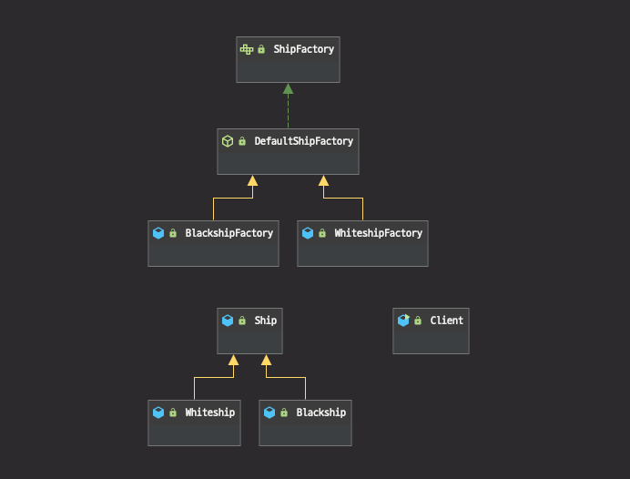
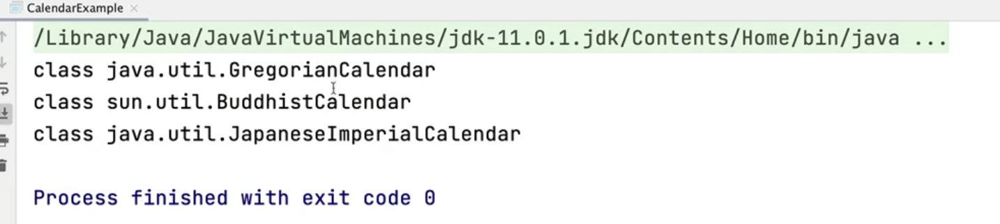
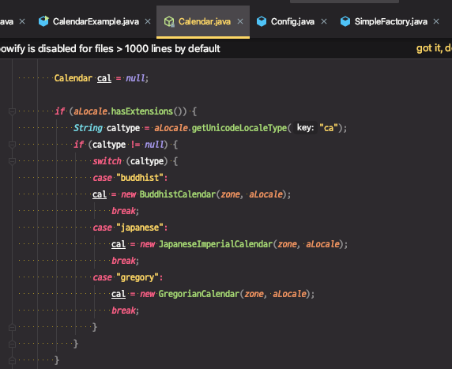
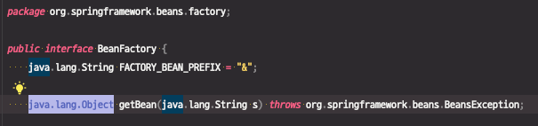

# **팩토리 메소드** **(Factory method)** **패턴**

구체적으로 어떤 인스턴스를 만들지는 서브 클래스가 정한다.

다양한 구현체 (Product)가 있고, 그중에서 특정한 구현체를 만들 수 있는 다양한 팩토리 (Creator)를 제공할 수 있다.



어떤 인스턴스를 생성하는 책임을 (구체적인 클래스가 아니라) 추상적인 인터페이스의 메서드로 감싸는 것이다.

why? 

하얀색 배만 만들던 공장이 사업이 커지면서 검은색 배를 만들게 된다면 그 구현부가 하나의 구현클래스(ConcreteCreator)에 담기에는 로직이 복잡해진다. 그래서 추상화되어있는 팩토리를 만들어서 사용한다.

방법?

`Creator`라는 팩토리역할을 할 인터페이스를 만들고, 기본 메서드 외에 일부 바뀌어야하는 부분을 추상메서드(`createProduct()`)로 빼내서 하위 구현클래스(`ConcreteCreator`)에서 구현해서 사용할 수 있게끔 만든다.

구체클래스에서 인스턴스를 만들 수 있다.

팩토리에서 만드는 Object의 타입(`Product`) 도 여러가지를 만들 수 있도록 인터페이스로 만들고, ConcreteCreator에서 ConcreteProduct를 만들도록 설계하면 확장에 용이한 구조가 된다.


## 구현 방법

확장에 열려있고 변경에 닫혀있는 구조로 만들어보자.




### 기존 구현

* ShipFactory에서 `orderShip`으로 WhiteShip, Blackship을 주문할 수 있다.

```java
public class Client {

    public static void main(String[] args) {
        Ship whiteship = ShipFactory.orderShip("Whiteship", "keesun@mail.com");
        System.out.println(whiteship);

        Ship blackship = ShipFactory.orderShip("Blackship", "keesun@mail.com");
        System.out.println(blackship);
    }

}
```

* ShipFactory
  * 이름에 따라서 Logo, Color를 다르게 입혀서 처리하기 위한 분기문이 존재한다.

```java
public class ShipFactory {

    public static Ship orderShip(String name, String email) {
        // validate
        if (name == null || name.isBlank()) {
            throw new IllegalArgumentException("배 이름을 지어주세요.");
        }
        if (email == null || email.isBlank()) {
            throw new IllegalArgumentException("연락처를 남겨주세요.");
        }

        prepareFor(name);

        Ship ship = new Ship();
        ship.setName(name);

        // Customizing for specific name
        if (name.equalsIgnoreCase("whiteship")) {
            ship.setLogo("\uD83D\uDEE5️");
        } else if (name.equalsIgnoreCase("blackship")) {
            ship.setLogo("⚓");
        }

        // coloring
        if (name.equalsIgnoreCase("whiteship")) {
            ship.setColor("whiteship");
        } else if (name.equalsIgnoreCase("blackship")) {
            ship.setColor("black");
        }

        // notify
        sendEmailTo(email, ship);

        return ship;
    }

    private static void prepareFor(String name) {
        System.out.println(name + " 만들 준비 중");
    }

    private static void sendEmailTo(String email, Ship ship) {
        System.out.println(ship.getName() + " 다 만들었습니다.");
    }

}
```

#### 문제점

* 또다른 종류의 배가 추가된다면?

  → 분기 처리 로직이 추가된다....!

* Ship이 구체클래스이기 때문에 만들어낼 제품에 필요한 특성이 있다면 필드가 변경될 수 있다. 

  → 기존 코드가 요구사항 때문에 계속해서 변경이 일어난다. (변경에 닫혀있지 않은 상황이다.)

⇒ 변경을 하면서도 기존의 공정 라인에 상관없이 또 다른 공정을 추가할 수 있는 방법이 팩토리 메소드 패턴을 사용하는 것이다.


### 팩토리 메소드 패턴 적용

※ 참고

* 다음 코드는 Java 11버전을 사용해서 interface에 private 메서드 사용이 가능하다.
  (Java 8 버전의 경우 이후에 나오는 코드를 참고)

1. ShipFactory 인터페이스 구현

   * 공통된 로직은 default 메소드로 구현

   * Ship을 만들고 Customizing, Coloring하는 부분은 어떤 특정 배에 특화된 (배를 만드는 공정) 로직이기 때문에 하위 구체클래스에서 구현하도록 위임한다.
     * `createShip()` 은 private으로 만들지 않았기 때문에 반드시 하위 클래스에서 구현해야하는 메서드이다.

```java
public interface ShipFactory {

    default Ship orderShip(String name, String email) {
        validate(name, email);
        prepareFor(name);
        Ship ship = createShip(); //구체 클래스에서 구현
        sendEmailTo(email, ship);
        return ship;
    }

    private void sendEmailTo(String email, Ship ship) {
        System.out.println(ship.getName() + " 다 만들었습니다.");
    }

    Ship createShip();

    private void validate(String name, String email) {
        if (name == null || name.isBlank()) {
            throw new IllegalArgumentException("배 이름을 지어주세요.");
        }
        if (email == null || email.isBlank()) {
            throw new IllegalArgumentException("연락처를 남겨주세요.");
        }
    }

    private void prepareFor(String name) {
        System.out.println(name + " 만들 준비 중");
    }

}
```


2. Ship을 구현한 Whiteship 정의
   * 배를 만드는 공정이 생성자에서 전부 처리된다.

```java
public class Whiteship extends Ship {

    public Whiteship() {
        setName("whiteship");
        setLogo("\uD83D\uDEE5️");
        setColor("white");
    }
}
```


3. WhiteshipFactory 정의
   * 현재, 배를 만드는 공정에서 발생하는 차이가 Whiteship 생성자에서 전부 처리되기 때문에 이를 반환만 해주면 된다.
   * 추가적으로 WhiteshipFactory만의 추가적인 공정 과정이 필요하다면 여기에 추가해주면 된다.

```java
public class WhiteshipFactory implements ShipFactory {

    @Override
    public Ship createShip() {
        return new Whiteship();
    }
}
```


4. 사용하는 코드 수정
   * WhiteshipFactory 구현체를 new 생성자를 통해서 만들고 `orderShip`을 호출한다.

```java
public class Client {

    public static void main(String[] args) {
        Client client = new Client();
      	Ship whiteship = new WhiteshipFactory().orderShip("Whiteship", "solar@mail.com");
	      System.out.println(whiteship); //whiteship 정보가 출력된다.
    }
}
```


이 상황에서 이 코드가 "확장에 열려있고, 변경에 닫혀있는 구조"가 맞다면, 새로운 배를 만드는 공정(`BlackshipFactory`)을 추가할 때, 기존 코드가 변경이되면 안된다.

즉, 현재까지 구현한 코드 (`Ship`, `ShipFactory`, `Whiteship`, `WhiteshipFacotry`)가 변경되면 안된다.


### OCP 구조 확인을 위한 새로운 기능 확장

1. Blackship이라는 새로운 제품을 추가

```java
public class Blackship extends Ship {

    public Blackship() {
        setName("blackship");
        setColor("black");
        setLogo("⚓");
    }
}
```


2. Blackship을 생성하는 BlackshipFactory 추가

```java
public class BlackshipFactory extends DefaultShipFactory {
    @Override
    public Ship createShip() {
        return new Blackship();
    }
}
```


3. Blackship을 사용

```java
public class Client {
    public static void main(String[] args) {
        Client client = new Client();
      
      	Ship whiteship = new WhiteshipFactory().orderShip("Whiteship", "solar@mail.com");
	      System.out.println(whiteship); //whiteship 정보가 출력된다.
      
      	Ship blackship = new BloackshipFactory().orderShip("Blackship", "solar@mail.com");
	      System.out.println(blackship); //blackship 정보가 출력된다.
    }
}
```


기존코드를 수정하지 않고, 새로운 공장과 새로운 제품을 추가했다. 

⇒ "확장에 열려있고, 변경에 닫혀있는 구조다."


> 클라이언트 코드는 바뀌지 않았나요? 그렇다면 이것은 변경에 닫혀있는 것이 맞나요?

그래서 보통은 "의존성주입"을 사용한다.

인터페이스 기반으로 코딩하는 코드를 작성하고 구체적인 클래스를 의존성 주입하는 방식을 사용하면, 클라이언트 코드도 최대한 변경되지 않도록 고칠 수 있다.


### 클라이언트 코드 개선

클라이언트는 어떤 Factory에 요청해야하는지 알고있어야 하기 때문에, 구체적인 구체 Factory 클래스를 알아야하고 호출부분의 코드는 변경된다.

팩토리 메소드 패턴에서는 새로운 제품 추가와 Creator들을 확장할 때 기존 제품과 기존 Factory가 변경되지 않는다는 점을 주목하면 좋다.


클라이언트 코드 중 인터페이스 기반으로 작성되어서 변경되는 부분이 있다면 DI를 이용할 수 있다.

* print()

  * 인터페이스 타입의 ShipFactory로 전달 받는다.

  * print()에서는 구현체가 어떤 것이든 코드가 변경되지 않는다.

  * print()를 호출하는 쪽에서 구현체를 넘겨준다.

  * 이 부분을 별도의 클래스로 분리해낸다면 일종의 Dependency Injection이라고 볼 수 있다.

    해당 클래스 또는 메서드에서 사용할 구현체를 호출하는 곳에서 지정해서 넣어주기 때문에

```java
public class Client {

    public static void main(String[] args) {
        Client client = new Client();
        client.print(new WhiteshipFactory(), "whiteship", "keesun@mail.com");
        client.print(new BlackshipFactory(), "blackship", "keesun@mail.com"); //구현체를 생성해서 넘겨준다.
    }

  //인터페이스 타입의 ShipFactory로 전달 받는다.
  //이 print()에서는 구현체가 어떤 것이든 코드가 변경되지 않는다.
  //이 print()를 호출하는 쪽에서 구현체를 넘겨준다.
    private void print(ShipFactory shipFactory, String name, String email) {
        System.out.println(shipFactory.orderShip(name, email));
    }

}
```


### Java 8 버전 - 추상클래스를 추가

* Java 9 이상

```java
public interface ShipFactory {
  //Java 9 버전 이상 사용가능 코드
    private void sendEmailTo(String email, Ship ship) {
        System.out.println(ship.getName() + " 다 만들었습니다.");
    }
}
```


* Java 8 이하

1. 추상메서드로 정의

```java
public interface ShipFactory {
    void sendEmailTo(String email, Ship ship);
}
```

2. 추상클래스를 추가해서 이 안에 추상메서드를 구현	

```java
public abstract class DefaultShipFactory implements ShipFactory {
    @Override
    public void sendEmailTo(String email, Ship ship) {
        System.out.println(ship.getName() + " 다 만들었습니다.");
    }
}
```

3. 추상클래스를 상속받도록 구체Factory 정의

```java
public class WhiteshipFactory extends DefaultShipFactory {

    @Override
    public Ship createShip() {
        return new Whiteship();
    }
}
```


* 다이어그램

 

## 장점

* 확장에 열려있고, 변경에 닫혀있는 객체지향 원칙을 적용해서 기존 코드를 수정하지 않고, (기존에 인스턴스를 만드는 과정이 담겨있는 로직을 건들이지 않고,) 그와 같은 류의 새로운 인스턴스를 다른 방법으로 얼마든지 확장이 가능하다.
* 이렇게 가능해진 이유는 Product와 Creator 간의 커플링을 루즈하게 가져가기 때문이다. (loosely coupled, 느슨한 결합)
* 기존 코드를 건들이지 않으면서 확장이 가능하기 때문에 코드가 간결해지고 기존 코드가 복잡해지지 않는다.

## 단점

* Before 코드를 보면 필요한 클래스가 3개 뿐이었다. 

  * Client코드, Factory하나, Product하나 - Client, Ship, ShipFactory

  팩토리 패턴을 적용하면 각자의 역할을 나누기 때문에 클래스가 늘어나는 단점을 피할 수 없다.


### 복습

* 팩토리 메소드 패턴을 적용했을 때의 장점은? 단점은?
*  “확장에 열려있고 변경에 닫혀있는 객체 지향 원칙”을 설명하세요. 
  * "확장에 열려있다." : 얼마든지 확장할 수 있다는 의미. 기능을 추가하거나 새로운 형태의 모델을 추가하는 등..
  * "변경에 닫혀있다" : 어떤 요구사항이 추가될 때 기존 코드가 바뀌지 않는 것이다.
* 자바 8에 추가된 default 메소드에 대해 설명하세요.
  * 이전에는 인터페이스에 추상메서드만 정의할 수 있었고, 인터페이스를 구현하는 클래스에서 해당 메서드를 구현하거나 인터페이스를 구현하는 클래스가 추상클래스로 만들어지는 방법밖에 없었다.
  * 자바 8에 인터페이스에 기본 구현체를 만들 수 있어서 인터페이스를 구현하는 클래스 또는, 인터페이스를 상속받은 또다른 인터페이스도 해당하는 기능을 사용할 수 있게 되었다.
* 자바 9에 추가된 private 메소드


## 실무 사용 예

### 1. 단순한 팩토리 패턴

* 매개변수의 값에 따라 또는 메소드에 따라 각기 다른 인스턴스를 리턴하는 단순한 버전의 팩토리 패턴

(기존) Creator 인터페이스가 있고 이를 구현한 여러개의 구체Creator가 존재했다.

단순 팩토리 패턴은 하나의 구현체를 두고 여러 다른 Products를 만들어줄 수 있다.

```java
public class SimpleFactory {

    public Object createProduct(String name) {
        if (name.equals("whiteship")) {
            return new Whiteship();
        } else if (name.equals("blackship")) {
            return new Blackship();
        }

        throw new IllegalArgumentException();
    }
}
```


* java.lang.Calendar 또는 java.lang.NumberFormat

`java.lang.Calendar` 가 단순 팩토리 패턴으로 만들어져 있다.

`getInstance()`가 오버로딩되어 있어서 파라미터에 따라 다른 구현체가 반환된다.

```java
public class CalendarExample {

    public static void main(String[] args) {
        System.out.println(Calendar.getInstance().getClass());
        System.out.println(Calendar.getInstance(Locale.forLanguageTag("th-TH-x-lvariant-TH")).getClass());
        System.out.println(Calendar.getInstance(Locale.forLanguageTag("ja-JP-x-lvariant-JP")).getClass());
    }
}
```






### 2. 스프링 BeanFactory

* Object 타입의 Product를 만드는 BeanFacotry라는 Creator!

BeanFactory를 일종의 팩토리 메소드 패턴을 구현한 구현체라고 볼 수 있다.

```java
public class SpringBeanFactoryExample {

    public static void main(String[] args) {
        BeanFactory xmlFactory = new ClassPathXmlApplicationContext("config.xml");
        String hello = xmlFactory.getBean("hello", String.class);
        System.out.println(hello);

        BeanFactory javaFactory = new AnnotationConfigApplicationContext(Config.class);
        String hi = javaFactory.getBean("hello", String.class);
        System.out.println(hi);
    }
}
```

* `BeanFactory` → Interface Creator
* `ClassPathXmlApplicationContext` , `AnnotationConfigApplicationContext` → ConcreteCreator

* 여기서 넘겨주는 Product는 Object 타입이다.

   

* `String hello` , `String hi` → ConcreateProduct

  xml 형식의 빈 설정파일로 등록한 빈이나 @Configuration으로 등록한 빈들이 ConcreateProduct에 해당한다.

  ```java
  @Configuration
  public class Config {
      @Bean
      public String hello() {
          return "hello";
      }
  }
  ```


