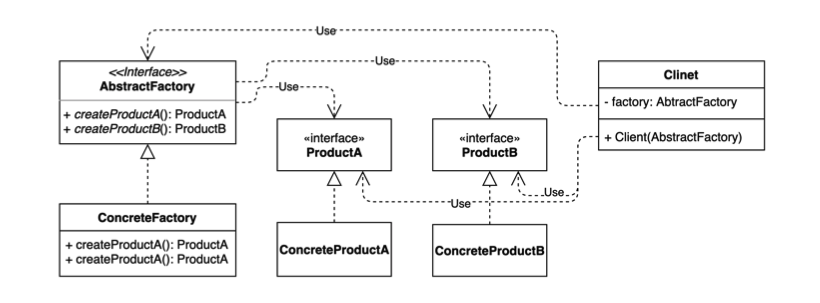
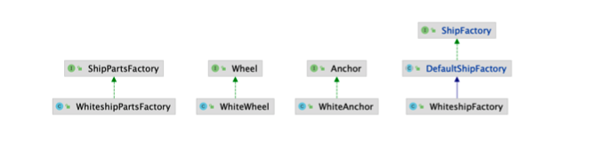
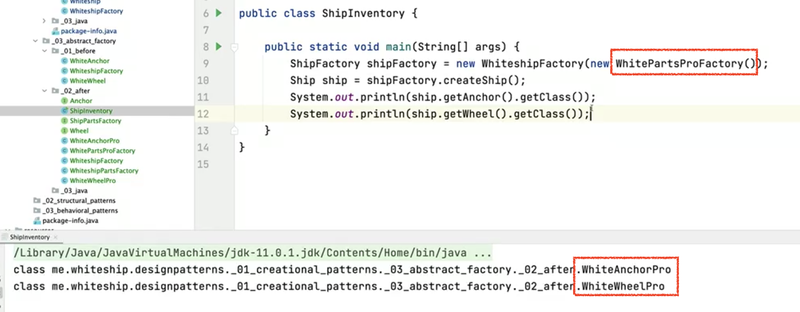
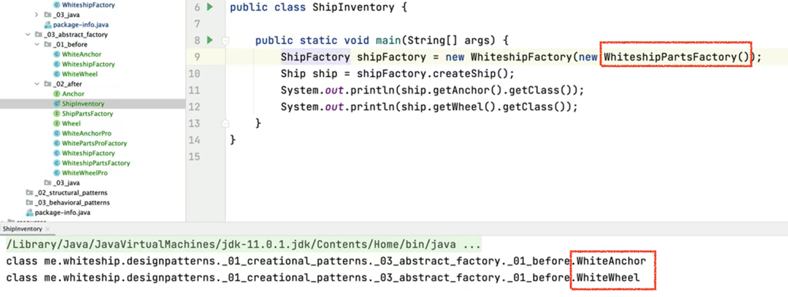

# 추상 팩토리 (Abstract factory) 패턴

서로 관련있는 여러 객체를 만들어주는 인터페이스(또는 추상클래스)

구체적으로 어떤 클래스의 인스턴스를(concrete product)를 사용하는지 감출 수 있다.



* 팩토리를 사용하는 Client의 입장에 초점을 맞춰서 추상 팩토리 패턴을 바라보자
* (팩토리에서 인스턴스를 만들어서 쓰는) 클라이언트코드를 인터페이스 기반으로 코딩할 수 있게끔 도와주는 패턴이다.
* 팩토리에 집중해서 보면 팩토리 메소드 패턴과 비슷하지만 팩토리를 사용하는 클라이언트 입장을 함께 봐야한다.
* 내부 구조가 팩토리 메소드 패턴과 굉장히 비슷하다. 앞서 팩토리 메소드 패턴의 구조에 Client만 추가된 것이다.

## 구현 방법

* 클라이언트 코드에서 구체적인 클래스의 의존성을 제거한다.



### 기존 코드

* Ship을 만들기 위해 필요한 Anchor와 Wheel을 구현체를 직접 만들어서 넣어주고 있다. (모델에서 Client에 해당한다고 보면된다.)

```java
public class WhiteshipFactory extends DefaultShipFactory {

    @Override
    public Ship createShip() {
        Ship ship = new Whiteship();
        ship.setAnchor(new WhiteAnchor()); //구현체를 직접 생성해서 넣어주고 있다. - new WhiteAnchorPro()
        ship.setWheel(new WhiteWheel());
        return ship;
    }
}
```

만약 비슷한 제품군 - 배의 규격에 맞는 제품들이 있을 때, 

Whiteship을 만들 때, WhiteAnchor와 WhiteWheel이 필요해서 직접 만들어서 넣었는데,

Whiteship의 스타일을 변경하고 싶다면, 이를 다 변경해줘야 한다. (ex. WhiteNewAnchor, WhiteWheelPro)

이렇게 클라이언트 쪽에서 발생하는 바뀌는 코드를 바뀌지 않도록 하면서 제품군을 늘려나갈 수 있도록 하는 방법이 추상 팩토리 패턴이다.


### 추상 팩토리 패턴 적용

1. WhiteAnchor와 WhiteWheel과 같은 비슷한 류의 제품을 만들어주는 인터페이스를 정의해서 규격을 맞춘다.

* 추상 팩토리 ShipPartsFactory 정의 
  * 각각의 제품들을 만들어준다.

```java
public interface ShipPartsFactory {

    Anchor createAnchor();

    Wheel createWheel();

}
```


2. 제품에 해당하는 Anchor, Wheel 등도 제품의 특징에 맞게 인터페이스를 만들어준다.

```java
public interface Anchor {
}
```

```java
public interface Wheel {
}
```


3. 추상 팩토리의 구체 팩토리 생성

* WhiteshipPartsFactory 정의
* 추상 팩토리인 ShipPartsFactory를 구현해서 만든다.

```java
public class WhiteshipPartsFactory implements ShipPartsFactory {

    @Override
    public Anchor createAnchor() {
        return new WhiteAnchor();
    }

    @Override
    public Wheel createWheel() {
        return new WhiteWheel();
    }
}
```


4. 각 제품군에 해당하는 구체 제품을 인터페이스를 implements 하여 만든다.

* WhiteAnchor가 Anchor의 특징(기능)을 가지고 있음을 보장한다. 

  → "Anchor의 규약(인터페이스)을 따르는 제품임을 말한다."

```java
public class WhiteAnchor implements Anchor {
}
```

```java
public class WhiteWheel implements Wheel {
}
```

⇒ 추상 팩토리에서 제공하는 모든 Parts들은 일련의 규약을 지키는 제품들을 만들어주는 Factory가 된다.


5. Client(`WhiteshipFactory`)에서 Abstract Factory를 사용

* 추상 팩토리(ShipPartsFactory)의 구현체를 전달받는다.(DI)
* 전달받은 팩토리를 통해서 Anchor와 Wheel 제품을 생성해서 사용한다.

⇒ 이 코드는 변경에 닫힌 코드가 된다.

```java
public class WhiteshipFactory extends DefaultShipFactory {

    private ShipPartsFactory shipPartsFactory;

    public WhiteshipFactory(ShipPartsFactory shipPartsFactory) { //추상 팩토리(ShipPartsFactory)의 구현체를 전달받는다.
        this.shipPartsFactory = shipPartsFactory;
    }

    @Override
    public Ship createShip() {
        Ship ship = new Whiteship();
        ship.setAnchor(shipPartsFactory.createAnchor()); //팩토리를 통해서 Anchor 제품을 생성해서 사용
        ship.setWheel(shipPartsFactory.createWheel());
        return ship;
    }
}
```


### 새로운 Pro 버전 제품을 생성하도록 추가

* 기존 코드에서는 변경이 발생한다.
  * WhiteShipFactory에서 Anchor를 WhiteAnchor에서 WhiteAnchorPro제품으로 변경하고 싶다면 코드의 수정이 발생했다.

```java
public class WhiteshipFactory extends DefaultShipFactory {

    @Override
    public Ship createShip() {
        Ship ship = new Whiteship();
        ship.setAnchor(new WhiteAnchorPro()); //구현체를 직접 생성해서 넣어주고 있다. pro제품으로 변경하기 위한 코드 수정 필요
        ship.setWheel(new WhiteWheel());
        return ship;
    }
}
```


#### 1. pro 버전 제품을 만든다.

* Anchor와 Wheel 규격에 맞는 제품을 만들기 위해 Anchor와 Wheel 인터페이스를 implements한다.

```java
public class WhiteAnchorPro implements Anchor{
}
```

```java
public class WhiteWheelPro implements Wheel {
}
```

#### 2. pro 버전 제품을 만드는 팩토리를 만든다.

* 추상 팩토리인 ShipPartsFactory를 구현해서 규격을 맞춘다.
* pro 버전 제품군으로 만들도록 구현

```java
public class WhitePartsProFactory implements ShipPartsFactory {
    @Override
    public Anchor createAnchor() {
        return new WhiteAnchorPro(); //pro 버전 제품군을 생성
    }

    @Override
    public Wheel createWheel() {
        return new WhiteWheelPro();
    }
}
```

→ `WhiteshipFactory` 는 변경되는 코드가 없다.

WhiteshipFactory를 생성할 때, 어떤 제품군을 만드는 팩토리를 넣어주는지에 따라 Whiteship을 만들 때 각기 다른 제품군을 만들 수 있다.

#### 3. WhiteshipFactory를 사용하는 ShipInventory 예

```java
public class ShipInventory {

    public static void main(String[] args) {
      //  ShipFactory shipFactory = new WhiteshipFactory(new WhiteshipPartsFactory());
        ShipFactory shipFactory = new WhiteshipFactory(new WhiteshipPartsProFactory()); //어떤 팩토리를 넣어주는지에 따라 다른 제품이 생성된다.
        Ship ship = shipFactory.createShip();
        System.out.println(ship.getAnchor().getClass());
        System.out.println(ship.getWheel().getClass());
    }
}
```






### 특징

* OCP 원칙을 지키고 있다.
  * WhiteshipFactory의 코드 변경없이 제품군을 확장할 수 있다.
* SRP 원칙을 지킨다고 볼 수도 있다.
  * 제품군을 제공하는 역할을 ShipPartsFactory로 위임했기 때문에
  * (한편으로 여러가지 제품을 만들기 때문에 SRP를 위반했다고 볼 수 도 있다. - 견해의 차이)


## 팩토리 메소드 패턴 차이점

* 팩토리 메소드 패턴

  * 구체적으로 어떤 인스턴스를 만들지는 서브 클래스가 정한다.

    다양한 구현체 (Product)가 있고, 그중에서 특정한 구현체를 만들 수 있는 다양한 팩토리 (Creator)를 제공할 수 있다.


* 추상 팩토리 패턴

  * 서로 관련있는 여러 객체를 만들어주는 인터페이스(또는 추상클래스)

    구체적으로 어떤 클래스의 인스턴스를(concrete product)를 사용하는지 감출 수 있다.


> 팩토리 메소드 패턴과 굉장히 흡사한데 무엇이 다른건가?

* 모양과 효과는 비슷하지만...
  * 둘 다 구체적인 **객체 생성 과정을 추상화**한 인터페이스를 제공한다. 
* 관점이 다르다.
  * 팩토리 메소드 패턴은 “팩토리를 **<u>구현</u>**하는 방법 (inheritance)”에 초점을 둔다.
  * 추상 팩토리 패턴은 “팩토리를 **<u>사용</u>**하는 방법 (composition)”에 초점을 둔다. 
* 목적이 조금 다르다.
  * 팩토리 메소드 패턴은 구체적인 객체 생성 과정을 하위 또는 구체적인 클래스로 옮기는 것이 목적
  * 추상 팩토리 패턴은 관련있는 여러 객체를 구체적인 클래스에 의존하지 않고 만들 수 있게 해주는 것이 목적


## 실무 사용 예

* 자바 라이브러리
  * javax.xml.xpath.XPathFactory#newInstance()
  * javax.xml.transform.TransformerFactory#newInstance()
  * javax.xml.parsers.DocumentBuilderFactory#newInstance()

* 스프링
  * FactoryBean과 그 구현체


### javax.xml.parsers.DocumentBuilderFactory#newInstance() 예제

xml 형식의 문서를 Java의 Object로 파싱해서 살펴볼 수 있는 `DocumentBuilderFactory` 가 있다.

1. `newInstance()` 로 factory를 만든다.

2. 팩토리에서 제공하는 메서드( `newDocumentBuilder()`)를 사용해서 추상적인 인스턴스(`DocumentBuilder`)를 가져온다.

⇒ 이 부분이 추상팩토리 패턴이라고 볼 수 있다.

DocumentBuilder의 구체타입이 아닌 추상적인 타입 기반으로 코딩하게 된다. 추상팩토리가 제공하는 메서드를 통해서 작업

```java
public class DocumentBuilderFactoryExample {

    public static void main(String[] args) throws ParserConfigurationException, IOException, SAXException {
        DocumentBuilderFactory factory = DocumentBuilderFactory.newInstance();
        DocumentBuilder builder = factory.newDocumentBuilder();
        Document document = builder.parse(new File("src/main/resources/config.xml"));
        System.out.println(document.getDocumentElement());
    }
}
```


### FactoryBean 예

* 스프링이 제공하는 인터페이스
* 빈을 만들 때 빈을 만드는 과정이 new 키워드를 사용할 수 없고, 복잡한 과정이 필요하다면 FactoryBean의 구현체를 만들어서 등록한다. 

1. FactoryBean의 인터페이스를 구현
   * 이렇게 ShipFactory를 빈으로 등록하면, 이 ShipFactory에서 만들어주는 Object가 빈으로 등록된다.

```java
public class ShipFactory implements FactoryBean<Ship> {

    @Override
    public Ship getObject() throws Exception {
        Ship ship = new Whiteship();
        ship.setName("whiteship");
        return ship;
    }

    @Override
    public Class<?> getObjectType() {
        return Ship.class;
    }
}
```

⇒

*  FactoryBean은 추상 팩토리 인터페이스에 해당한다.
* ShipFactory은 추상 팩토리 인터페이스의 구현체가 된다.
* 이렇게 만든 팩토리를 사용하는 클라이언트에 해당하는 코드는 스프링 내부에 있다. 


### Client 사용 예

* config.xml

  * ShipFactory를 빈으로 등록

  ```xml
  <?xml version="1.0" encoding="UTF-8"?>
  <beans xmlns="http://www.springframework.org/schema/beans"
         xmlns:xsi="http://www.w3.org/2001/XMLSchema-instance"
         xsi:schemaLocation="http://www.springframework.org/schema/beans http://www.springframework.org/schema/beans/spring-beans.xsd">
  
      <bean id="hello" class="java.lang.String">
          <constructor-arg value="hello"/>
      </bean>
  
      <bean id="whiteship" class="me.whiteship.designpatterns._01_creational_patterns._03_abstract_factory._03_java.ShipFactory" />
    
  
  </beans>
  ```

  * 등록한 빈을 사용

  ```java
  public class FactoryBeanExample {
  
      public static void main(String[] args) {
          ApplicationContext applicationContext = new ClassPathXmlApplicationContext("config.xml");
          Ship whiteship = applicationContext.getBean("whiteship", Ship.class);
          System.out.println(whiteship.getName());
      }
  }
  ```

  `whiteship`이라는 이름으로 등록된 빈을 가져오는데, ShipFactory에서 만들어주는 Ship 타입으로 인스턴스를 가져올 수 있다.

  ShipFactory를 빈으로 등록했는데 스프링이 FactoryBean이라는 것을 감지하고, 팩토리 빈에서 내부적으로 만들어주는 인스턴스를 빈으로 등록해주기 때문에 가능하다.

* 자바 설정

  * 자바 설정으로 빈으로 만들 때는 팩토리빈이 크게 의미는 없다.

  * ShipFactory로 가져오거나 Ship으로 가져올 수 있다.

  ```java
  public class FactoryBeanExample {
  
      public static void main(String[] args) {
          ApplicationContext applicationContext = new AnnotationConfigApplicationContext(FactoryBeanConfig.class);
  //        ShipFactory bean = applicationContext.getBean(ShipFactory.class);
          Ship bean = applicationContext.getBean(Ship.class);
          System.out.println(bean);
      }
  }
  ```