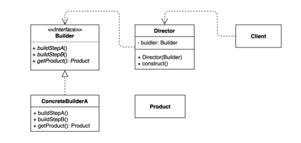
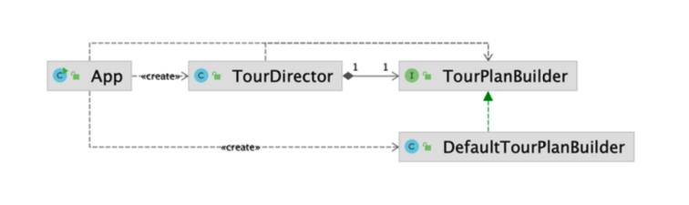

# 빌더 패턴

동일한 프로세스를 거쳐 다양한 구성의 인스턴스를 만드는 방법.

(복잡한) 객체를 만드는 프로세스를 독립적으로 분리할 수 있다.







## 구현 방법

### 기존 코드

* App 
  * 여행 상품(`TourPlan` )을 만드는 클라이언트 코드

```java
public class App {

    public static void main(String[] args) {
      	// 1번
        TourPlan shortTrip = new TourPlan();
        shortTrip.setTitle("오레곤 롱비치 여행");
        shortTrip.setStartDate(LocalDate.of(2021, 7, 15));

			 // 2번
        TourPlan tourPlan = new TourPlan();
        tourPlan.setTitle("칸쿤 여행");
        tourPlan.setNights(2);
        tourPlan.setDays(3);
        tourPlan.setStartDate(LocalDate.of(2020, 12, 9));
        tourPlan.setWhereToStay("리조트");
        tourPlan.addPlan(0, "체크인 이후 짐풀기");
        tourPlan.addPlan(0, "저녁 식사");
        tourPlan.addPlan(1, "조식 부페에서 식사");
        tourPlan.addPlan(1, "해변가 산책");
        tourPlan.addPlan(1, "점심은 수영장 근처 음식점에서 먹기");
        tourPlan.addPlan(1, "리조트 수영장에서 놀기");
        tourPlan.addPlan(1, "저녁은 BBQ 식당에서 스테이크");
        tourPlan.addPlan(2, "조식 부페에서 식사");
        tourPlan.addPlan(2, "체크아웃");
    }
}
```

* Tourplan
  * 여행 정보 - 이름, n박 m일, 시작날짜, 장소, 구체계획(`DetailPlan`)

```java
public class TourPlan {

    private String title;

    private int nights;

    private int days;

    private LocalDate startDate;

    private String whereToStay;

    private List<DetailPlan> plans;

    public TourPlan() {
    }

    public TourPlan(String title, int nights, int days, LocalDate startDate, String whereToStay, List<DetailPlan> plans) {
        this.title = title;
        this.nights = nights;
        this.days = days;
        this.startDate = startDate;
        this.whereToStay = whereToStay;
        this.plans = plans;
    }

   // getter, setter ...

    public void addPlan(int day, String plan) {
        this.plans.add(new DetailPlan(day, plan));
    }
}
```

* DetailPlan
  * 장소 등..

```java
public class DetailPlan {

    private int day;

    private String plan;

    public DetailPlan(int day, String plan) {
        this.day = day;
        this.plan = plan;
    }

   // getter, setter ...
}
```


#### 단점

* 일관된 프로세스가 없다.

* 예를 들어, days와 nights는 같이 셋팅되어야 하는데 이를 강제하지 못한다.

* 인스턴스가 불완전한 상태로 만들어지는 상태가 생길 수 있다.

* 다양한 파라미터들을 지원하는 생성자를 만들고 싶을 때, 생성자들을 만드는 방법이 장황해진다.

  * 장황하게 만든 생성자에 수많은 null값이나 default값을 넣어야하는 경우가 많다.

  * 많은 필드가 필요한 생성자 부터 일부 필드별로 생성자를 만들게 되면 생성자가 많아지게 된다. 

    → 사용자 측면에서 어떤생성자를 사용해야할지 헷갈리게 된다.

⇒ 빌더패턴을 적용하면 빌더에 인스턴스를 만드는 방법을 step별로 인터페이스로 정의해두고 (ex. stepA, stepB .. ) 최종적으로 어떤 인스턴스를 받아올 수 있는 `getProduct()` 메소드를 인터페이스에 만들어 두고, 구현체를 만든다.

인터페이스 - 구현체 관계이기 때문에 원한다면 인스턴스를 만드는 새로운 방법을 또 다른 ConcreteBuilder를 만듦으로서 다양하게 객체들을 만들 수 있는 빌더를 구성할 수 있다.

(이렇게 빌더만 만들어두고 사용해도 된다. 디자인 패턴에서는 `Director`라는 것이 추가되어있다.)

Client가 직접 ConcreteBuilder를 사용하는 것이 아니라 Director를 사용해서 빌더를 사용하면, Director내에 반복되는 빌더 호출 step을 숨겨놓고, Client는 (builder api의 모든 프로세스를 정의하는 것이 아니라) Director를 통해서 간단하게 인스턴스를 받아서 사용할 수 있다.


### 빌더 패턴 적용

### 1. 빌더 인터페이스 정의

* 어떤 과정을 거쳐서 최종적인 `TourPlan`인스턴스를 만들지 정의한다.

* 리턴 타입은 `TourPlanBuilder`를 넘겨준다. 이러한 것을 여러개 만들어서 사용한다.

  why?

  빌더를 통해서 메소드 체이닝해주기 위해서

  빌더 인터페이스를 사용하는 클라이언트 쪽 코드에서는 title()메소드를 호출하고 나면 Builder 타입의 인스턴스(`TourPlanBuilder`)를 받게 된다. 그러면 이 안에서 제공하는 또 다른 메소드를 사용해야 한다.

  최종적으로 빌터 타입이 아닌 `TourPlan`을 리턴할 때까지

* 최종 반환 타입은 `TourPlan`이다.

* `TourPlan`의 `getPlan()`에서는 전달받은 데이터를 검증할 수도 있다.

  * ex) nights는 셋팅되었는데 days는 셋팅되지 않은 경우, 장거리 여행이면 whereToStay가 필수 셋팅되어 있는지

  → 반환 전에 인스턴스의 상태가 불완전한 상태인지 아닌지 확인할 수 있는 단계를 추가할 수 있는 것

```java
public interface TourPlanBuilder {

    TourPlanBuilder nightsAndDays(int nights, int days); //몇박며칠 - 같이 셋팅되어야하는 정보

    TourPlanBuilder title(String title);

    TourPlanBuilder startDate(LocalDate localDate);

    TourPlanBuilder whereToStay(String whereToStay);

    TourPlanBuilder addPlan(int day, String plan);

    TourPlan getPlan(); //최종 반환

}
```


### 2. 빌더 인터페이스 구현체 정의

* 모든 필드가 정의되어 있고, 값이 들어올 때마다 필드에 값을 넣어준다.

* `return this;`로 반환하면 `TourPlanBuilder` 타입인 `DefaultTourBuilder` 인터페이스가 리턴된다.

  → `TourPlanBuilder`가 제공하는 메소드를 사용할 수 밖에 없게 된다. (체이닝)

* `getPlan()`에서 최종적으로 필요한 `TourPlan` 인스턴스를 반환한다.

```java
public class DefaultTourBuilder implements TourPlanBuilder {

    private String title;

    private int nights;

    private int days;

    private LocalDate startDate;

    private String whereToStay;

    private List<DetailPlan> plans;

    @Override
    public TourPlanBuilder nightsAndDays(int nights, int days) {
        this.nights = nights;
        this.days = days;
        return this;
    }

    @Override
    public TourPlanBuilder title(String title) {
        this.title = title;
        return this;
    }

    @Override
    public TourPlanBuilder startDate(LocalDate startDate) {
        this.startDate = startDate;
        return this;
    }

    @Override
    public TourPlanBuilder whereToStay(String whereToStay) {
        this.whereToStay = whereToStay;
        return this;
    }

    @Override
    public TourPlanBuilder addPlan(int day, String plan) {
        if (this.plans == null) {
            this.plans = new ArrayList<>();
        }

        this.plans.add(new DetailPlan(day, plan));
        return this;
    }

    @Override
    public TourPlan getPlan() { //최종 인스턴스 반환
        return new TourPlan(title, nights, days, startDate, whereToStay, plans);
    }
}
```


### 3. 클라이언트에서 빌더를 사용해서 인스턴스 생성

```java
public class App {

    public static void main(String[] args) {
      TourPlanBuilder builder = new DefaultTourBuilder();
      TourPlan plan = builder.title("칸쿤 여행")
                              .nightsAndDays(2, 3)
                              .startDate(LocalDate.of(2020, 12, 9))
                              .whereToStay("리조트")
                              .addPlan(0, "체크인하고 짐 풀기")
                              .addPlan(0, "저녁 식사")
                              .getPlan();
      
      TourPlan longBeanchTrip = builder.title("롱비치")
                              .startDate(LocalDate.of(2021, 7, 15))
                              .getPlan();
    }
}
```


> 이런 builder 프로세스가 자주 반복된다?

예를 들어여행 상품을 판매하는 곳이라면, 

이 프로세스를 미리 셋트로 만들어서 Director에 넣어두고 재사용할 수 있다.


### 4. Director 사용

* 앞서 만든 `TourPlanBuilder`를 사용해서 만든다.

  → 생성자 주입을 통해 사용하는 구조로 만든다.

* builder에 들어갈 정보를 미리 셋팅해서 저장해둔다.

  * 칸쿤 여행 상품을 만든다.

  * 롱비치 여행 상품을 만든다.

```java
public class TourDirector {

    private TourPlanBuilder tourPlanBuilder;

    public TourDirector(TourPlanBuilder tourPlanBuilder) {
        this.tourPlanBuilder = tourPlanBuilder;
    }

    public TourPlan cancunTrip() {
        return tourPlanBuilder.title("칸쿤 여행")
                .nightsAndDays(2, 3)
                .startDate(LocalDate.of(2020, 12, 9))
                .whereToStay("리조트")
                .addPlan(0, "체크인하고 짐 풀기")
                .addPlan(0, "저녁 식사")
                .getPlan();
    }

    public TourPlan longBeachTrip() {
        return tourPlanBuilder.title("롱비치")
                .startDate(LocalDate.of(2021, 7, 15))
                .getPlan();
    }
}
```


* Director를 사용한 클라이언트 코드

```java
public class App {

    public static void main(String[] args) {
        TourDirector director = new TourDirector(new DefaultTourBuilder());
        TourPlan tourPlan = director.cancunTrip();
        TourPlan tourPlan1 = director.longBeachTrip();
    }
}
```


## 장점

* 만들기 복잡한 객체를 순차적으로 만들 수 있다. (빌더가 그 방법을 제공한다.)
* 복잡한 객체를 만드는 구체적인 과정을 숨길 수 있다. (Director 사용)
* 동일한 프로세스를 통해 각기 다르게 구성된 객체를 만들 수도 있다.
* 불완전한 객체를 사용하지 못하도록 방지할 수 있다.

### 단점

* 원하는 객체를 만들려면 빌더(또는 Derector) 인스턴스부터 만들어야 한다.
  * 객체를 하나 더 만들어야 하므로 성능상 단점이 되는 부분이라고 말할 수도 있다.
* 구조가 복잡해 진다. (트레이드 오프)


#### 1. 만들기 복잡한 객체를 순차적으로 만들 수 있다.

예를 들어 동일한 빌더를 반환하지 않고, 순차적으로 다음에 사용해야할 빌더 타입을 이전 순서에서 반환해서 순서를 강제할 수 있다.

```java
public interface TourPlan01Builder {

    TourPlan02Builder nightsAndDays(int nights, int days); //몇박며칠 - 같이 셋팅되어야하는 정보
}
```

```java
public interface TourPlan02Builder {
  
    TourPlan03Builder title(String title);
}
```

```java
public interface TourPlanBuilder {

    TourPlan03Builder startDate(LocalDate localDate);

    TourPlan getPlan(); //최종 반환
}
```


#### 2. 동일한 프로세스를 통해 각기 다르게 구성된 객체를 만들 수도 있다.

TourDirector에서 동일한 프로세스를 사용하지만 생성자로 부터 주입받는 TourPlanBuilder가 달라진다면 TourPlan타입이지만 TourPlan의 하위 클래스가 반환될 수 있다.

예를 들어, VIP용 투어 플랜을 생성하는 TourVIPPlanBuilder가 들어오면  VIP 전용 서비스를 해주는 TourPlan의 하위 클래스인 TourVIPPlan를 반환할 수도 있다.

세부 플랜이 더 추가되어 있을 수 있다.

⇒ 새로운 빌더 구현체를 만들어서 사용함으로써 확장성을 가질 수 있다.

```java
public class TourDirector {

    private TourPlanBuilder tourPlanBuilder;

    public TourDirector(TourPlanBuilder tourPlanBuilder) {
        this.tourPlanBuilder = tourPlanBuilder;
    }

    public TourPlan cancunTrip() {
        return tourPlanBuilder.title("칸쿤 여행")
                .nightsAndDays(2, 3)
                .startDate(LocalDate.of(2020, 12, 9))
                .whereToStay("리조트")
                .addPlan(0, "체크인하고 짐 풀기")
                .addPlan(0, "저녁 식사")
                .getPlan();
    }

    public TourPlan longBeachTrip() {
        return tourPlanBuilder.title("롱비치")
                .startDate(LocalDate.of(2021, 7, 15))
                .getPlan();
    }
}
```


## 실무 사용 예

* 자바 8 Stream.Buidler API
* StringBuilder는 빌더 패턴일까?
* 롬복의 @Builder
  * https://projectlombok.org/features/Builder
* 스프링
  * UriComponentsBuilder
  * MockMvcWebClientBuilder
  * ...Builder


#### 1. StringBuilder

일종의 빌더 패턴이다.

```java
public class StringBuilderExample {

    public static void main(String[] args) {
        StringBuilder stringBuilder = new StringBuilder();
        String result = stringBuilder.append("whiteship").append("keesun").toString();
        System.out.println(result);
    }
}
```


#### 2. Stream API

Stream 내의 Builder 클래스

Stream을 만들 때 `add()`를 통해서 stream에 들어갈 데이터를 계속해서 추가할 수 있다.

```java
public class StreamExample {

    public static void main(String[] args) {
//      문법이 이렇게 되는 이유는 제네릭을 공부해볼 것
//      Stream<String> names = Stream.<String>builder().add("keesun").add("whiteship").build();
        Stream.Builder<String> stringStreamBuilder = Stream.builder();
        Stream<String> names = stringStreamBuilder.add("keesun").add("whiteship").build();
        names.forEach(System.out::println);
    }
}
```


#### 3. 롬복의 @Builder

`@Builder` 어노테이션을 붙이면 클래스를 컴파일할 때, 자동으로 annotation processor를 통해 클래스 내에 builder api가 만들어진다.

```java
@Builder
public class LombokExample {

    private String title;

    private int nights;

    private int days;

    public static void main(String[] args) {
        LombokExample trip = LombokExample.builder()
                .title("여행")
                .nights(2)
                .days(3)
                .build();
    }

}
```


#### 4. Spring - UriComponentsBuilder

uri를 직접 문자열로 "http://www.whiteship.me/java-planlist-ep1" 이렇게 만드는 것보다 안전하게 만들 수 있다.

* `encode()` : 공백이 있는 경우 인코딩하여 `%20` uri로 쓰기 안전한 형태로 만들 수 있다.

```java
public class SpringExample {

    public static void main(String[] args) {
        UriComponents howToStudyJava = UriComponentsBuilder.newInstance()
                .scheme("http")
                .host("www.whiteship.me")
                .path("java playlist ep1")
                .build().encode();
        System.out.println(howToStudyJava);
    }
}
```

* 빌더 형태가 약간 다르다. - `newInstance()` 사용


앞서 우리가 만든 빌더 형태도 개선할 수 있다.

`TourPlan`의 필드를 `DefaultTourBuilder`에서 중복으로 가지고 있는 것을 개선

```java
public class DefaultTourBuilder implements TourPlanBuilder {

    private TourPlan tourPlan;
  
    public TourPlanBuilder newInstance() {
      this.tourPlan = new TourPlan();
      return this;
    }

    @Override
    public TourPlanBuilder nightsAndDays(int nights, int days) {
			this.tourPlan.setNights(nights);
	     this.tourPlan.setDays(days);
        return this;
    }

		// 생략
}
```

```java
public interface TourPlanBuilder {
  //추가
  TourPlanBuilder newInstance(); 
  
  //기존 코드 생략
}
```


대신, 빌더를 사용할 때 반드시 newInstance()를 통해서 먼저 초기화한 다음에 사용할 수 있다.


