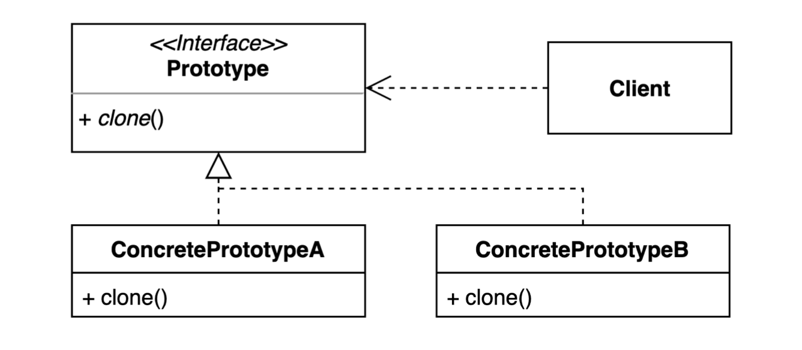
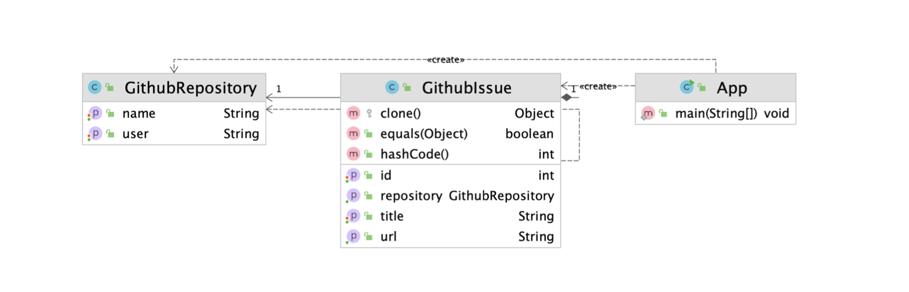

# 프로토타입 (Prototype) 패턴

기존 인스턴스를 (프로토타입으로 사용하여) 복제하여 새로운 인스턴스를 만드는 방법

복제 기능을 갖추고 있는 기존 인스턴스를 프로토타입으로 사용해 새 인스턴스를 만들 수 있다.






## 어떤 경우에 사용?

* 기존의 객체를 응용해서 새로운 객체를 만들 때

* 기존의 객체를 만들 때 시간이 오래걸리는 작업에 사용

  ex) DB에서 데이터를 읽어와서 인스턴스를 생성, 네트워크를 거쳐서 요청을 보내서 가져온 데이터를 기반으로 인스턴스를 생성

* 매번 DB를 조회하거나 네트워크 통신을하면 인스턴스를 만들 때마다 오래 걸리고 리소스도 많이 사용하게 된다.

* 기존에 이미 DB를 조회하거나 네트워크 통신을 통해 가져온 데이터를 가지고 만들어진 객체를 가지고 복사해서 그 안의 모든 데이터를 복제해서 새로운 인스턴스를 만들고, 원하는 값만 일부 변경해서 사용한다.

* Prototype 인스턴스에서 제공하는 `clone()` (추상) 메소드를 복제 기능을 제공할 구체 클래스들이 해당 인스턴스를 반환하도록 구현한다.
* 구체클래스의 `clone()`에서 어떤 식으로 복제가 이루어져야하는지 구현해준다.


## 적용할 수 있는 코드

* App
  * GithubIssue와 Repository 정보를 가지고 url을 만든다.

```java
public class App {

    public static void main(String[] args) {
        GithubRepository repository = new GithubRepository();
        repository.setUser("whiteship");
        repository.setName("live-study");

        GithubIssue githubIssue = new GithubIssue(repository);
        githubIssue.setId(1);
        githubIssue.setTitle("1주차 과제: JVM은 무엇이며 자바 코드는 어떻게 실행하는 것인가.");

        String url = githubIssue.getUrl();
        System.out.println(url);
    }

}
```

* GithubIssue

```java
public class GithubIssue {

    private int id;

    private String title;

    private GithubRepository repository; //이슈가 속해있는 repository 정보

    public GithubIssue(GithubRepository repository) {
        this.repository = repository;
    }

    // getter, setter ...

    public String getUrl() {
        return String.format("https://github.com/%s/%s/issues/%d",
                repository.getUser(),
                repository.getName(),
                this.getId());
    }
}
```

* GithubRepository

```java
public class GithubRepository {

    private String user;

    private String name; //repository 이름

	// getter, setter ...
}
```


새로운 URL을 만들기 위해서 URL을 만드는 일련의 과정을 반복해서 수행하는 것은 비효율 적이다.

```java
public class App {

    public static void main(String[] args) {
        GithubRepository repository = new GithubRepository();
        repository.setUser("whiteship");
        repository.setName("live-study");

        GithubIssue githubIssue = new GithubIssue(repository);
        githubIssue.setId(1);
        githubIssue.setTitle("1주차 과제: JVM은 무엇이며 자바 코드는 어떻게 실행하는 것인가.");

        String url = githubIssue.getUrl();
        System.out.println(url);
      
      // 두번째 이슈 - url 정보 생성
        GithubRepository repository = new GithubRepository(); //중복
        repository.setUser("whiteship");  //중복
        repository.setName("live-study"); //중복

        GithubIssue githubIssue = new GithubIssue(repository);
        githubIssue.setId(2); //다른 내용
        githubIssue.setTitle("2주차 과제: Java String"); //다른 내용

        String url = githubIssue.getUrl();
        System.out.println(url);
    }

}
```


⇒ 두번째 GithubIssue를 첫번째 만들어 놓은 GithubIssue 정보를 활용해서 만든다.


## 프로토타입 패턴 적용

### 1. 프로토 타입 클래스

* `clone()`은 Object가 가진 메소드

  * 특징

    * clone == githubIssue ⇒ `false`
    * clone.equals(githubIssue) ⇒ `true`

  * `protected` 접근지정자라 아무 인스턴스나 사용할 수 없다.

  * 명시적으로 clone이 가능하도록 만들어줘야한다. 

    ⇒ `Cloneable` 인터페이스를 구현해야 한다.

  * `clone()` 메소드를 오버라이딩한다.

    1. 여기에서 Object에서 기본적으로 제공해주는 `clone()`을 사용해서 return 해주면 된다. 

       ⇒ `return super.clone()`

       ⇒ **"shallow copy(얕은 복사)"를 지원한다.** ★

       shallow copy를 사용해도 상관없다면 그대로 사용해도 된다.

       만약, 프로토타입의 변화에 영향을 받지 않는 완벽한 새로운 clone을 만들고 싶다면 deep copy하도록 작성하면 된다.

    2. 커스텀한 구현할 수도 있다.

* `equals()` 동일성 비교를 위해 `equals()`를 재정의
  * `equals()`를 재정의 했다면 반드시 `hashCode()`도 재정의해야 한다.

```java
public class GithubIssue implements Cloneable { //Cloneable 인터페이스 구현

    private int id;

    private String title;

    private GithubRepository repository;

    // 생략... (동일)

   //추가
    @Override
    protected Object clone() throws CloneNotSupportedException {
      //방법1 - 자바에서 기본으로 제공해주는 Object의 clone을 그대로 사용 -> sallow copy
//      return super.clone();
      
      //방법2 -> deep copy 하도록 작성
        GithubRepository repository = new GithubRepository();
        repository.setUser(this.repository.getUser());
        repository.setName(this.repository.getName());

        GithubIssue githubIssue = new GithubIssue(repository);
        githubIssue.setId(this.id);
        githubIssue.setTitle(this.title);

        return githubIssue;
    }

    @Override
    public boolean equals(Object o) {
        if (this == o) return true;
        if (o == null || getClass() != o.getClass()) return false;
        GithubIssue that = (GithubIssue) o;
        return id == that.id && Objects.equals(title, that.title) && Objects.equals(repository, that.repository);
    }

    @Override
    public int hashCode() {
        return Objects.hash(id, title, repository);
    }
}
```


### 2. 클라이언트 코드 - 프로토타입 사용

```java
public class App {

    public static void main(String[] args) throws CloneNotSupportedException {
        GithubRepository repository = new GithubRepository();
        repository.setUser("whiteship");
        repository.setName("live-study");

        GithubIssue githubIssue = new GithubIssue(repository);
        githubIssue.setId(1);
        githubIssue.setTitle("1주차 과제: JVM은 무엇이며 자바 코드는 어떻게 실행하는 것인가.");

        String url = githubIssue.getUrl();
        System.out.println(url);

      // 첫번째 만든 GithubIssue를 복제해서 새로운 GithubIssue를 만든다.
        GithubIssue clone = (GithubIssue) githubIssue.clone();
        System.out.println(clone.getUrl());

      // 프로토타입의 정보가 변경 -> sallow copy 였다면 clone에도 영향을 줄 수 있다.
        repository.setUser("Keesun");

        System.out.println(clone != githubIssue); //true
        System.out.println(clone.equals(githubIssue)); //true -> 명시적으로 equals를 재정의 해줘야 한다.
        System.out.println(clone.getClass() == githubIssue.getClass()); //true
        System.out.println(clone.getRepository() == githubIssue.getRepository()); //shallow copy라면 true, deep copy라면 false

        System.out.println(clone.getUrl()); //clone()이 sallow copy or deep copy 인지에 따라 다른 내용이 출력된다.
    }

}
```


## 장점

* 복잡한 객체를 만드는 과정을 숨길 수 있다.
* 기존 객체를 복제하는 과정이 새 인스턴스를 만드는 것보다 비용(시간 또는 메모리)적인면에서 효율적일 수도 있다.

* 추상적인 타입을 리턴할 수 있다.
  * clone() 메소드에서 리턴하는 객체의 타입은 반드시 해당 클래스와 동일할 필요가 없다. 유연하게 인스턴스를 만들 수 있다.

## 단점

* 복제한 객체를 만드는 과정 자체가 복잡할 수 있다. (특히, 순환 참조가 있는 경우)

  동일한 객체를 만들어줘야하는데 객체가 가지고 있는 레퍼런스 간에 순환 참조가 있는 경우, clone() 메소드를 직접 구현하는 과정이 복잡해질 수 있다.


## 실무 사용 예

* 자바 Object 클래스의 clone 메소드와 Cloneable 인터페이스
* shallow copy와 deep copy
* ModelMapper


### 1. 자바 Collection

* 컬렉션 복사 예시 - 실제 사용되지 않는 방법
  * ArrayList에 `clone()` 메소드 사용

  ```java
  public class JavaCollectionExample {
  
      public static void main(String[] args) {
          Student keesun = new Student("keesun");
          Student whiteship = new Student("whiteship");
          ArrayList<Student> students = new ArrayList<>();
          students.add(keesun);
          students.add(whiteship);
  
        // 컬렉션 복사
          ArrayListList<Student> clone = (ArrayList<Student>) students.clone();
          System.out.println(clone);
      }
  }
  ```


> 자주 쓰이지 않는 이유 ?

보통 변수의 타입을 지정할 때 가능한 추상적인 타입을 사용한다.

`ArrayList`가 아닌 `List`를 필드의 데이터 타입으로 사용

추상적인 타입을 사용하는 이유는 구체적인 타입의 오브젝트를 또 다른 구현체로 변경할 수 있는 유연함이 있기 때문이다.

`List`에서는 `clone()`메소드를 지원해주지 않는다. (`Cloneable`인터페이스를 상속받고 있지 않는다.)


* 실제 사용하는 컬렉션 복사

  1. ArraysList 생성자를 사용하는 방법 (가장 많이 사용하는 방법)
     * 엄밀히 따지면 프로토타입 패턴을 쓰는 것은 아니지만, 보통 실무에서 기존의 Array를 가지고 안의 내용을 복사(sallow copy) 새로운 컬렉션을 만들 때 만드는 방식이다.

  ```java
  public class JavaCollectionExample {
  
      public static void main(String[] args) {
          Student keesun = new Student("keesun");
          Student whiteship = new Student("whiteship");
          List<Student> students = new ArrayList<>();
          students.add(keesun);
          students.add(whiteship);
  
        // 컬렉션 복사
          List<Student> clone = new ArrayList<>(students);
          System.out.println(clone); //[Student{name='keesun'}, Student{name='whiteship'}]
      }
  }
  ```


### 2. ModelMapper

GithubRepository와 GithubIssue의 필드값을 가지고 `GithubIssueData`에 평이하게 정의된 필드값을 채워서 만들어야할 때

하나하나 값을 게터로 꺼내와서 세터로 넣어줄 수도 있지만, ModelMapper를 사용할 수도 있다.

* map(source, destination class);
* 원리 - 자바 리플렉션을 사용

```java
public class ModelMapperExample {

    public static void main(String[] args) {
        GithubRepository repository = new GithubRepository();
        repository.setUser("whiteship");
        repository.setName("live-study");

        GithubIssue githubIssue = new GithubIssue(repository);
        githubIssue.setId(1);
        githubIssue.setTitle("1주차 과제: JVM은 무엇이며 자바 코드는 어떻게 실행하는 것인가.");

      // 일반 방법
      GithubIssueData githubIssueData = new GithubIssueData();
      githubIssueData.setId(githubIssue.getId());
      githubIssueData.setRepository(githubIssue.getRepository().getName());
      
      // ModelMapper를 사용한 방법
        ModelMapper modelMapper = new ModelMapper();
        GithubIssueData githubIssueData02 = modelMapper.map(githubIssue, GithubIssueData.class);
        System.out.println(githubIssueData02);
    }
}
```


```java
public class GithubIssueData {

    private int id;

    private String title;

    private String repositoryUser;

    private String repositoryName;

  // getter, setter ...

    @Override
    public String toString() {
        return "GithubIssueData{" +
                "id=" + id +
                ", title='" + title + '\'' +
                ", repositoryUser='" + repositoryUser + '\'' +
                ", repositoryName='" + repositoryName + '\'' +
                '}';
    }
}
```


