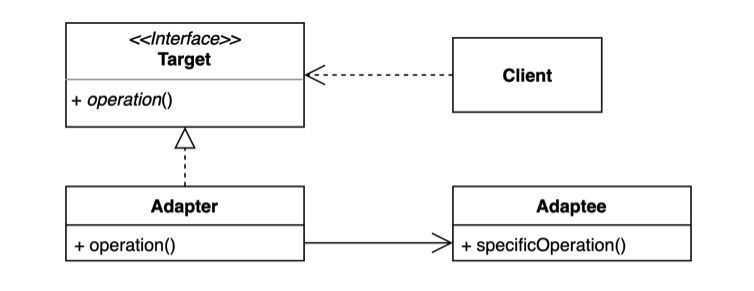
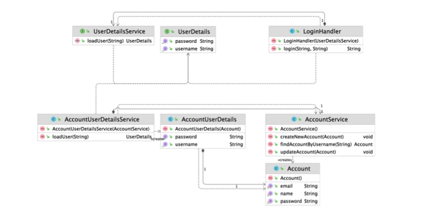

# 어댑터 (Adapter) 패턴

기존 코드를 클라이언트가 사용하는 인터페이스의 구현체로 바꿔주는 패턴

클라이언트가 사용하는 인터페이스를 따르지 않는 기존 코드를 재사용할 수 있게 해준다.




ex) 110V용 코드를 220V용 콘센트에 꼽을 수 있도록 해주는 중간 어댑터

클라이언트가 사용하는 인터페이스가 서로 다를 때 그 둘 사이의 차이를 메워주는 어댑터를 만들어서 기존 코드를 재사용할 수 있도록 해준다.

인터페이스가 서로 다르더라도 같이 사용할 수 있게 상호호환되도록 만들어 준다.

**구성요소**

* 클라이언트는 항상 Target 인터페이스만 사용하는 형태
* Adaptee에 해당하는 클래스(ex. 한국에서 미국으로 들고온 한국 냉장고)
* Target과  Adaptee 사이를 메워주는 Adapter




## 적용할 수 있는 코드

* `security` 패키지에서 제공하는 클래스들

  다른 여러 코드에서 재사용할 수 있는 클래스들이다.

  * UserDetails

    * username과 password 정보를 알아낼 수 있는 인터페이스
    * `Target`에 해당

    ```java
    public interface UserDetails {
        String getUsername();
        String getPassword();
    }
    ```

  * UserDetailsService

    * username에 해당하는 UserDetails 유저 정보를 읽어들이는 인터페이스

    * `Target`에 해당

    ```java
    public interface UserDetailsService {
        UserDetails loadUser(String username);
    }
    ```

  * LoginHandler

    * UserDetails와 UserDetailsService로 로그인을 처리하는 핸들러

    * `Client`에 해당

    ```java
    public class LoginHandler {
    
        UserDetailsService userDetailsService;
    
        public LoginHandler(UserDetailsService userDetailsService) {
            this.userDetailsService = userDetailsService;
        }
    
        public String login(String username, String password) {
            UserDetails userDetails = userDetailsService.loadUser(username);
            if (userDetails.getPassword().equals(password)) {
                return userDetails.getUsername();
            } else {
                throw new IllegalArgumentException();
            }
        }
    }
    ```

* Account

  * 애플리케이션마다 (각 애플리케이션에 맞게) 만드는 일반적인 Account

  * security 패키지에서 제공하는 클래스와 다르게 해당 애플리케이션에서만 사용하는 용도의 클래스이다.

  * `Adaptee`에 해당

  ```java
  public class Account {
      private String name;
      private String password;
      private String email;
    
    	// getter, setter ...
  }
  ```

* AccountService

  * 애플리케이션마다 (각 애플리케이션에 맞게) 만드는 일반적인 AccountService
  * security 패키지에서 제공하는 클래스와 다르게 해당 애플리케이션에서만 사용하는 용도의 클래스이다.
  * `Adaptee`에 해당

  ```java
  public class AccountService {
  
      public Account findAccountByUsername(String username) {
          Account account = new Account();
          account.setName(username);
          account.setPassword(username);
          account.setEmail(username);
          return account;
      }
  
      public void createNewAccount(Account account) {
  
      }
  
      public void updateAccount(Account account) {
  
      }
  
  }
  ```


`Client` 코드에 해당하는 로그인 기능을 처리해주는 `LoginHandler`는 `UserDatils`와 `UserDetailsService`라는 정해진 규격의 인터페이스를 사용하고 있다. (`Target`에 해당) 

우리 애플리케이션의 `Account`와 `AccountService`는 `Adaptee`에 해당한다. 여기에 중간 어댑터를 만들어서 현재 `security` 내의 클래스와 상호호환되지 않는 이 두 클래스를 호환시킬 수 있도록 한다.


## 어댑터 패턴 적용

클라이언트가 어떤 인터페이스를 기반으로 사용 중인지 확인해야 한다.

* UserDetails와 Account를 연결하는 방법
* UserDetailsService와 AccountService를 연결하는 방법


### 1. Target 인터페이스를 구현한 어댑터 클래스 생성 (1) - AccountUserDetailsService

Adaptee를 사용해서 Target 인터페이스 규약에 맞도록 구현해준다.

1. UserDetailsService 인터페이스를 implements

2. Adaptee에 해당하는 AccountService를 필드로 가지고 사용

3. loadUser()를 Override할 때, AccountService를 사용

   이 때, `AccountService`는 `UserDetails`와 상관없는 `Account`를 넘겨주기 때문에 이를 다시 `UserDetails`로 변환해주는 어댑터가 필요

```java
public class AccountUserDetailsService implements UserDetailsService {

    private AccountService accountService;

    public AccountUserDetailsService(AccountService accountService) {
        this.accountService = accountService;
    }

    @Override
    public UserDetails loadUser(String username) {
        return new AccountUserDetails(accountService.findAccountByUsername(username));
    }
}
```


### 2. Target 인터페이스를 구현한 어댑터 클래스 생성 (2) - AccountUserDetails

1. UserDetails라는 Target을 Adaptee에 해당하는 Account를 사용해서 구현

```java
public class AccountUserDetails implements UserDetails {

    private Account account;

    public AccountUserDetails(Account account) {
        this.account = account;
    }

    @Override
    public String getUsername() {
        return account.getName();
    }

    @Override
    public String getPassword() {
        return account.getPassword();
    }
}
```


### 3. 어댑터 사용한 클라이언트 코드

security에서 제공하는 LoginHandler를 사용

```java
public class App {

    public static void main(String[] args) {
        AccountService accountService = new AccountService();
        UserDetailsService userDetailsService = new AccountUserDetailsService(accountService);
        LoginHandler loginHandler = new LoginHandler(userDetailsService);
        String login = loginHandler.login("solar", "solar");
        System.out.println(login); //solar
    }
}
```


어댑터를 별도의 클래스로 만들면 기존의 코드는 하나도 수정하지 않고 사용할 수 있게 되었다.

3rd party 코드이거나 maven 의존성으로 추가한 코드의 경우처럼 직접 수정할 수 없을 때 이렇게 별도의 클래스인 어댑터를 만들어 사용할 수 있다.


### 어댑터 패턴을 적용하지 않고 사용하는 방법

만약 직접 코드를 수정할 수 있는 경우라면 Adaptee가 Target 인터페이스를 직접 구현하도록 수정하면 된다.

```java
public class Account implements UserDetails {
    private String name;
    private String password;
    private String email;
  
  @Override
  public String getUsername() {
    return this.name;
  }
  
  @Override
  public String getPassword() {
    return this.password;
  }
  
  	// getter, setter ...
}
```

```java
public class AccountService implements UserDetailsService {

    public Account findAccountByUsername(String username) {
        Account account = new Account();
        account.setName(username);
        account.setPassword(username);
        account.setEmail(username);
        return account;
    }

    public void createNewAccount(Account account) { }

    public void updateAccount(Account account) { }

  	@Override
  	public UserDetails loadUser(String username) {
      return findAccountByUsername(username);
    }
}
```


단점은 기존의 코드가 수정된다.

장점은 별도의 클래스를 생성하지 않아도 되기 때문에 복잡도를 조금 줄일 수 있다.

어댑터 패턴을 적용한 코드가 단일책임원칙을 지킨 코딩 기법이 될 수 있지만, 항상 원칙을 지키는 것보다 실용적인 선택을 해야하는 경우도 있다.


## 장점

* 기존 코드(Adaptee)를 변경하지 않고 원하는 인터페이스(Target) 구현체를 만들어 재사용할 수 있다. 

  ⇒ 기존 코드를 변경하지 않고, 확장할 수 있다는 점에서 **OCP(Open Closed Principle)** 원칙에 가까운 패턴이다.

* 기존 코드가 하던 일과 특정 인터페이스 구현체로 변환하는 작업을 각기 다른 클래스로 분리하여 관리할 수 있다.

  ⇒ 각각이 하던 일에 집중할 수 있기 때문에 **SRP(Single Responsibility Principle)** 원칙에 가까운 패턴이다.

## 단점

* 새 클래스가 생겨 복잡도가 증가할 수 있다.
* 경우에 따라서는 기존 코드가 해당 인터페 이스를 구현하도록 수정하는 것이 좋은 선택이 될 수도 있다.


## 실무 사용 예

* 자바
  * java.util.Arrays#asList(T...)
  * java.util.Collections#list(Enumeration), java.util.Collections#enumeration()
  * java.io.InputStreamReader(InputStream)
  * java.io.OutputStreamWriter(OutputStream)

* 스프링
  * HandlerAdpter: 우리가 작성하는 다양한 형태의 핸들러 코드를 스프링 MVC가 실행할 수 있 는 형태로 변환해주는 어댑터용 인터페이스.
  * 스프링 시큐리티의 UserDetails, UserDetailsService


### 1. java.util.Arrays#asList(T...)

* 배열을 리스트로 변환해준다.

  배열 --(어댑터)--> 리스트

* `T...` : 가변인자 - 내부적으로는 배열로 넘겨받게 된다.

```java
List<String> strings = Arrays.asList("a", "b", "c");
```


### 2. java.util.Collections#list(Enumeration), java.util.Collections#enumeration()

*  java.util.Collections#enumeration() : 컬렉션을 Enumeration으로 변환해준다.

* `strings` : Adaptee
* `Collections.enumeration()` : Adapter
* `Enumerations<String>` : Target

```java
Enumeration<String> enumeration = Collections.enumeration(strings);
```

*  java.util.Collections#list(Enumeration) : Enumberation을 컬렉션으로 변환해준다.

```java
ArrayList<String> list = Collections.list(enumeration);
```


### 3. java.io.InputStreamReader(InputStream), java.io.OutputStreamWriter(OutputStream)

어떤 패턴이 적용되었는지 파악할 수 있다면 코드를 읽는것이 수월해진다.

문자열 인풋으로 → InputStream 아웃풋이 나온다.

InputStream 인풋으로 → InputStreamReader 아웃풋이 나온다.

InputStreamReader 인풋으로 BufferedReader 아웃풋이 나온다.

(패턴을 보는 시각에 따라 다른 패턴이 적용되었다고 볼 수도 있지만,) 일종의 어댑터 패턴이 적용되었다고 볼 수 있다.

`FileInputStream()`, `InputStreamReader()`, `BufferedReader()`를 각각 원하는 Target 형태를 돌려주는 어댑터라고 볼 수 있다.

```java
public class AdapterInJava {

    public static void main(String[] args) {
        // io
        try(InputStream is = new FileInputStream("input.txt");
            InputStreamReader isr = new InputStreamReader(is);
            BufferedReader reader = new BufferedReader(isr)) {
            while(reader.ready()) {
                System.out.println(reader.readLine());
            }
        } catch (IOException e) {
            throw new RuntimeException(e);
        }
    }
}
```


### 4. HandlerAdpter

* 핸들러 : 요청을 처리하고 응답을 반환

우리가 작성하는 다양한 형태의 핸들러 코드를 스프링 MVC가 실행할 수 있는 형태로 변환해주는 어댑터용 인터페이스.

```java
public class AdapterInSpring {

    public static void main(String[] args) {
        DispatcherServlet dispatcherServlet = new DispatcherServlet();
        HandlerAdapter handlerAdapter = new RequestMappingHandlerAdapter();
    }
}
```


* 가장 많이 사용하는 형태의 핸들러

```java
@Controller
public class HelloController {

    @GetMapping("/hello")
    public String hello() {
        return "hi";
    }

}
```


* `doDispatch()` 코드 일부

```java
// 해당 핸들러를 처리할 수 있는 HandlerAdapter를 찾아온다.
// Determine handler adapter for the current request.
HandlerAdapter ha = getHandlerAdapter(mappedHandler.getHandler());

// ..(생략)

// 핸들러를 찾아오면 요청을 처리한다. 처리결과로 model and view를 반환한다.
// Actually invoke the handler.
mv = ha.handle(processedRequest, response, mappedHandler.getHandler());

```


* `getHandlerAdapter()`

핸들러는 다양한 형태이기 때문에 `Object` 타입으로 받아온다.

핸들러를 처리할 수 있는 `HandlerAdapter`를 찾아서 반환한다.

```java
protected HandlerAdapter getHandlerAdapter(Object handler) throws ServletException {
   if (this.handlerAdapters != null) {
      for (HandlerAdapter adapter : this.handlerAdapters) {
         if (adapter.supports(handler)) {
            return adapter;
         }
      }
   }
   throw new ServletException("No adapter for handler [" + handler +
         "]: The DispatcherServlet configuration needs to include a HandlerAdapter that supports this handler");
}
```


어떤 핸들러를 사용하느냐에 따라 각기 다른 핸들러 어댑터를 사용하게 된다.

핸들러 어댑터는 간단한 인터페이스만 구현해주면 된다.

```java
public interface HandlerAdapter {

   /**
    * Given a handler instance, return whether or not this {@code HandlerAdapter}
    * can support it. Typical HandlerAdapters will base the decision on the handler
    * type. HandlerAdapters will usually only support one handler type each.
    * <p>A typical implementation:
    * <p>{@code
    * return (handler instanceof MyHandler);
    * }
    * @param handler the handler object to check
    * @return whether or not this object can use the given handler
    */
   boolean supports(Object handler);

   /**
    * Use the given handler to handle this request.
    * The workflow that is required may vary widely.
    * @param request current HTTP request
    * @param response current HTTP response
    * @param handler the handler to use. This object must have previously been passed
    * to the {@code supports} method of this interface, which must have
    * returned {@code true}.
    * @throws Exception in case of errors
    * @return a ModelAndView object with the name of the view and the required
    * model data, or {@code null} if the request has been handled directly
    */
   @Nullable
   ModelAndView handle(HttpServletRequest request, HttpServletResponse response, Object handler) throws Exception;

   /**
    * Same contract as for HttpServlet's {@code getLastModified} method.
    * Can simply return -1 if there's no support in the handler class.
    * @param request current HTTP request
    * @param handler the handler to use
    * @return the lastModified value for the given handler
    * @see javax.servlet.http.HttpServlet#getLastModified
    * @see org.springframework.web.servlet.mvc.LastModified#getLastModified
    */
   long getLastModified(HttpServletRequest request, Object handler);
```


핸들러 어댑터는 요청을 처리하는 방법을 구현해주면 된다. 

그 중 가장많이 사용하는 것이 `RequestMappingHandlerAdapter`이다. 

원한다면 직접만들어서 구현할 수 있다.

스프링은 Adapter에 해당하는 인터페이스를 제공해주는 것이다.

* `HttpServletRequest`와 `HttpServletResponse`를 받아서 `ModelAndView`를 반환해주는 어댑터에 대한 인터페이스를 정의한 것이 `HandlerAdapter`이다.

> 왜 이런 어댑터 인터페이스가 필요했을까?

다양한 형태의 핸들러가 있고, 각기 다른 형태에 따라 각각 다르게 처리해야하기 때문에, 다르게 처리해야하는 모든 핸들러가 스프링MVC에 들어있고, 다양한 형태의 핸들러를 다 지원할 수 있게(확장에 열려있게) 해주기 위해 스프링 MVC가 고안해놓은 인터페이스이다.


> SpringMVC를 학습한다면, DispacherServlet 구현 코드를 읽어보는 것을 추천
>
> doDispatch가 핵심코드이다.

