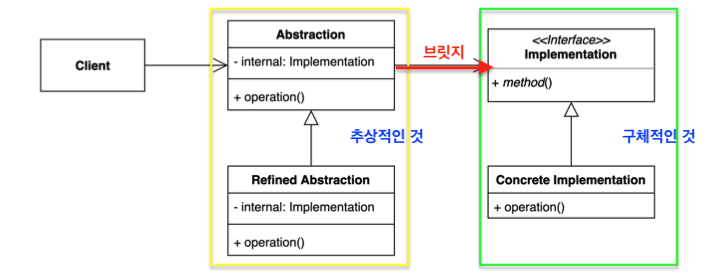
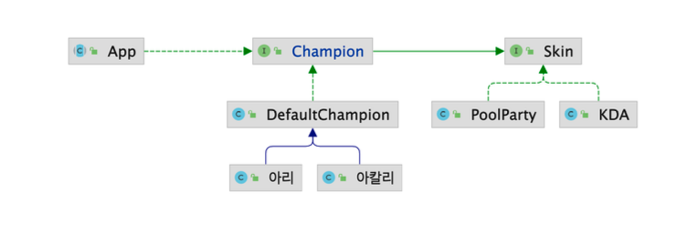
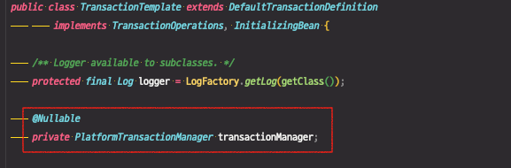
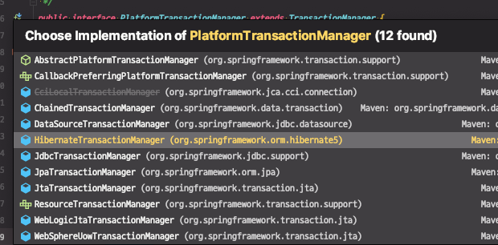

# 브릿지 패턴

**추상적인 것**과 **구체적인 것**을 분리하여 연결하는 패턴

하나의 계층 구조일 때 보다 각기 나누었을 때 독립적인 계층 구조로 발전 시킬 수 있다.



**구성요소의 역할**

* Client : Abstraction을 사용하는 코드
* Abstraction : 상위의 고차원의 추상적인 로직을 담고있는 코드
* Refined Abstraction
  * Abstraction을 구현체 또는, 이를 상속받는 하위 클래스
  * 추상적인 개념들을 다양하게 변형하고 확장한 Child 클래스로 이 자체 하나가 또 다른 `'Abstraction' - 'Refined Abstraction'` 구조로 확장될 수 있다.
* Implementation
  * 구체적인 정보(상태, 액션, 플랫폼에 특화된 코드 등..)를 담고 있다.
  * 이 자체도 인터페이스나 상위 클래스를 사용해서 또 다른 Concrete Implementation을 가지고 별도의 계층 구조로 발전시킬 수 있다.


**특징**

* 상속이 아닌 Composition을 사용하게 된다.
* 추상적인 것과 구체적인 것을 구분짓는 것에 조금 더 집중된 패턴이다.
* 서로 성격이 상이한 것들을 (하나의 계층구조가 아닌) 분리해서 브릿지를 이용해 그 사이를 연결한다.
  * ex) 동작만 있는 것 - 상태만 있는 것 / 프론트 코드 - 백엔드 코드 / GUI - GUI에서 호출하는 API
* Client는 Implementation을 직접 사용하지 않고, 추상적인 계층구조만 사용한다. (간접적으로 Implementation을 사용하게 된다.)
* Abstraction은 구체적은 것을 참조해야한다.
* 모델링에서 Abstraction과 Implementation이 반드시 자바에서의 인터페이스와 클래스를 나타내는 것이 아니다. 의미적인 것이다.




## 적용해볼 수 있는 코드

* Champion 인터페이스
  * Champion : 게임 캐릭터
  * 캐릭터 외관을 꾸밀 수 있는 skin이 있다. ⇒ (스킨종류) KDA, PoolParty

```java
public interface Skin {
    String getName();
}
```

```java
public interface Champion extends Skin {
}
```


* 계층 구조를 하나만 유지할 때, KDA나 PoolParty 스킨을 입은 캐릭터들을 다음과 같이 만들 수 있다.

```java
public class KDA아리 implements Champion {}
public class KDA아칼리 implements Champion {}
public class KDA카이사 implements Champion {}

public class PoolParty아리 implements Champion {}
public class PoolParty아칼리 implements Champion {}
public class PoolParty카이사 implements Champion {}
```


### **현재 구조의 단점**

* 지금은 Champion이 스킨 특징만 가지고 있지만 다른 특징인 스킬까지 계층구조에 반영되기 시작하면 걷잡을 수 없이 많은 클래스가 늘어나게 된다.

이 문제를 해결하기위해 브릿지 패턴을 적용해볼 수 있다.

동작(액션)에 해당하는 것은 Champion에 남겨두고, 외관(Skin)이나 또 다른 차원의 액션(Skill)을 분리해내고 계층구조를 만들면 브릿지 패턴 모양으로 코드를 개선할 수 있다.


### 챔피언 클래스 확장

* Champion
  * 움직이고 스킬을 사용할 수 있는 기능 추가

```java
public interface Champion extends Skin {

    void move();

    void skillQ();

    void skillW();

    void skillE();

    void skillR();

}
```

* KDA아리 예
  * 챔피언 아리가 KDA 스킨에 맞게끔 동작이 변경되어야 한다.
  * move() : 스킨에 맞는 복장에 맞게 움직여야 한다.
  * sKillX() : Q, W, E, R 스킬도 각 스킨에 따라 다른 동작을 한다.

```java
public class KDA아리 implements Champion {

    @Override
    public void move() {
        System.out.println("KDA 아리 move");
    }

    @Override
    public void skillQ() {
        System.out.println("KDA 아리 Q");
    }

    @Override
    public void skillW() {
        System.out.println("KDA 아리 W");
    }

    @Override
    public void skillE() {
        System.out.println("KDA 아리 E");
    }

    @Override
    public void skillR() {
        System.out.println("KDA 아리 R");
    }

    @Override
    public String getName() {
        return null;
    }
}
```


> 새로운 스킨이 추가된다면?

"정복자"라는 스킨을 추가해보자

"정복자아리" 클래스를 추가해서 정복자라는 스킨을 착용한 아리 캐릭터에 대한 내용을 채워야한다.

```java
public class 정복자아리 implements Champion {
    @Override
    public void move() {
        System.out.println("정복자 아리 move");
    }

    @Override
    public void skillQ() {
        System.out.println("정복자 아리 Q");
    }

    @Override
    public void skillW() {
        System.out.println("정복자 아리 W");

    }

    @Override
    public void skillE() {
        System.out.println("정복자 아리 E");
    }

    @Override
    public void skillR() {
        System.out.println("정복자 아리 R");
    }

    @Override
    public String getName() {
        return null;
    }
}
```

* 코드 실행
  * 해당하는 서브 클래스를 각각 만들어서 실행하면 된다.

```java
public class App {

    public static void main(String[] args) {
        Champion kda아리 = new KDA아리();
        kda아리.skillQ();
        kda아리.skillR();
    }
}
```


하나의 계층구조로 다양한 특징들을 표현하려고 하기 때문에 계층구조가 커지고, 각 Child Class를 개발하는 과정이 다른 클래스와 닮은 것이 많다고 느껴진다.


## 브릿지 패턴 적용

### 1. DefaultChampion 클래스 생성

* Champion 인터페이스를 구현한다.
* Skin이라는 인터페이스를 사용
* 각 챔피언의 이름을 담는 name 필드

```java
public class DefaultChampion implements Champion {

    private Skin skin;

    private String name;

    public DefaultChampion(Skin skin, String name) {
        this.skin = skin;
        this.name = name;
    }

    @Override
    public void move() {
        System.out.printf("%s %s move\n", skin.getName(), this.name);
    }

    @Override
    public void skillQ() {
        System.out.printf("%s %s Q\n", skin.getName(), this.name);
    }

    @Override
    public void skillW() {
        System.out.printf("%s %s W\n", skin.getName(), this.name);
    }

    @Override
    public void skillE() {
        System.out.printf("%s %s E\n", skin.getName(), this.name);
    }

    @Override
    public void skillR() {
        System.out.printf("%s %s R\n", skin.getName(), this.name);
    }

    @Override
    public String getName() {
        return null;
    }
}
```


```java
public interface Skin {
    String getName();
}
```


### 2. 챔피언 추가

**Skin과 상관없이 챔피언만 추가할 수 있다.**

* DefaultChampion을 상속받아서 구현

1. "아리" 챔피언 추가

      ```java
      public class 아리 extends DefaultChampion {

          public 아리(Skin skin) {
              super(skin, "아리");
          }
      }
      ```

2. "아칼리" 챔피언 추가

      ```java
      public class 아칼리 extends DefaultChampion{
      
          public 아칼리(Skin skin) {
              super(skin, "아칼리");
          }
      }
      ```


### 3. 스킨 추가

**챔피언과 상관없이 스킨만 추가할 수 있다.**

* Skin을 확장해서 구현

1. "KDA" 스킨 추가

   ```java
   public class KDA implements Skin{
       @Override
       public String getName() {
           return "KDA";
       }
   }
   ```

2. "PoolParty" 스킨 추가

   ```java
   public class PoolParty implements Skin {
       @Override
       public String getName() {
           return "PoolParty";
       }
   }
   ```

   

⇒ 서로 다른 계층 구조에 영향을 주지 않고, 현재 계층 구조만 확장해나갈 수 있다.


### 4. Client 코드

* Champion 인터페이스 기반으로 코딩할 수 있다.
* Champion을 생성할 때, 어떤 스킨을 가지고 있는 캐릭터인지 구체타입을 지정해주면 된다.

```java
public abstract class App implements Champion {

    public static void main(String[] args) {
        Champion kda아리 = new 아리(new KDA());
        kda아리.skillQ();
        kda아리.skillW();

        Champion poolParty아리 = new 아리(new PoolParty());
        poolParty아리.skillR();
        poolParty아리.skillW();
    }
}
```

```text
/*출력*/
KDA 아리 Q
KDA 아리 W
PoolParty 아리 R
PoolParty 아리 W
```


> 클라이언트 코드가 추상적인 것(인터페이스)만 보고있지 않은 것 같다?

클라이언트 코드가 `Abstraction` 부분인 `Champion` 인터페이스만 쓰고 있는 것이 맞다.

new 해주는 부분은 얼마든지 원한다면 감출 수 있다. 예를 들어 DI(의존성 주입)방법을 통해서 생성된 객체를 넘겨받아 사용할 수 있다.


### 구조

(이론적으로 보면)

클라이언트 코드는 Abstraction 계층 구조만 사용하고, Abstraction에 해당하는 Champion이 Implementaion 계층 구조인 Skin을 사용하는 것이다.

각각의 Skin인 `KDA`와 `PoolParty`가 `Concrete Implementation`이 된다.

각각의 챔피언인 `아리`와 `아칼리`가 `Refined Abstration`이 된다.


## 장점

* 추상적인 코드를 구체적인 코드 변경 없이도 독립적으로 확장할 수 있다. 

  ⇒ `OCP(개방 폐쇄 원칙)` 객체지향 원칙을 따른다.

  ​	구체적인 코드가 변경되어도 추상적인 코드는 변경되지 않는다.

* 추상적인 코드과 구체적인 코드를 분리하여 수 있다.

  ⇒ `SRP(단일 책임 원칙)` 객체지향 원칙을 따른다.

  ​	본인이 해야할 일만 관리하면 된다.

※ 두 가지 객체지향 원칙을 지켜서 얻을 수 있는 부가적인 장점

* 기존 코드를 재사용할 수 있다.
* 중복 코드를 줄일 수 있다.

## 단점

* 계층 구조가 늘어나 복잡도가 증가할 수 있다.


## 실무 사용 예

* 자바
  * JDBC API, DriverManger와 Driver 
  * SLF4J, 로깅 퍼사드와 로거
* 스프링
  * Portable Service Abstraction


### 1. JDBC 

(정확한 코드는 아니고, 인터페이스를 확인하기 위해 임의로 작성한 코드) 

* 추상적인 부분

  * Connection, DriverManager, Statement, ResultSet을 사용하는 부분

    → 브릿지 패턴의 추상화에 해당한다.

* 구체적인 부분
  * Driver
    * 드라이버 최상위에는 java.sql에 Driver 인터페이스가 있다.
    * 이 드라이버를 구현한 여러가지 구현체가 있다.
  * 아래 코드에서는 그 중, "org.h2.Driver"를 사용한다.

클래스를 로딩하여 드라이버를 등록시켜 놓고, DriverManager를 사용해서 코드를 작성하면, 최종적으로 h2 DB를 사용하게 된다.

MySQL 드라이버를 등록해놓고, MySQL 커넥션 정보를 입력하면 **동일한 Abstract를 사용해서** MySQL DB를 사용할 수 있다.

> ※ 동일한 Abstract를 사용한다?
> 즉, 동일한 Connection, DriverManager, Statement, ResultSet을 사용한다는 의미이다.

⇒ 새로운 DB로 변경한다 하더라도 JDBC 코드를 변경할 필요가 없어지는 것이다. (연결정보 같은 것들은 제외..)

추상화된 인터페이스 자체가 바뀌지 않는다는 것이다.


```java
public class JdbcExample {

    public static void main(String[] args) throws ClassNotFoundException {
        Class.forName ("org.h2.Driver");

        try (Connection conn = DriverManager.getConnection ("jdbc:h2:mem:~/test", "sa","")) {

            String sql =  "CREATE TABLE  ACCOUNT " +
                    "(id INTEGER not NULL, " +
                    " email VARCHAR(255), " +
                    " password VARCHAR(255), " +
                    " PRIMARY KEY ( id ))";

            Statement statement = conn.createStatement();
            statement.execute(sql);

          // 아래 두줄은 보여주기위해 작성한 코드
//            PreparedStatement statement1 = conn.prepareStatement(sql);
//            ResultSet resultSet = statement.executeQuery(sql);
        } catch (SQLException e) {
            throw new RuntimeException(e);
        }
    }
}
```


### 2. SLF4J

* SLF4J : 로깅 퍼사드
  * 로거를 감싸서 만들어주는 API
* 로깅 퍼사드 부분이 추상화된 계층 구조
* 로깅 퍼사드가 감싸고 있는 실제 로거들이 구현체이다.


```java
public class Slf4jExample {

    private static Logger logger = LoggerFactory.getLogger(Slf4jExample.class);

    public static void main(String[] args) {
        logger.info("hello logger");
    }
}
```

* 예시 코드에서는 구현체는 없다.

* 예시 코드의 `Logger`도 slf4j에서 제공하는 API이다.
* 즉, 로깅할 때 로깅 퍼사드를 통해서 (코드 상에서는 보이지 않지만) 실제 구현체 로거를 사용하는 것이다.


> 패턴을 보는 시각에 따라 다른 패턴으로 볼 수 있다. 지금은 추상화된 것과 구체적인 것이 분리되어있다는 관점에서 본다면 이 것도 브릿지 패턴이라고 볼 수도 있다.

`Logger`, `LoggerFactory` 인터페이스는 새로운 로거를 만들어내더라도 바뀌지 않는 부분이기 때문에 추상부분과 구체부분이 분리되었다고 보는 것이다.


> 추상적인 로깅 퍼사드를 사용하는 이유

라이브러리나 프레임워크에서 log4j와 같은 구체적인 로거를 사용한다면 그 프레인워크나 라이브러리를 사용하는 다른 클라이언트 코드도 log4j를 강제적으로 사용하게된다.

로깅 퍼사드를 사용하면 로거를 강제하지 않고 클라이언트에서 원하는 로거를 사용할 수 있다.


### 3. Portable Service Abstraction(PSQ)

스프링이 브릿지 패턴의 일부분으로 볼 수 있는 (추상적인 부분과 구체적인 부분 중) **구체적인 구현체 부분을** 추상화해놓았다.

즉, 구체적인 부분에 해당하는 것의 인터페이스를 스프링이 많이 만들어 두었다.


* `MailSender`, `PlatformTransactionManager` 
  * 구체적인 부분의 인터페이스
  * `<<Interface>> Implementation` 에 해당한다.
* `JavaMailSenderImpl` , `JdbcTransactionManager`
  * Concrete Implementation
  * Implementation 인터페이스의 구현체

```java
public class BridgeInSpring {

    public static void main(String[] args) {
        MailSender mailSender = new JavaMailSenderImpl();

        PlatformTransactionManager platformTransactionManager = new JdbcTransactionManager();
    }
}
```


JavaMailSenderImpl 대신 테스트용 MailSender를 만들어서 테스트에 용이하게 만들 수 있다.

PlatformTransactionManager 구현체는 여러가지가 있다. 영속성과 관련된 기술에 특화된 TransactionManager가 여러개 구현되어있다. 필요하면 구현체를 바꿔서 사용할 수 있다.

대신, 코드는 PlatformTransactionManager라는 추상화 되어있는 API를 사용하도록 코딩해야 코드가 새로운 구현체가 만들어진다해도 코드의 변경이 발생하지 않는다.

```java
public interface PlatformTransactionManager extends TransactionManager { 
//  ... 
}
```


PlatformTransactionManager를 사용하는 대표적인 예가 `TransactionTemplate`이다.

* 코드를 보면 `PlatformTransactionManager` 를 사용하고 있다.

* TransactionTemplate는 추상화된 부분의 코드라 볼 수 있고, 이 코드가 `PlatformTransactionManager`라는 Implementation 인터페이스를 구현한 구체적인 구현체를 사용하고 있다.

 


* PlatformTransactionManager 구현체 예
  * HibernateTransactionManager
  * Concrete Implementation



