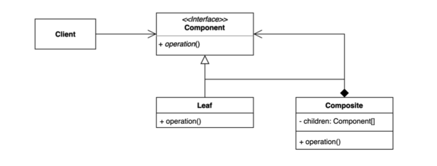
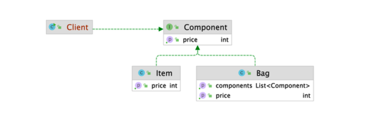

# 컴포짓 (Composite) 패턴

그룹 전체와 개별 객체를 동일하게 처리할 수 있는 패턴.

클라이언트 입장에서는 ‘전체’나 ‘부분’이나 모두 동일한 컴포넌트로 인식할 수는 계층 구조를 만든다. (Part-Whole Hierarchy)



클라이언트 입장에서는 이것이 전체인지 전체의 부분인지 아무 상관없이 동일한 인터페이스를 사용할 수 있도록 하는 패턴

* 특정한 구조 제한이 있다. - "트리"구조를 구성해야 한다.

  생각보다 "트리 구조"를 많이 사용하기 때문에 알아야하는 패턴이다.



## 적용할 수 있는 코드

* Client
  * Item 두가지와 이 Item을 담은 Bag이 있다.
  * Item 한가지의 가격을 출력하는 메소드와 Bag에 들어있는 모든 아이템 가격 총합을 출력하는 메소드가 있다.

```java
public class Client {

    public static void main(String[] args) {
        Item doranBlade = new Item("도란검", 450);
        Item healPotion = new Item("체력 물약", 50);

        Bag bag = new Bag();
        bag.add(doranBlade);
        bag.add(healPotion);

        Client client = new Client();
        client.printPrice(doranBlade);
        client.printPrice(bag);
    }

    private void printPrice(Item item) {
        System.out.println(item.getPrice());
    }

    private void printPrice(Bag bag) {
        int sum = bag.getItems().stream().mapToInt(Item::getPrice).sum();
        System.out.println(sum);
    }

}
```

* Item

```java
public class Item {

    private String name;

    private int price;

    public Item(String name, int price) {
        this.name = name;
        this.price = price;
    }

    public int getPrice() {
        return this.price;
    }
}
```

* Bag

```java
public class Bag {

    private List<Item> items = new ArrayList<>();

    public void add(Item item) {
        items.add(item);
    }

    public List<Item> getItems() {
        return items;
    }
}
```


#### 현재 코드의 문제점

* Bag 안에 들어있는 모든 Item 가격의 총합을 클라이언트 코드에 있는 것이 객체지향적으로 봤을 때 옳을까?
* 클라이언트가 너무 많은 정보를 알고있는 상황이다.
* 캐릭터가 가방을 두 개 들고 있다면?
* 가방 안에 가방이 들어있다면?

⇒ 컴포짓 디자인 패턴을 적용하면 이 문제를 쉽게 해결할 수 있다.


## 컴포짓 패턴 적용

* Component Interface
  * 값을 구할만한 모든 컴포넌트의 공통적인 인터페이스를 정의한다. 
* Client는 Component라는 인터페이스 타입만 사용하게 된다. 

* Item, Bag, Character는 Leaf 또는 Composite 객체가 된다.

* Leaf는 가장 primitive한 단위가 된다. (가장 기본적인 단위)

* primitive 타입들을 그룹으로 가져갈 수 있는 Composite 타입의 객체가 있다.
  * **Composite은 여러개의 Component를 배열(리스트) 형태로 가지고 있다.**
  * ★ **하지만 Leaf 타입이 아니라 Component 타입인 점을 주의해야 한다.** ★
  * 그래야 전체와 부분을 동일하게 처리할 수 있다.
  * Component가 지원하는 모든 오퍼레이션을 모두 지원해야 한다.


### 1. Component Interface 정의

* 공통된 Operation 정의

* **여기서 정의해야하는 액션은 Item과 Bag을 사용하는 클라이언트 코드에서 동일하게 사용하던 Operation이다.**

  **⇒ "가격 계산"** 

```java
public interface Component {
    int getPrice();
}
```


### 2. Item에서 Component 구현

* Component를 implements
* getPrice() Override한다. (기존 코드와 동일)

```java
public class Item implements Component {

    private String name;

    private int price;

    public Item(String name, int price) {
        this.name = name;
        this.price = price;
    }

    @Override
    public int getPrice() {
        return this.price;
    }
}
```


### 3. Bag에서 Component 구현

* Component를 implements

* Composite에 들어있는 Component들의 가격을 구하는 로직이 클라이언트쪽에서 가방쪽으로 옮겨지게 된다.

  (객체지향적으로 올바른 선택)

```java
public class Bag implements Component {
   //Leaf(Item) 타입이 아니라 Component 타입이어야 한다.
  
    private List<Component> components = new ArrayList<>();

    public void add(Component component) {
        components.add(component);
    }

    public List<Component> getComponents() {
        return components;
    }

    @Override
    public int getPrice() {
        return components.stream().mapToInt(Component::getPrice).sum();
    }
}
```


### 4. Client 코드 수정

* 클라이언트가 사용하는 타입이 `Component` 이다.

* `Component`를 구체적인 타입으로 볼 필요가 없다.

* 여기서 사용되는 Item과 Bag이 공통된 인터페이스를 가지고 있다.

  ⇒ 클라이언트는 `Bag`이라는 `전체` `Item`이라는 `부분`이나 동일하게 취급할 수 있는 트리구조를 다루게 되는 것이다.

* Item 하나의 가격을 출력하는 코드나 Bag에 들어있는 모든 아이템의 가격 총합을 출력하는 코드가 하나로 통합된다.

* (가장 큰 차이점) 클라이언트는 가격을 어떻게 구해야하는지 구체적인 정보를 알 필요가 없다.

```java
public class Client {

    public static void main(String[] args) {
        Item doranBlade = new Item("도란검", 450);
        Item healPotion = new Item("체력 물약", 50);

        Bag bag = new Bag();
        bag.add(doranBlade);
        bag.add(healPotion);

        Client client = new Client();
        client.printPrice(doranBlade);
        client.printPrice(bag);
    }

    private void printPrice(Component component) {
        System.out.println(component.getPrice());
    }


}
```


> ※ 코딩 시 좋은 습관
>
> 사용하는 특정 타입의 가능한 인터페이스를 쓸 수 있다면, 인터페이스를 사용하는 것이 코드에 더 좋은 영향을 주는 경우가 많다.


## 장점

* 복잡한 트리 구조를 편리하게 사용할 수 있다.

  ⇒ 클라이언트에서 트리 구조를 사용할 때, 트리의 최상위 노드에 해당하던지 Leaf에 해당하는 노드인지 상관없이 Component라는 공통된 인터페이스를 구현하고 있다면, 클라이언트는 해당 인터페이스를 기준으로 사용하면 되기 때문에 다형성, 재귀를 활용하기 좋다.

* 다형성과 재귀를 활용할 수 있다.

* 클라이언트 코드를 변경하지 않고 새로운 엘리먼트 타입을 추가할 수 있다.

  ⇒ 새로운 타입으 Composite(, Leaf)가 추가되더라도 클라이언트 코드(앞서 예시에서 `printPrice()`)는 변경되지 않는다.

  ⇒ `OCP(개방 폐쇄 원칙)` 객체지향 원칙을 따른다.

## 단점

* 트리를 만들어야 하기 때문에 (공통된 인터페이스를 정의해야 하기 때문에) 지나치게 일반화 해야 하는 경우도 생길 수 있다.

  그러다 부작용으로 런타임 시에 타입을 체크해야하는 경우가 생길 수 있다.

  ex) `printPrice()`에서 Component의 타입이 `Item`인지 `Bag`인지 체크하고 있다?

  그런 경우, 특정 디자인 패턴에 종속적으로 코드를 작성하고 있는 것이 아닌지,

  컴포짓 패턴이 어울리지 않는 것이 아닌가 고민해볼 필요가 있다.


## 실무 사용 예

패턴 특징 상 primitive(기초적인) 타입과 primitive를 감싸는 타입이 둘 다 동일한 인터페이스를 구현하거나 상속받은 경우에 찾아볼 수 있다.

* 자바
  * Swing 라이브러리 : 자바로 데스크탑용 애플리케이션을 만드는 툴
  * JSF (JavaServer Faces) 라이브러리 : 컴포넌트 기반의 웹 UI를 만드는 툴


* JFrame : JTextField나 JButton을 추가할 수 있다.
  * 다른 Leaf들을 감쌀 수 있는 `Composite` 객체이다.
* JTextField / JButton
  * `Leaf` 객체
*  `setVisible()`은 JFrame과 JTextField, JButton의 상위...상위 특정 컴포넌트 클래스를 구현하고 있다.
* 최상위 상속 객체를 확인
  * JFrame → Frame → Window → Container → Component
  * JTextField → JTextComponent → JComponent → Container → Component
  * JButton → AbstractButton → JComponent → Container → Component
* Component에서 제공하는 Operation을 모두 구현하고 있다.
* `setVisible()`을 가지고 있으면 안에 있는 모든 엘리먼트를 모두 보여주게 된다.

```java
public class SwingExample {

    public static void main(String[] args) {
        JFrame frame = new JFrame();

        JTextField textField = new JTextField();
        textField.setBounds(200, 200, 200, 40);
        frame.add(textField);

        JButton button = new JButton("click");
        button.setBounds(200, 100, 60, 40);
        button.addActionListener(e -> textField.setText("Hello Swing"));
        frame.add(button);

        frame.setSize(600, 400);
        frame.setLayout(null);
        frame.setVisible(true);
    }
}
```


