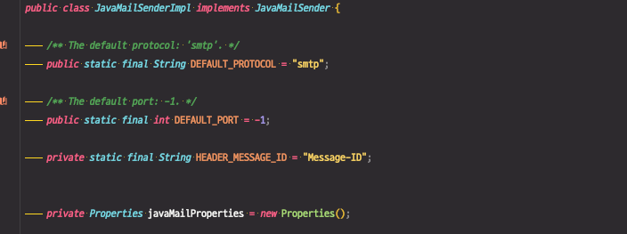

# 퍼사드 (Facade) 패턴

※ 퍼사드(Facade) : 건물의 입구쪽을 바라보는 외벽

복잡한 서브 시스템 의존성을 최소화하는 방법

클라이언트가 사용해야 하는 복잡한 서브 시스템 의존성을 간단한 인터페이스로 추상화 할 수 있다.


## 패턴 적용하기

### 기존 코드

간단한 메일을 보내는 코드 예시 (동작하지는 않음)

동작과정은 다음과 같다.

1. 메일을 위해 필요한 properties 정의 - smtp 서버, port
2. 세션을 만든다.
3. MimeMessage에 송/수신자 정보, 메일 내용 등을 저장
4. Transport로 메시지 전송

```java
public class Client {

    public static void main(String[] args) {
        String to = "Solar@mail.com";
        String from = "Holar@mail.com";
        String host = "127.0.0.1";

        Properties properties = System.getProperties();
        properties.setProperty("mail.smtp.host", host);

        Session session = Session.getDefaultInstance(properties);

        try {
            MimeMessage message = new MimeMessage(session);
            message.setFrom(new InternetAddress(from));
            message.addRecipient(Message.RecipientType.TO, new InternetAddress(to));
            message.setSubject("Test Mail from Java Program");
            message.setText("message");

            Transport.send(message);
        } catch (MessagingException e) {
            e.printStackTrace();
        }
    }
}
```

* 클라이언트 코드에 의존성이 많다.
* 이러한 특정 라이브러리나 프레임워크에 종속적인 코드에 의존하는 것을 피하는 것이 좋다.
* 퍼사드 패턴을 이용해 코드를 개선한다.

서브 시스템(ex. 우리가 사용하는 라이브러리, 프레임워크 등)에 대한 의존성을 갖지 않도록, 즉, 클라이언트가 서브 시스템에 해당하는 객체를 생성하거나 인터페이스를 사용하는 등 직접 사용하는 것이 아니라

복잡한 서브 시스템에서 우리가 사용하고자 하는 기능 하나에 대한 인터페이스 또는, 클래스가 제공하는 특정 오퍼레이션 하나로 압축시켜서 퍼사드라는 중간층을 제공한다.

복잡한 디테일은 퍼사드 뒤로 숨기고, 클라이언트는 퍼사드만을 사용한다.


### 퍼사드 패턴 적용

* Email 관련 라이브러리에 대한 의존성을 줄여서 약결합 코드로 개선한다.

* 인터페이스나 클래스로 추상화하고 싶다면 기존 코드를 어떻게 추상화 시킬지 분석을 잘해야 한다.

* 메시지 관련 데이터 : `MimeMessage` , 메시지 송/수신지, 내용 등
* 이메일 서버 설정과 관련된 데이터 : `Properties`

(※ 정해진 답이 없는 문제이다. 어떻게 추상화 시킬지 고민해보자)

다음과 같이 나눠볼 수 있겠다.

1. 메일을 보내는 역할하는 클래스
2. 메일의 설정
3. 메일의 메시지


#### 1. 메일을 보내는 역할하는 클래스

```java
public class EmailSender {

    private EmailSettings emailSettings;

    public EmailSender(EmailSettings emailSettings) {
        this.emailSettings = emailSettings;
    }

    /**
     * 이메일 보내는 메소드
     * @param emailMessage
     */
    public void sendEmail(EmailMessage emailMessage) {
        Properties properties = System.getProperties();
        properties.setProperty("mail.smtp.host", emailSettings.getHost());

        Session session = Session.getDefaultInstance(properties);

        try {
            MimeMessage message = new MimeMessage(session);
            message.setFrom(new InternetAddress(emailMessage.getFrom()));
            message.addRecipient(Message.RecipientType.TO, new InternetAddress(emailMessage.getTo()));
            message.addRecipient(Message.RecipientType.CC, new InternetAddress(emailMessage.getCc()));
            message.setSubject(emailMessage.getSubject());
            message.setText(emailMessage.getText());

            Transport.send(message);
        } catch (MessagingException e) {
            e.printStackTrace();
        }
    }


}
```


#### 2. 메일의 설정

```java
public class EmailSettings {

    private String host;

    public String getHost() {
        return host;
    }

    public void setHost(String host) {
        this.host = host;
    }
}
```


#### 3. 메일의 메시지

```java
public class EmailMessage {

    private String from;

    private String to;
    private String cc;
    private String bcc;

    private String subject;

    private String text;

    // getter, setter 
}
```


#### 4. Client에서 사용하는 코드

```java
public class Client {

    public static void main(String[] args) {
        EmailSettings emailSettings = new EmailSettings();
        emailSettings.setHost("127.0.0.1");

        EmailSender emailSender = new EmailSender(emailSettings);

        EmailMessage emailMessage = new EmailMessage();
        emailMessage.setFrom("Solar");
        emailMessage.setTo("Holar");
        emailMessage.setCc("일남");
        emailMessage.setSubject("오징어게임");
        emailMessage.setText("밖은 더 지옥이더라고..");

        emailSender.sendEmail(emailMessage);
    }
}
```

이전 코드에 비해 코드 교체가 수월하다.

테스트 상에서 목업하기 쉬워진다. (이전 코드는 static 메소드를 사용하기 때문에 목킹하기 힘들다.)

그리고 Properties가 있어야 Session을 만들 수 있고, Session이 있어야 MimeMessage를 만들 수 있는 형태로 서로 얽혀있다.

EmailSender를 인터페이스로 만들게 되면, DefaultEmailSender, JavaEmailSender로 만들어서 각 서비스에 해당하는 이메일 샌더를 만들 수 있는 유연한 구조가 된다.


> 어짜피 클라이언트 코드가 사용하던 코드가 뒤로 빠져있을 뿐인데 이 구조가 의미가 있을까?

이메일을 보내는 작업을 여러곳에서 한다고 했을 때, 이 패턴이 효과있다.

A라는 클래스, B라는 클래스마다 이메일을 보내기위한 의존성을 중복적으로 갖고 있다면,이메일 셋팅을 변경하고자 할 때 변경 지점이 여러곳이 된다.

지금 구조는 관리 포인트를 한 곳으로 모을 수 있게 된다.

또한, 인터페이스로 설계하면 구현체를 만들어서 교체하기가 수월해진다.


## 장단점

* 장점
  * 서브 시스템에 대한 의존성을 한곳으로 모을 수 있다.
  * 코드가 읽기 편해질 수 있다.
  * 서브 시스템을 직접 사용하려면 해당 API를 잘 알아야하는데, 추상화를 시키면 그 부담을 줄일 수 있다.
* 단점
  * 퍼사드 클래스가 서브 시스템에 대한 모든 의존성을 가지게 된다.


## 실무 사용 예

* 스프링
  * Spring MVC
  * 스프링이 제공하는 대부분의 기술 독립적인 인터페이스와 그 구현체


### 퍼사드 패턴이 적용된 스프링 코드(1) - JavaMailSenderImpl

* (브릿지 패턴에서 소개한 인터페이스와 같다고 볼 수 있다.)
* 브릿지 패턴에서의 목적은 서로 다른 상이한 인터페이스를 연결하는 것이다.
* 퍼사드 패턴의 목적은 특정한 디테일한 기술을 감추는 것이다.

※ 특정한 코드 하나가 패턴 하나만 적용됐다고 보기 어렵다. 보는 시각에 따라 달라진다.


```java
public class FacadeInSpring {

    public static void main(String[] args) {
        MailSender mailSender = new JavaMailSenderImpl();

        PlatformTransactionManager platformTransactionManager = new JdbcTransactionManager();
    }
}
```

* `JavaMailSenderImpl` 확인 
  * Java의 Mail과 관련된 내용을 `JavaMailSenderImpl` 뒤에 숨겨놓은 퍼사드로 볼 수 있다.



* `MailSender` : 퍼사드 인터페이스
  * 특정 기술에 종속적이지 않다.


클라이언트가 직접적으로 사용하는 인터페이스는 `MainSender`이고, 실질적으로 사용하게 되는것은 `JavaMailSenderImpl` 가 된다.


### 퍼사드 패턴이 적용된 스프링 코드(2) - PlatformTransactionManager

* PlatformTransactionManager

  스프링에서 트랜젝션을 관리할 때 내부적으로 사용하는 인터페이스

* 트랜젝션을 처리해주는 코드가 다양하다.

  * JDBC를 사용해서 처리
  * 하이버네이트, JPA를 사용해서 처리

사용하는 API와 코드가 다 다르다. 이 것을 `PlatformTransactionManager` 인터페이스 뒤로 숨긴 것이다.

이 인터페이스 구현체 중 하나인 `JdbcTransactionManager`인 경우 JDBC API를 사용하는 특화된 기술로 구현이 되어있다. 

* `JdbcTransactionManager` 퍼사드 : 특정 기술에 종속적인 코드를 갖고 있게된다.

* `PlatformTransactionManager`  인터페이스를 사용하는 클라이언트 코드들은 JDBC에 비종속적인 코드를 유지할 수 있다.


#### 스프링 MVC

스프링 MVC의 모든 API가 일종의 퍼사드라고 볼 수 있다.

Java가 제공하는 서블릿을 감싸고 있는 일종의 퍼사드이다.

스프링 MVC 버전 5부터는 동일한 스프링 MVC 애노테이션과 API를 쓰더라도 (서블릿이 아닌) Reactive Stream 기반의 WebFlux로 동작할 수 있다. 


