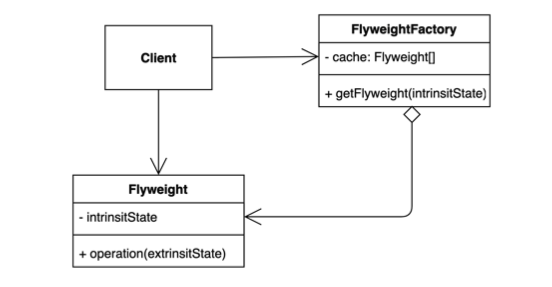
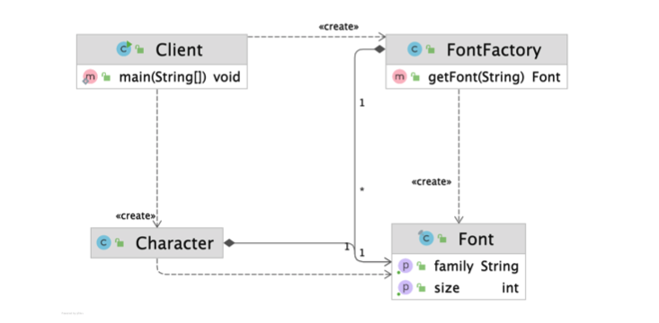
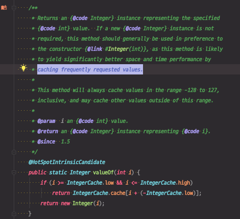

# 플라이웨이트 (Flyweight) 패턴

객체를 가볍게 만들어 메모리 사용을 줄이는 패턴.

자주 변하는 속성(또는 외적인 속성, extrinsit)과 변하지 않는 속성(또는 내적인 속성, intrinsit)을 분리하고 재사용하여 메모리 사용을 줄일 수 있다.



* 아주 많은 인스턴스를 만드는 특징을 가지는 애플리케이션에서 주로 사용하는 디자인패턴이다.

* 많은 인스턴스를 만들면 메모리 사용량이 많아져 OOME가 발생할 수 있다. 이 패턴을 적용해서 공통되는 부분, 자주 변하지 않는 속성을 모아서 재사용할수 있도록 한다. 

* 자주 변하지 않는 것들을 모아놓은 것이 `Flyweight`이다.

* `Client`는 `FlyweightFactory`를 통해서 `Flyweight`를 가져다 사용할 수 있다.

* 한 번 동일한 속성으로 만들어 놓은 `Flyweight`는 `FlyweightFacotry`에서 캐싱해두고, `Client`가 같은 속성을 요청할 때 동일한 `Flyweight` 인스턴스를 사용할 수 있도록 한다.

* **★ 중요 ★ `Flyweight`는 Immutable 해야한다.**

  다른 여러 인스턴스에서 공유하는 객체이기 때문에 값을 다시 변경할 수 있으면 안된다.




## 적용할 수 있는 코드

* 편집기를 만드는 예제
* Character
  * 한 글자 마다 속성을 표현하는 객체
* 편집기에 글을 많이 쓸 수록 글자가 많아진다. 그만큼 인스턴스가 사용하는 메모리 양이 편집기 성능에 많은 영향을 줄 수 있다.

```java
public class Character {

    private char value;

    private String color;

    private String fontFamily;

    private int fontSize;

    public Character(char value, String color, String fontFamily, int fontSize) {
        this.value = value;
        this.color = color;
        this.fontFamily = fontFamily;
        this.fontSize = fontSize;
    }
}
```

```java
public class Client {

    public static void main(String[] args) {
        Character c1 = new Character('h', "white", "Nanum", 12);
        Character c2 = new Character('e', "white", "Nanum", 12);
        Character c3 = new Character('l', "white", "Nanum", 12);
        Character c4 = new Character('l', "white", "Nanum", 12);
        Character c5 = new Character('o', "white", "Nanum", 12);
    }
}
```

현재 코드 분석

* fontFamily와 fontSize가 많이 겹친다.
* color의 경우  enum을 사용해서 고정된 값을 사용하도록 변경할 수 있다.

⇒ 자주 변경되지 않는 속성값을 `Flyweight`로 만들 수 있다.


## 플라이웨이트 패턴 적용

* Character클래스가 가지고 있는 데이터 중, 많은 부분이 중복된다.
* '자주 바뀐다', '자주 바뀌지 않는다' 기준은 주관적이고 상황에 따라 변한다. 도메인의 특성을 잘 파악해서 적용하면 된다.


### 1. fontFamily와 fontSize를 묶어서 intrinsit한 데이터로 보고, Flyweight 객체로 취급한다.

* Font 클래스에 두 속성을 정의
* Flyweight 객체를 Immutable하게 만들어야 한다.
  * 모든 필드에 `final` 키워드 추가
  * setter 없음
  * 상속이 불가능 하도록 class에 `final` 키워드 추가

```java
public final class Font {

    final String family;

    final int size;

    public Font(String family, int size) {
        this.family = family;
        this.size = size;
    }

    public String getFamily() {
        return family;
    }

    public int getSize() {
        return size;
    }
}
```


### 2. extrinsit한 데이터만 남겨둔 Character 클래스 정의

* value, color는 자주 변하는 속성
* Flyweight 객체를 참조

```java
public class Character {

    private char value;

    private String color;

    private Font font;

    public Character(char value, String color, Font font) {
        this.value = value;
        this.color = color;
        this.font = font;
    }
}
```


### 3. FlyweightFactory 정의

* `Font`라는 Flyweight 인스턴스에 접근할 수 있고, 캐싱해준다.
* Map으로 캐싱을 구현
* Flyweight을 가져오는 메소드 필요
  * 캐시에 데이터가 있으면 캐시에서 꺼내서 이미 만들어 놓은 객체를 반환
  * 캐시에 데이터가 없다면, 새로운 인스턴스를 만들어서 캐시에 저장하고 객체를 반환

```java
public class FontFactory {

    private Map<String, Font> cache = new HashMap<>();

    public Font getFont(String font) {
        if (cache.containsKey(font)) {
            return cache.get(font);
        } else {
            String[] split = font.split(":");
            Font newFont = new Font(split[0], Integer.parseInt(split[1]));
            cache.put(font, newFont);
            return newFont;
        }
    }
}
```


### 4. Client 코드에서 Flyweight 사용

* FontFactory에서 Font 인스턴스를 가져와서 사용

```java
public class Client {

    public static void main(String[] args) {
        FontFactory fontFactory = new FontFactory();
        Character c1 = new Character('h', "white", fontFactory.getFont("nanum:12"));
        Character c2 = new Character('e', "white", fontFactory.getFont("nanum:12"));
        Character c3 = new Character('l', "white", fontFactory.getFont("nanum:12"));
    }
}
```


## 장점

* 애플리케이션에서 사용하는 메모리를 줄일 수 있다.

### 단점

* 코드의 복잡도가 증가한다.


## 실무 사용 예

* 자바
  * Integer.valueOf(int)
    * 캐시를 제공한다.
    * https://docs.oracle.com/javase/8/docs/api/java/lang/Integer.html#valueOf-int-


### 1. Integer.valueOf(int)

자주 사용되는 값인 `-128 ~ 127` 범위 데이터를 캐싱한다.

따라서 `==` 동일성 비교를 하면 같은 인스턴스를 사용하기 때문에 `true`를 반환하지만, 범위에 벗어나는 값은 캐싱하지 않기 때문에 `==` 동일성 비교를 하면 다른 인스턴스가 만들어져 `false`가 된다.



```java
public class FlyweightInJava {

    public static void main(String[] args) {
        Integer i1 = Integer.valueOf(10);
        Integer i2 = Integer.valueOf(10);
        System.out.println(i1 == i2); //true - 캐싱이 되어서 같은 인스턴스
      
	     Integer i3 = Integer.valueOf(10000);
        Integer i4 = Integer.valueOf(10000);
        System.out.println(i1 == i2); //false - 캐싱이 안되어서 다른 인스턴스
        System.out.println(i1.equals(i2)); //true - 동등성 비교 (값을 비교)
    }
}
```


> (참고) 숫자, 문자 비교시 동일성 비교 `==`은 사용하지 말 것을 권장

