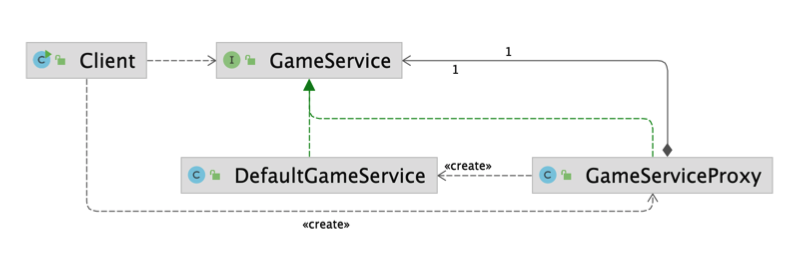

# 프록시 (Proxy) 패턴

특정 객체에 대한 접근을 제어하거나 기능을 추가할 수 있는 패턴.

초기화 지연, 접근 제어, 로깅, 캐싱 등 다양하게 응용해 사용 할 수 있다.


※ 프록시 : 대리(인)

특정 객체의 오퍼레이션에 접근하기 전에 프록시 객체를 먼저 지나서 접근하도록 하는 패턴이다.

클라이언트가 원래 사용하려는 객체를 직접 쓰는 것이 아니라 대리인을 거쳐서 사용하게 된다. 

* 보안 - 객체에 대한 접근 제어
* 객체 생성 시 많은 리소스를 필요로한다면 객체 생성을 (애플리케이션 구동시에 미리 만들어두지 않고,) 최초로 사용될 때 초기화하도록 초기화 지연 방법 제공
* 로깅, 캐싱 적용
  * 프록시에 캐싱을 적용하면 타켓 오퍼레이션까지 가지 않고, 값을 반환할 수 있어서 성능을 높일 수 있다.
* 리턴값이 있는 경우, 리턴값 변경 작업을 처리해줄 수 있다.


**구조**

* RealSubject

  * 원래 사용하려는 객체

* Subject Interface

  * RealSubject Interface가 있을 수도 있고, 상속을 사용할 수도 있다.
  * 또는 없는 경우도 있다.

* Client가 RealSubject에 해당하는 Interface를 사용한다.

* Subject 인터페이스를 RealSubject와 Proxy 모두 구현한다.

* Client는 RealSubject가 아닌 Proxy를 사용한다.

* Proxy

  * **본인의 인터페이스 타입으로 필드를 가지고 있다.** (like. 데코레이터 패턴)

    * 프록시로 들어온 오퍼레이션 중에 RealSubject를 사용해야하는 경우에 참조하기 위해서

    * 사용하기 전/후에 추가적인 작업을 할 수 있도록

  * 동일한 오퍼레이션을 구현해야한다.





## 적용할 수 있는 코드

* Client
  * GameService를 이용해서 게임을 시작한다.

```java
public class Client {
    public static void main(String[] args) throws InterruptedException {
        GameService gameService = new GameService();
        gameService.startGame();
    }
}
```

```java
public class GameService {
    public void startGame() {
        System.out.println("이 자리에 오신 여러분을 진심으로 환영합니다.");
    }
}
```


게임서비스를 시작하고 끝낼 때, 이 오퍼레이션이 얼마나 걸리는지 확인하고 싶다.

하지만 GameService 코드는 수정할 수 없을 경우, 또는 Client에서 시간을 측정할 수 있지만 그렇게 측정하는 코드를 추가하지 않고 프록시 패턴을 사용하면 기존 코드를 유지하면서 쉽게 적용할 수 있다.


## 프록시 패턴 적용

* 기존 코드를 변경하지 않고 적용할 수도 있고, 인터페이스를 만들어서 적용할 수도 있다.

### 1. 기존 코드를 변경하지 않고 적용 - RealSubject를 수정할 수 없는 경우

#### 1. Proxy 구현

* GameService를 상속받는다.

* `startGame()` 오퍼레이션을 시작하기 전/후에 타임을 체크

```java
public class GameServiceProxy extends GameService {

    private GameService gameService;

    @Override
    public void startGame() {
        long before = System.currentTimeMillis();
        if (this.gameService == null) {
            this.gameService = new DefaultGameService();
        }

        gameService.startGame();
        System.out.println(System.currentTimeMillis() - before); //경과 시간 출력
    }
}
```

#### 2. Client에서 Proxy를 사용

```java
public class Client {

    public static void main(String[] args) {
        GameService gameService = new GameServiceProxy();
        gameService.startGame();
    }
}
```


### 2. 인터페이스를 만들어서 적용 (추천)

#### 1. RealSubject의 인터페이스를 정의

* GameService 인터페이스 정의

```java
public interface GameService {
    void startGame();
}
```


#### 2. RealSubject에서 인터페이스를 구현

* 실제 오퍼레이션 구현

```java
public class DefaultGameService implements GameService {
    @Override
    public void startGame() {
        System.out.println("이 자리에 오신 여러분을 진심으로 환영합니다.");
    }
}
```


#### 3. Proxy가 Subject 인터페이스를 구현

* GameService를 구현한다.
  * 이 안에서 `RealSubject`인  `DefaultGameService`를 사용하게 된다.
* **본인의 인터페이스 타입인 `GameService` 필드를 가지고 있다.**
* 부가적인 기능을 구현한다.
  * 예시는 오페레이션 수행 시간을 측정하는 코드를 추가

```java
public class GameServiceProxy implements GameService {

    private GameService gameService;
  
    public GameServiceProxy(GameService gameService) {
      this.gameService = gameService;
    }

    @Override
    public void startGame() {
        long before = System.currentTimeMillis(); //부가 기능
        gameService.startGame();
        System.out.println(System.currentTimeMillis() - before); //부가 기능
    }
}
```


#### 4. Client에서 Proxy를 사용

* Client는 타겟 객체인 DefaultGameService를 직접 사용하지 않고, Proxy 객체인 GameServiceProxy를 사용한다.

```java
public class Client {

    public static void main(String[] args) {
        GameService gameService = new GameServiceProxy(new DefaultGameService());
        gameService.startGame();
    }
}
```


### 3. Proxy에서 초기화 지연

```java
public class GameServiceProxy implements GameService {

    private GameService gameService;

    @Override
    public void startGame() {
        long before = System.currentTimeMillis();
        if (this.gameService == null) { // 객체가 생성되지 않은 경우에 생성한다.
            this.gameService = new DefaultGameService();
        }

        gameService.startGame();
        System.out.println(System.currentTimeMillis() - before);
    }
}
```

* Client에서 `DefaultGameService` 객체를 주입해주지 않아도 된다.

```java
public class Client {

    public static void main(String[] args) {
        GameService gameService = new GameServiceProxy();
        gameService.startGame();
    }
}
```


## 장점

* 기존 코드를 변경하지 않고 새로운 기능을 추가할 수 있다.

  ⇒ `OCP(개방 폐쇄 원칙)` 객체지향 원칙을 따른다.

* 기존 코드가 해야 하는 일만 유지할 수 있다.

  ⇒ `SRP(단일 책임 원칙)` 객체지향 원칙을 따른다.

* 기능 추가 및 초기화 지연 등으로 다양하게 활용할 수 있다.

## 단점

* 코드의 복잡도가 증가한다.
* 상속을 사용해서 프록시를 만들 때 제약사항이 있다.
  * 상속은 하나만 받을 수 있다.
  * 만약 상속 받아야하는 클래스가 final이면 상속이 불가능하다.

> 기존 코드를 수정할 수 있다면,
> 상속보다 인터페이스를 구현하는 것이 더 유연한다. - ex) 테스트코드를 만들 때


## 실무 사용 예

* 자바
  * 다이나믹 프록시
  * java.lang.reflect.Proxy
* 스프링
  * 스프링 AOP


### 1. 다이나믹 프록시

예시에서는 프록시를 인터페이스의 구현체 또는 클래스를 상속받은 서브클래스를 정적으로 만들었다. (컴파일타임에 사용할 수 있게끔)

자바에서 프록시 인스턴스를 런타임에 만들 수 있는 방법을 제공한다. ⇒ "다이나믹 프록시"라고 한다.

자바의 리플렉션 기능을 사용하면 된다.

* `Proxy.newProxyInstance()`
  * 1st 인자 : 클래스로더
  * 2st 인자 : 동적으로 생성되는 프록시가 구현해야되는 인터페이스 타입
  * 3st 인자 : InvocationHandler 타입의 인스턴스
    * `invoke()` 메소드 구현
      * 아무 동작도 하지 않는 다이나믹 프록시를 구현한다면 `method.invoke(target, args);`만 호출해주면 된다.
      * `target` : 어떤 인스턴스의 메소드를 실행할 것인지를 지정한다.
        * `RealSubject`에 해당하는 `DefaultGameService`를 target으로 써야한다.
      * `args` : 메소드에 넘겨주는 파라미터를 전달

```java
public class ProxyInJava {

    public static void main(String[] args) {
        ProxyInJava proxyInJava = new ProxyInJava();
        proxyInJava.dynamicProxy();
    }

    private void dynamicProxy() {
        GameService gameServiceProxy = getGameServiceProxy(new DefaultGameService());
        gameServiceProxy.startGame();
    }

    private GameService getGameServiceProxy(GameService target) {
        return  (GameService) Proxy.newProxyInstance(this.getClass().getClassLoader(),
                new Class[]{GameService.class}, (proxy, method, args) -> {
                    System.out.println("Before"); //부가 작업
                    method.invoke(target, args);
                    System.out.println("After"); //부가 작업
                    return null;
                });
    }
}
```


⇒ 여러 메소드에 중복되는 로직을 동적 다이나믹 프록시를 통해서 런타임에 생성해서 사용할 수 있다.


### 2. Spring AOP

스프링에서는 이 프록시 기능을 추상화시켜서 AOP를 제공한다.

여러 코드에 흩어질 수 있는 다양한 코드를 Aspect라는 개념으로 모아서 한 곳에서 작성할 수 있다.

성능을 측정하는 코드를 여러 메서드에 적용해야한다면 성능 측정 로직을 하나의 Aspect으로 만들어서 어디에 적용할지 Around에 적어준다.

* Spring AOP는 스프링이 관리하는 빈에만 적용할 수 있다.
* Aspect도 @Component 어노테이션으로 빈으로 등록해준다.
* @Aspct : Ascpect라는 것을 알려준다.
* @Around : 메소드를 어디에 적용할지 지정
* ProceedingJoinPoint : Aspect가 적용될 지점 - GameService의 `startGame()`
* point.proceed() : 타겟 메소드 호출

```java
@Aspect
@Component
public class PerfAspect {

    @Around("bean(gameService)")
    public void timestamp(ProceedingJoinPoint point) throws Throwable {
        long before = System.currentTimeMillis(); //부가 기능
        point.proceed(); //타겟 메소드 호출
        System.out.println(System.currentTimeMillis() - before); //부가 기능
    }
}
```


Aspect를 적용하면 빈을 만들 때, GameService 타입의 또 다른 프록시 빈을 만들어준다. 스프링이 구동될 때, 내부적으로 제일 밑단에서는 다이나믹 프록시를 사용해서 동적으로 GameService와 같은 타입으로 프록시 빈을 만들어서 등록한다.

프록시 빈을 주입받아서 사용하게 된다.

```java
@SpringBootApplication
public class App {

    public static void main(String[] args) {
        SpringApplication app = new SpringApplication(App.class);
        app.setWebApplicationType(WebApplicationType.NONE);
        app.run(args);
    }

    @Bean
    public ApplicationRunner applicationRunner(GameService gameService) { //여기서 GameService 프록시 빈을 주입받아서 사용하게 된다.
        return args -> {
            gameService.startGame();
        };
    }
}
```

```java
@Service
public class GameService {

    public void startGame() {
        System.out.println("이 자리에 오신 여러분을 진심으로 환영합니다.");
    }

}
```


Java에서 다이나믹 프록시의 경우 `GameService`를 인터페이스로 만들었다. 인터페이스로 만드는 방법은 Java의 `Proxy` 클래스가 지원을 해준다.

스프링예제를 보면 `GameService` 인터페이스가 없다. 이런 경우 상속을 사용해서 만들어야 한다. 이때는 `CGLIB` 를 사용해야 한다. 사용되는 것을 확인해보려면 브레이크 포인트를 잡아서 디버깅해보면 `EnhancerBySpringGLIB` 클래스 타입인 것을 확인할 수 있다. CGLIB로 동적으로 만들어진 가짜 GameService 빈인 것이다.

GameService이긴 한데 직접적으로 사용하는 것이 아닌 이를 감싼 CGLIB를 사용해서 만든 프록시 인스턴스가 사용되는 것이다.


* 인터페이스가 있다면 인터페이스 기반의 프록시를 사용하도록 스프링이 적절하게 선택한다.


