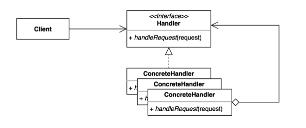
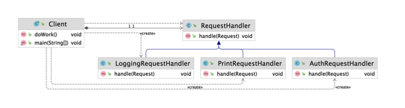
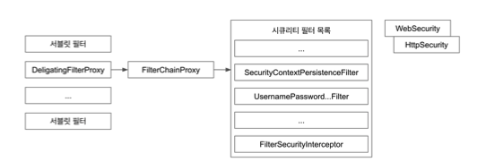
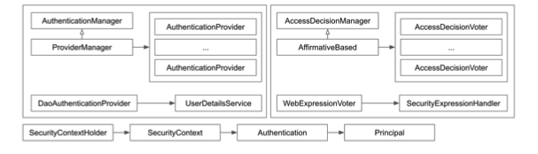
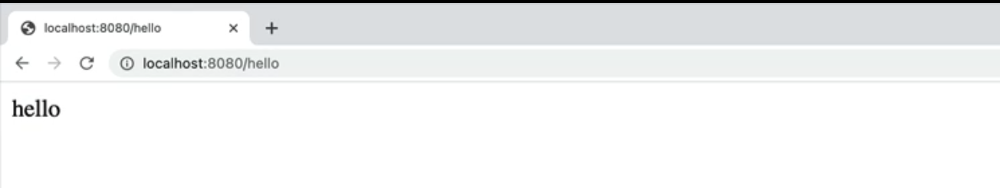
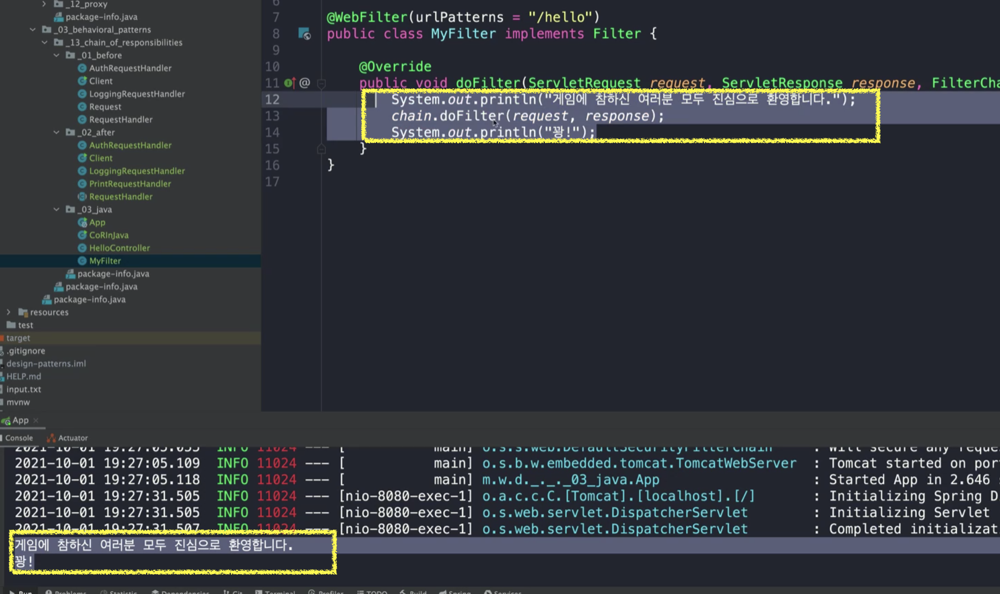
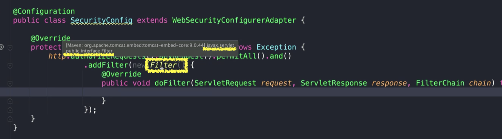
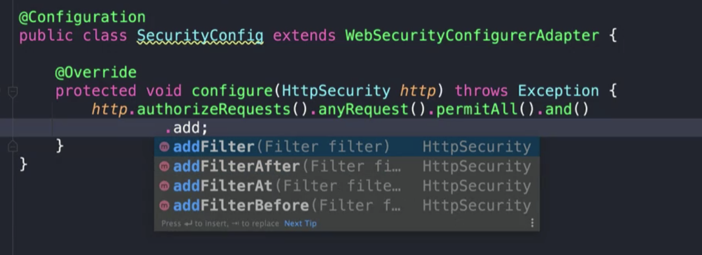

# 책임 연쇄 패턴 (Chain-of-Responsibility) 패턴

요청을 보내는 쪽(sender)과 요청을 처리하는 쪽(receiver)의 분리하는 패턴

핸들러 체인을 사용해서 요청을 처리한다.



* 여기서 말하는 책임은 "SRP(단일 책임 원칙)"의 책임이라고 보면 된다.
* 특정한 책임을 가진 클래스들이 체인처럼 연결되어있는 구조로 요청을 처리한다.
* 요청을 보내는 쪽에서는 요청을 처리하는 Handler가 어떤 구체적인 타입인지 상관없이 디커플링된 상태에서 요청을 처리할 수 있게끔 해주는 패턴이다.




## 적용할 수 있는 코드

* Client
  * 본문을 출력해주는 RequestHandler를 사용해서 요청을 처리한다.

```java
public class Client {

    public static void main(String[] args) {
        Request request = new Request("무궁화 꽃이 피었습니다.");
        RequestHandler requestHandler = new RequestHandler();
        requestHandler.handler(request);
    }
}
```

* RequestHandler
  * Request의 본문을 출력

```java
public class RequestHandler {

    public void handler(Request request) {
        System.out.println(request.getBody());
    }
}
```

* Request

```java
public class Request {

    private String body;

    public Request(String body) {
        this.body = body;
    }
	//getter, setter ...
}
```


### 요청을 받은 쪽에서 "인증"과정을 추가해야 한다면?

#### 방법1. 인증과정을 처리하는 코드를 handler에 추가한다.

```java
public class RequestHandler {

    public void handler(Request request) {
      //1. 인증 처리
        System.out.println("인증이 되었나?");
        System.out.println("이 핸들러를 사용할 수 있는 유저인가?");
      //2. 본문 출력
        System.out.println(request.getBody());
    }
}
```


⇒ "SRP(단일 책임 원칙)"에 위배된다.


#### 방법2. RequestHandler를 상속받아서 인증과정을 처리하는 AuthRequestHandler를 추가한다.

Client는 AuthRequestHandler를 사용해서 요청을 처리한다.

```java
public class AuthRequestHandler extends RequestHandler {

    @Override
    public void handler(Request request) {
        System.out.println("인증이 되었나?");
        System.out.println("이 핸들러를 사용할 수 있는 유저인가?");
        super.handler(request);
    }
}
```

```java
public class Client {

    public static void main(String[] args) {
        Request request = new Request("무궁화 꽃이 피었습니다.");
        RequestHandler requestHandler = new AuthRequestHandler(); //구체적인 핸들러를 지정
        requestHandler.handler(request);
    }
}
```


⇒ SRP(단일 책임 원칙)를 지킬 수 있다. 하지만, Client가 직접 어떤 핸들러를 사용해야 하는지 알아야 하고, 그에따라 코드가 변한다.


### "로깅" 처럼 해야할 일이 또 추가된다면?

로그와 관련된 LoggingRequestHandler를 추가한다.

Client는 LoggingRequestHandler를 사용해야 한다.

```java
public class LoggingRequestHandler extends RequestHandler {

    @Override
    public void handler(Request request) {
        System.out.println("로깅");
        super.handler(request);
    }
}
```

```java
public class Client {

    public static void main(String[] args) {
        Request request = new Request("무궁화 꽃이 피었습니다.");
        RequestHandler requestHandler = new LoggingRequestHandler();
        requestHandler.handler(request);
    }
}
```


### 문제점

인증과 로깅을 둘 다 적용하려면??

⇒ 해결 방법이 복잡해진다.

복잡해지는 이유는 클라이언트가 사용해야하는 핸들러를 직접 알아야하는 것이 문제가 되는 것이다.

여기에 책임 연쇄 패턴을 적용하면 클라이언트는 구체적으로 어떤 핸들러를 사용해야하는지 알 필요없이 요청만 하도록 할 수 있다.


## 책임 연쇄 패턴 적용

체인을 부분적으로 골라서 적용할 수도 있다.

### 1. Handler 인터페이스 또는 추상 클래스 정의

인터페이스로 정의해도 되지만, 다음 체인으로 이어지기 위한 필드가 필요하다. 어짜피 추상 클래스를 사용해야 한다.

* 다음 핸들러로 이어질 수 있도록 `nextHandler`를 생성자로 받아온다.
* `handle()`
  * 요청을 처리
  * `nextHandler`가 있다면 요청 처리를 다음 해들러로 넘겨준다.

```java
public abstract class RequestHandler {

    private RequestHandler nextHandler;

    public RequestHandler(RequestHandler nextHandler) {
        this.nextHandler = nextHandler;
    }

    public void handle(Request request) {
        if (nextHandler != null) {
            nextHandler.handle(request);
        }
    }
}
```


### 2. 요청 본문 출력 Handler 구현

```java
public class PrintRequestHandler extends RequestHandler {

    public PrintRequestHandler(RequestHandler nextHandler) {
        super(nextHandler);
    }

    @Override
    public void handle(Request request) {
        System.out.println(request.getBody());
        super.handle(request);
    }
}
```


### 3. 인증 처리 Handler 구현

* 아무런 처리를 하지않고 bypass 할 수도 있고,
* 인증 정보가 없다면 더이상 진행하지 않고, 요청 처리를 종료할 수 있다.

```java
public class AuthRequestHandler extends RequestHandler {

    public AuthRequestHandler(RequestHandler nextHandler) {
        super(nextHandler);
    }

    @Override
    public void handle(Request request) {
        System.out.println("인증이 되었는가?");
        super.handle(request);
    }
}
```


### 4. 로깅 처리 Handler 구현

* 요청에 특정 값이 있는 경우에만 동작할 수 있도록 할 수 있다.

```java
public class LoggingRequestHandler extends RequestHandler {

    public LoggingRequestHandler(RequestHandler nextHandler) {
        super(nextHandler);
    }

    @Override
    public void handle(Request request) {
        System.out.println("로깅");
        super.handle(request);
    }
}
```


### 5. 클라이언트에서 핸들러를 체이닝해서 사용

* `main()` 코드는 Client 밖에서 동작해도 된다.

* 체이닝한 Handler를 만들어서 넣어주면 된다.

* Client는 더이상 어떤 핸들러를 사용할 것인지 구체적으로 직접 지정하지 않아도 된다.

  ⇒ 요청을 보내는 쪽과 받는 쪽의 커플링이 끊겨졌다.

```java
public class Client {

    private RequestHandler requestHandler;

    public Client(RequestHandler requestHandler) {
        this.requestHandler = requestHandler;
    }

    public void doWork() {
        Request request = new Request("이번 놀이는 뽑기입니다.");
        requestHandler.handle(request);
    }

    public static void main(String[] args) {
        RequestHandler chain = new AuthRequestHandler(new LoggingRequestHandler(new PrintRequestHandler(null))); //체이닝 구성
        Client client = new Client(chain); //구성한 체인을 Client에 넘겨준다.
        client.doWork();
    }
}
```

```tex
인증이 되었는가?
로깅
이번 놀이는 뽑기입니다.
```


* 핸들러를 설계하는 것이 자유롭다. 모든 핸들러를 거쳐가거나 특정 핸들러만 거쳐가도록 할 수 있다.

* 단지, 체인을 만들어주는 곳에서만 체인이 결정된다. 또는 핸들러 내에서 핸들러를 어떻게 설계하느냐에 따라 결정
* 체인 순서가 중요할 수도 있고, 아닐 수도 있다. 애플리케이션의 특징이나 체인을 구성하기에 따라 달려있다.
* 복잡한 연결인 경우 체인을 1 → 2 → 3 → 2 → 1 순서처럼 다시 돌아오게 구성할 수 있다.


## 장점

* 클라이언트 코드를 변경하지 않고 새로운 핸들러를 체인에 추가할 수 있다.

  ⇒ `OCP(개방 폐쇄 원칙)` 객체지향 원칙을 따른다.

* 각각의 체인은 자신이 해야하는 일만 한다.

  ⇒ `SRP(단일 책임 원칙)` 객체지향 원칙을 따른다.

* 체인을 다양한 방법으로 구성할 수 있다.

## 단점

* 디버깅이 조금 어렵다.


## 실무 사용 예

이런 패턴의 경우 요청을 처리하는 과정 중에 filter, interceptor에서 찾아볼 수 있다.

* 자바

  * 서블릿 필터

  

* 스프링
  * 스프링 시큐리티 필터




### 1. 자바 - 서블릿 필터

Filter 인터페이스를 구현하려면 `doFilter()`를 오버라이딩해야 한다.

* 서블릿 필터
  *  서블릿 컨테이너로 들어오는 요청 중 특정 url 패턴에 해당하는 서블릿에 대해 필터링하는 용도로 Servlet 3.0 부터 추가된 기능
  * 요청을 처리하는 서블릿에게 전달되기 전에 여러개의 Filter를 거쳐서 최종적으로 서블릿에 전달된다.
  * 그 과정에서 계속해서 요청을 전달하려면 다음 체인(또는, 최종 목적지 서블릿)으로 넘기려면 `chain.doFilter()`를 호출해야 한다.
  * `chain.doFilter()` 호출 전에 전처리를 하거나, 호출 후 후처리(response에 헤더 추가, 값 변경 등..)를 할 수 있다.

```java
public class CoRInJava {

    public static void main(String[] args) {
        Filter filter = new Filter() {
            @Override
            public void doFilter(ServletRequest request, ServletResponse response, FilterChain chain) throws IOException, ServletException {
                // TODO 전처리
                chain.doFilter(request, response);
                // TODO 후처리
            }
        };
    }
}
```


#### 1. 필터 생성

* `javax.servlet.Filter` 인터페이스를 구현

* `@WebFilter`
  * 서블릿에서 제공하는 어노테이션 (스프링에서 제공하는 것이 아님)
  * 이 어노테이션을 스캔해서 빈으로 등록해주는 기능을 스프링이 가지고 있다. → `@ServletComponentScan`
  * urlPattern 지정 : 어떤 요청에 이 Filter를 적용할 것인지 지정
* `chain.doFilter(request, response);`
  * 본래 요청을 처리해야할 핸들러까지 보내주려면 호출해줘야 한다.
  * 조건에 따라 더이상 요청을 처리하지 않고 끝내려면 이를 호출하지 않으면 된다.

```java
import javax.servlet.*;
import javax.servlet.annotation.WebFilter;
import java.io.IOException;

@WebFilter(urlPatterns = "/hello")
public class MyFilter implements Filter {

    @Override
    public void doFilter(ServletRequest request, ServletResponse response, FilterChain chain) throws IOException, ServletException {
      //전처리
        System.out.println("게임에 참하신 여러분 모두 진심으로 환영합니다.");
        chain.doFilter(request, response); //요청을 본래 처리할 핸들러로 연결
      //후처리
        System.out.println("꽝!");
    }
}
```


#### 2. 스프링 부트 애플리케이션을 만들어서 필터를 사용해보자

* `@ServletComponentScan`
  * 서블릿 어노테이션을 스캔해서 빈으로 등록해준다.

```java
@ServletComponentScan
@SpringBootApplication
public class App {

    public static void main(String[] args) {
        SpringApplication.run(App.class, args);
    }
}
```


#### 3. 요청을 처리할 컨드롤러 

* "/hello" 요청을 처리할 핸들러를 하나 정의

```java
@RestController
public class HelloController {

    @GetMapping("/hello")
    public String hello() {
        return "hello";
    }
}
```


애플리케이션을 실행하면 스프링 시큐리티 설정이 되어있어서 로그에 출력되는 `Using generated security password` 값을 복사해서 [ID : user, PW : 복사한 값]으로 로그인하면 된다.

요청이 필터를 거쳐 서블릿까지 잘 전달되었다면 다음과 같이 Filter에서 전처리/후처리에서 출력한 값과 Response 메시지를 확인할 수 있다.






### 2. 스프링 시큐리티 필터

스프링 시큐리티를 웹에 적용하는 경우 보통 `WebSecurityConfigurerAdapter`를 상속받아서 설정을 오버라이딩한다.

다음 예시는 http 요청에 대해 인증을 따로 거치지 않고, 모든 요청을 허락한다는 의미이다.

이렇게하면 시큐리티 로그인 페이지없이 바로 접근할 수 있다.

```java
@Configuration
public class SecurityConfig extends WebSecurityConfigurerAdapter {

    @Override
    protected void configure(HttpSecurity http) throws Exception {
        http.authorizeRequests().anyRequest().permitAll().and(); //인증을 따로 거치지 않고, 모든 요청을 허락
    }

}
```


* 이 자체가 하나의 거대한 Filter Chain을 설정하는 코드이다.

* 체이닝 하는 과정을 이 코드에서 한다. `addFilterXXX()` 

  필터를 특정 필터 이전/이후에 추가, 맨 마지막에 추가 등등이 가능"

* "스프링 시큐리티의 필터는 서블릿 필터와 동일하다.

  * Filter 패키지를 확인해보면 `javax.servlet`이다.

  

* 스프링 시큐리티는 아주 거대한 스프링 시큐리티 필터들의 체인이다. 이 체인을 `FilterChainProxy`로 부터 참조한다. 체인을 쭉 거치면서 처리된다.

* 스프링 시큐리티가 제공하는 기본 필터들이 이미 체인을 구성하고 있어서 별다른 설정을 하지 않아도, 그 구성된 필터 중의 일부를 바꾸거나 임의의 필터를 만들어서 추가하는 작업이 가능하다. 



