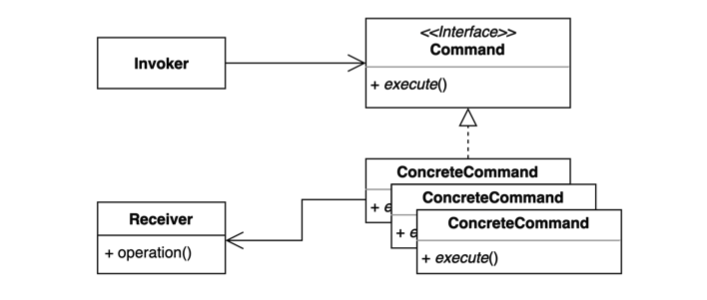
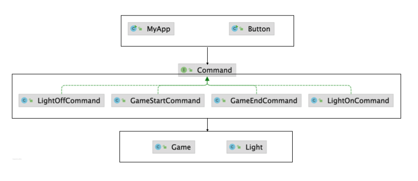

# 커맨드 (Command) 패턴

요청을 캡슐화 하여 호출자(invoker)와 수신자(receiver)를 분리하는 패턴.

요청을 처리하는 방법이 바뀌더라도, 호출자의 코드는 변경되지 않는다.




커맨드 패턴을 적용해서 요청을 캡슐화한다.

요청(Command) 안에 어떤 모든 정보가 들어있다. 오퍼레이션(Receiver)을 호출해야하는지, Receiver를 호출할 때 필요한 파라미터 정보, 명령을 수행하기 위한 모든 작업을 Command라는 인터페이스로 캡슐화 한다.

* Invoker는 추상화되어있는 Command 인터페이스에 `execute()`만 호출한다.

* Command 자체를 재사용할 수 있다.

* Command를 로깅, 언두(unDo)작업 등을 추가적으로 할 수 있다.

* Command Interface
  * 여러 구체 Command를 추상화한 인터페이스
  * 인터페이스 또는 추상클래스를 사용해도 된다.
* ConcreteCommand
  * 구체적인 Command
  * 실질적으로 어떠한 Receiver를 사용할지, 오퍼레이션 정보들이 담긴다.
* Receiver
  * 요청에 대한 작업을 수행



## 적용할 수 있는 코드

* `Button` → `Invoker` 요청을 보내는 쪽
* `Light` → `Receiver` 요청을 받는 쪽

* Button

  * press() : 버튼을 누른다.

    * 버튼을 눌렀을 때 불을 키려면 `light.on()`를 호출
    * 버튼을 눌렀을 때 불을 끄려면 `light.off()`을 호출
    * 버튼을 눌렀을 때 어떠한 행동을 할 것인지에 따라 코드를 수정해야한다.

  * `Light`의 변경의 영향이 여기까지 전달될 수 있다.

    ex) `Light`의 `off()` 메서스명이 `turnOff()`로 변경되면, Button 코드도 수정해야 한다.

```java
public class Button {

    private Light light;

    public Button(Light light) {
        this.light = light;
    }

    public void press() {
        light.off();
    }

    public static void main(String[] args) {
        Button button = new Button(new Light());
        button.press();
        button.press();
        button.press();
        button.press();
    }
}
```

* Light

```java
public class Light {

    private boolean isOn;

    public void on() {
        System.out.println("불을 켭니다.");
        this.isOn = true;
    }

    public void off() {
        System.out.println("불을 끕니다.");
        this.isOn = false;
    }

    public boolean isOn() {
        return this.isOn;
    }
}
```

* Game

```java
public class Game {

    private boolean isStarted;

    public void start() {
        System.out.println("게임을 시작합니다.");
        this.isStarted = true;
    }

    public void end() {
        System.out.println("게임을 종료합니다.");
        this.isStarted = false;
    }

    public boolean isStarted() {
        return isStarted;
    }
}
```


#### MyApp에서 똑같이 Light 불을 끄고 켜고 싶다면?

* Button 에서의 코드와 중복되는 부분이 많다.

```java
public class MyApp {

    private Light light;

    public MyApp(Light light) {
        this.light = light;
    }

    public void press() {
        light.off();
    }

    public static void main(String[] args) {
        Button button = new Button(new Light());
        button.press();
        button.press();
        button.press();
        button.press();
    }
}
```


#### MyApp과 Button에서 Light를 끄고 키는 것이 아니라 Game을 시작하거나 종료하고 싶다면?

MyApp에서 Game을 `start()`, `end()`하도록 코드를 다 수정해줘야 한다.

```java
public class MyApp {

    private Game game;

    public MyApp(Game game) {
        this.game = game;
    }

    public void press() {
        game.start();
    }

    public static void main(String[] args) {
        Button button = new Button(new Light());
        button.press();
        button.press();
        button.press();
        button.press();
    }
}
```


### 문제점

* 코드의 변경이 자주 일어난다.
* 요청을 보내는 쪽에서 비슷한 코드가 중복된다.

⇒ Invoker와 Receiver 간의 관계가 타이트하게 연결되어 있기 때문이다.


## 커맨드 패턴 적용

### 1. Command 인터페이스 정의

* 이렇게 따로 정의하지 않고, 자바의  `Runnable`인터페이스를 사용해도 문제없다.

```java
public interface Command {
    void execute();
}
```


### 2. ConcreteCommand 구현

* LightOnCommand

  불을 켜는 작업을 하기 위한 모든 요소가 있어야 한다.

  어떤 인스턴스를 어떠한 파라미터를 가지고 호출할지 등..

  * undo() : 불을 켜는 것의 undo 작업은 불을 끄는 것이기 때문에 `LightOffCommand`를 실행한다.

    ```java
    public class LightOnCommand implements Command {
  
        private Light light;
  
        public LightOnCommand(Light light) {
            this.light = light;
        }
  
        @Override
        public void execute() {
            light.on();
        }
  
        @Override
        public void undo() {
            new LightOffCommand(this.light).execute();
        }
    }
    ```

* LightOffCommand

    ```java
    public class LightOffCommand implements Command {
    
        private Light light;
    
        public LightOffCommand(Light light) {
            this.light = light;
        }
    
        @Override
        public void execute() {
            light.off();
        }
    
        @Override
        public void undo() {
            new LightOnCommand(this.light).execute();
        }
    }
    ```

* GameStartCommand

    ```java
    public class GameStartCommand implements Command {
    
        private Game game;
    
        public GameStartCommand(Game game) {
            this.game = game;
        }
    
        @Override
        public void execute() {
            game.start();
        }
    
        @Override
        public void undo() {
            new GameEndCommand(this.game).execute();
        }
    }
    ```

* GameEndCommand

  ```java
    public class GameEndCommand implements Command {
    
        private Game game;
    
        public GameEndCommand(Game game) {
            this.game = game;
        }
    
        @Override
        public void execute() {
            game.end();
        }
    
        @Override
        public void undo() {
            new GameStartCommand(this.game).execute();
        }
    }
    ```


### 3. Button 클래스가 Command를 사용하도록 수정

* Command를 받아서 실행(`execute()`)하면 된다.
* Button을 사용할 때, Command 구현체를 넣어서 생성해주면 된다.

```java
public class Button {

    private Command command;
  
    public Button(Command command) {
      this.command = command;
    }

    public void press(Command command) {
        command.execute();
    }

    public static void main(String[] args) {
        Button button = new Button(new Command() {
          
          @Override
          public void execute() {
            
          }
        });
        button.press();
        button.press();
    }

}
```


1. 버튼으로 불을 켜고 싶다면 Command 구현체로 `LightOnCommand` 인스턴스를 넘겨주면 된다.

   ```java
   public static void main(String[] args) {
     Button button = new Button(new LightOnCommand(new Light()));
     button.press();
     button.press();
   }
   ```

   ```tex
   불을 켭니다.
   불을 켭니다.
   ```

2. 버튼으로 게임을 시작하고 싶다면 Command 구현체로 `GameStartCommand` 인스턴스를 넘겨주면 된다.

   ```java
   public static void main(String[] args) {
     Button button = new Button(new GameStartCommand(new Game()));
     button.press();
     button.press();
   }
   ```


### 4. undo 기능 활용

* Stack에 명령이 들어오는 대로 쌓아둔다.
* Button의 `undo()`를 호출하면, Stack의 가장 상위명령(최근 명령)부터 꺼내서 `undo()`를 수행한다.

```java
public class Button {

    private Stack<Command> commands = new Stack<>();

    public void press(Command command) {
        command.execute();
        commands.push(command);
    }

    public void undo() {
        if (!commands.isEmpty()) {
            Command command = commands.pop();
            command.undo();
        }
    }

    public static void main(String[] args) {
        Button button = new Button();
        button.press(new GameStartCommand(new Game()));
        button.press(new LightOnCommand(new Light()));
        button.undo();
        button.undo();
    }

}
```

```tex
게임을 시작합니다.
불을 켭니다.
불을 끕니다.
게임을 종료합니다.
```


### 5. 다른 애플리케이션에서 Command를 재사용

* 이미 만들어둔 Command를 재사용할 수 있다.

```java
public class MyApp {

    private Command command;

    public MyApp(Command command) {
        this.command = command;
    }

    public void press() {
        command.execute();
    }

    public static void main(String[] args) {
        MyApp myApp = new MyApp(new GameStartCommand(new Game()));
    }
}
```


Invoke 쪽 Button의 코드는 변경이 없다.

Receiver 코드가 변경돼도 Invoke 코드는 변경되지 않는다. 다만 구체  Command에서는 구체적으로 Receiver를 어떻게 써야하는지 알고있어야 하므로 수정해야 한다.

ex) Light에서 불을 끄는 메소드 명이 `off() → turnOff()`로 변경되어도 Button 쪽 코드는 수정되지 않고, LigthOffCommand 코드만 변경해주면 된다.

**Command 코드가 변경된다 하더라도 Invoke 코드가 변경되지 않는다는 점이 중요하다.**

또한 **만들어둔 Command를 재사용할 수 있어서 중복코드를 줄일 수 있다.**

 Receiver 코드가 변경되면 이를 사용하는 여러 Invoke 코드를 수정하지 않고, Command 코드만 수정하면 되기 때문에 변경 범위가 축소된다.


## 장점

* 기존 코드를 변경하지 않고 새로운 커맨드를 만들 수 있다.

  ⇒ `OCP(개방 폐쇄 원칙)` 객체지향 원칙을 따른다.

* 수신자의 코드가 변경되어도 호출자의 코드는 변경되지 않는다.

* 각  커맨드가 자신이 해야할 일만 하고 있다.

  ⇒ `SRP(단일 책임 원칙)` 객체지향 원칙을 따른다.

* 커맨드 객체를 언두(undo), 로깅, DB에 저장, 네트워크로 전송 하는 등 다양한 방법으로 활용할 수도 있다.

### 단점

* 코드가 복잡하고 클래스가 많아진다.


## 실무 사용 예

* 자바
  * Runnable
  * 람다
  * 메소드 레퍼런스
* 스프링
  * SimpleJdbcInsert
  * SimpleJdbcCall
    * Jdbc에 있는 StoredProcedure를 호출할 때 사용할 수 있다.
    * 일종의 Command 인스턴스를 만들 수 있는 편리한 클래스


### 1. 자바

* Executors : 스레드풀을 만들어주는 일종의 Factory 클래스
* ExecutorService : 스레드풀을 활용해서 비동기적으로 오퍼레이션을 실행할 수 있는 기능 제공
  * `submint()`에 `Runnable()` 구현체를 넘겨준 것과 비슷하다.
  * Runnale()을 `Command`라고 볼 수 있다.
    * 스레드를 실행할 때 해야하는 모든 일이 Runnable 타입의 인스턴스 내에 구현돼있다.
  * 넘겨받은 Command를 ExecutorService가 실행시켜준다.

```java
public class CommandInJava {

    public static void main(String[] args) {
        Light light = new Light();
        Game game = new Game();
        ExecutorService executorService = Executors.newFixedThreadPool(4); //4개의 스레드를 가진 스레드풀 생성
			 executorService.submit(new Runnable() { //자바 8이전 익명 클래스
            @Override
            public void run() {
                light.on();;
            }
        });
        executorService.submit(() -> game.start()); //람다
        executorService.submit(game::end); //메소드 레퍼런스
        executorService.submit(light::off);
        executorService.shutdown();
    }
}
```


### 2. 스프링

* SimpleJdbcInsert
  * 일종의 하나의 Command라고 보면 된다.
  * 내부적으로 JdbcTemplate을 사용
  * Insert 쿼리를 실행하기 위해 필요한 모든 정보를 가지고 있는 Command Object
  * Command를 만들기 위한 편의성 메소드 제공 - `withTableName()`, `usingGeneratedKeyColumns()`
  * 최종적으로 `execute()`를 실행

```java
public class CommandInSpring {

    private DataSource dataSource;

    public CommandInSpring(DataSource dataSource) {
        this.dataSource = dataSource;
    }

    public void add(Command command) {
        SimpleJdbcInsert insert = new SimpleJdbcInsert(dataSource)
                .withTableName("command")
                .usingGeneratedKeyColumns("id");

        Map<String, Object> data = new HashMap<>();
        data.put("name", command.getClass().getSimpleName());
        data.put("when", LocalDateTime.now());
        insert.execute(data);
    }

}
```


