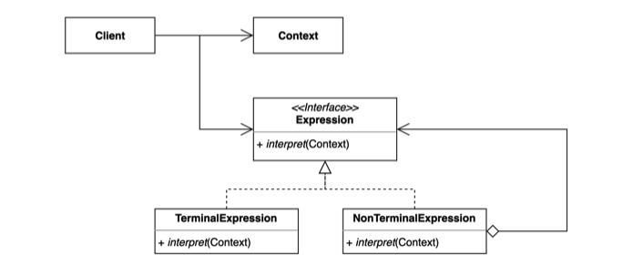

# 인터프리터 (Interpreter) 패턴

자주 등장하는 문제를 간단한 언어로 정의하고 재사용하는 패턴.

반복되는 문제 패턴을 언어 또는 문법으로 정의하고 확장할 수 있다.



※ 인터프리터

* 사람이 작성한 코드를 기계가 이해할 수 있는 형태로 변환해주는 장치(컴파일러)
* 연주자들, 통역하는 사람


정규표현식이 일종의 인터프리터라고 보면된다.

가지고 있는 문서(문자셋)에서 특정 패턴(정규표현식)에 해당하는 문장,단어들을 찾을 수 있다.

**구조**

* Context
  * 모든 Expression에서 사용하는 공통된 정보
  * 글로벌 변수, 값들이 모여있는 곳
* Expression Interface
  * `interpret(Context)` : Context값을 참조한다.
  * 표현하는 문법을 나타낸다.
  * TerminalExpression
    * 그 자체로 종료가 되는 Expression
  * NonTerminalExpression
    * 다른 Expression을 재귀적으로 참조하고 있는 Expression
    * TerminalExpression 또는 NonTerminalExpression을 참조할 수 있다.
  * 예제 - "xyz+-" 를 Expression 트리구조로 표현할 수 있다.
    * x, y, z → 자신의 값을 반환하고 실행이 종료되기 때문에 `TerminalExpression`이다.
    * +, - → 다른 Expression 두 개를 Interpret한 다음에 그 결과를 더한 뒤 종료된다.
      * 다른 Expression Interpret하려면 다른 Expression을 타야하므로 `NonTerminalExpression`이다.
  * 이 부분이 컴포짓(Composite) 패턴 구조와 아주 유사하다.
    * 컴포짓 패턴을 사용해서 정의하는 트리구조가 AST(Abstract Syntax Tree, 추상 구문 트리)이다.
  * Expression들로 AST를 만드는 것이다.
    * 문법을 구조적으로 표현한 트리라고 생각하면 된다.
  * 만들어진 AST에 interpret()를 호출해서 문제를 해결한다.


## 적용할 수 있는 코드

* InFix(중위표현식) : 연산자를 두 피연산자 사이에 표기 ex. 1 + 2 - 5
* PostFix(후위표현식) : 연산자를 두 피연산자 뒤에 표기 ex. 1 2 + 5 -
* PretFix(전위표현식) : 연산자를 두 피연산자 앞에 표기 ex. + 1 2 - 5


* PostfixNotation : 후위 표현식을 계산해주는 클래스

```java
public class PostfixNotation {

    private final String expression;

    public PostfixNotation(String expression) {
        this.expression = expression;
    }

    private void calculate() {
        Stack<Integer> numbers = new Stack<>();

        for (char c : this.expression.toCharArray()) {
            switch (c) {
                case '+':
                    numbers.push(numbers.pop() + numbers.pop());
                    break;
                case '-':
                    int right = numbers.pop();
                    int left = numbers.pop();
                    numbers.push(left - right);
                    break;
                default:
                    numbers.push(Integer.parseInt(c + ""));
            }
        }

        System.out.println(numbers.pop());
    }
  
  
    public static void main(String[] args) {
        PostfixNotation postfixNotation = new PostfixNotation("123+-"); // 1 - (2 + 3)
        postfixNotation.calculate();
    }
}
```


### 만약 `"123+-"`라는 표현식을 자주 사용한다면?

위 표현식에서 1, 2, 3이라는 숫자만 바꿔서 자주 사용하는 경우, 인터프리터 패턴을 적용해보는 것을 고려할 수 있다.

`"xyz+-"` 라는 일종의 표현식, 문법... PostFix를 지원하는 문법이 되는 것이다.

`x`, `y`, `z`가 일종의 언어가 되어야 한다. 이 `x`, `y`, `z`값을 "도메인에 특화되어있는 언어(DSL, domain specific language)"라고 한다. 도메인에 특화된 단어들을 사용할 수 있다.


## 인터프리터 패턴 적용

### 0. Client에서 사용하는 코드

1. `parse()` : 문법 Expression구조로 변환해주기 위해 문자열을 파싱한다.
2. 파싱한 결과로 `PostfixExpression`을 얻는다.
3. `Expression`을 `interpret()`한다. 이 때, Context 정보를 준다.
   * Context는 x, y, z, a 각각이 어떠한 값인지에 대한 정보이다.
   * `Map.of()` : key-value 값으로 정의할 수 있다.

```java
public class App {

    public static void main(String[] args) {
        PostfixExpression expression = PostfixParser.parse("xyz+-a+"); //최종적으로 MinuxExpression이 반환된다.
        int result = expression.interpret(Map.of('x', 1, 'y', 2, 'z', 3, 'a', 4));
        System.out.println(result);
    }
}
```


### 1. Expression Interface 정의

* `interpret()` 정의
  * Map 형식의 context를 전달받아서 int형 결과를 반환한다.

```java
public interface PostfixExpression {

    int interpret(Map<Character, Integer> context);

}
```


### 2. Terminal Expression 정의

* x, y, z 가 해당한다.
* Character 형태의 variable을 받아서 context에서 해당하는 값을 찾아서 반환한다.

```java
public class VariableExpression implements PostfixExpression {

    private Character character;

    public VariableExpression(Character character) {
        this.character = character;
    }

    @Override
    public int interpret(Map<Character, Integer> context) {
        return context.get(this.character);
    }
}
```


### 3. NonTerminalExpression

1. PlusExpression 정의

   * Expression 2개가 필요 - `left`, `right`

   * context를 이용해 `left`를 interpret하고, `right`를 interpret한 결과를 더해서 반환

    ```java
    public class PlusExpression implements PostfixExpression {
   
        private PostfixExpression left;
   
        private PostfixExpression right;
   
        public PlusExpression(PostfixExpression left, PostfixExpression right) {
            this.left = left;
            this.right = right;
        }
   
        @Override
        public int interpret(Map<Character, Integer> context) {
            return left.interpret(context) + right.interpret(context);
        }
    }
    ```
   
1. MinusExpression 정의

   ```java
   public class MinusExpression implements PostfixExpression {
   
       private PostfixExpression left;
   
       private PostfixExpression right;
   
       public MinusExpression(PostfixExpression left, PostfixExpression right) {
           this.left = left;
           this.right = right;
       }
   
       @Override
       public int interpret(Map<Character, Integer> context) {
           return left.interpret(context) - right.interpret(context);
       }
   }
   ```
   
   

### 4. Parser 구현

* parse()
  * 넘겨받은 문자열을 파싱한다.
  * Character를 하나씩 순회하면서 문자에 해당하는 Expresstion을 만들어서 Stack에 넣어준다.
* getExpression()
  * `+` : 두 개의 expression을 꺼내서 `PlusExpression`을 만든다.
  * `-` : 위에 있는 것이 right, 아래에 있는 것이 left이다. 이 둘을 꺼내서 `MinusExpression`을 만든다.
  * 그 외, `VariableExpression`을 만든다.

```java
public class PostfixParser {

    public static PostfixExpression parse(String expression) {
        Stack<PostfixExpression> stack = new Stack<>();
        for (char c : expression.toCharArray()) {
            stack.push(getExpression(c, stack));
        }
        return stack.pop(); //최종적으로 스택에 하나의 Expression만 남아있게 된다.
    }

    private static PostfixExpression getExpression(char c, Stack<PostfixExpression> stack) {
        switch (c) {
            case '+':
                return new PlusExpression(stack.pop(), stack.pop());
            case '-':
                PostfixExpression right = stack.pop();
                PostfixExpression left = stack.pop();
                return new MinusExpression(left, right);
            default:
                return new VariableExpression(c);
        }
    }
}
```


※ 동작 흐름


이를 일종의 AST(Abstract Syntax Tree, 추상 구문 트리)라고 볼 수 있다.


### Java 8 이후 도입된 interface static method로 코드 개선

#### 1. PostfixExpression 인터페이스에 static method 구현

* plus() / minus()
  * PostfixExpression 구현체를 만들어주는 static 메소드
  * left, right 두 개의 값을 받아서 각각 context 값을 가지고 interpret()한 값을 더해서/빼서 반환
  * 익명 메소드 형태 또는 람다 표현식으로 작성할 수 있다.
* variable()
  * context에서 값을 찾아서 반환

```java
public interface PostfixExpression {

    int interpret(Map<Character, Integer> context);

    static PostfixExpression plus(PostfixExpression left, PostfixExpression right) {
        return context -> left.interpret(context) + right.interpret(context);
        /*
        return new PostfixExpression() {
            @Override
            public int interpret(final Map<Character, Integer> context) {
                return left.interpret(context) + right.interpret(context);
            }
        };
         */
    }

    static PostfixExpression minus(PostfixExpression left, PostfixExpression right) {
        return context -> left.interpret(context) - right.interpret(context);
    }
    
    static PostfixExpression variable(Character c) {
        return context -> context.get(c);
    }
}
```


#### 2. 기존의  `MinusExpression`, `PlusExpression`, `VariableExpression`  클래스가 필요없어지기 때문에 삭제한다.


#### 3. PostfixParser에서 PostfixExpression의 static 메소드를 사용하도록 코드 수정

```java
public class PostfixParser {

    public static PostfixExpression parse(String expression) {
        Stack<PostfixExpression> stack = new Stack<>();
        for (char c : expression.toCharArray()) {
            stack.push(getExpression(c, stack));
        }
        return stack.pop(); //최종적으로 스택에 하나의 Expression만 남아있게 된다.
    }

    private static PostfixExpression getExpression(char c, Stack<PostfixExpression> stack) {
        switch (c) {
            case '+':
                return PostfixExpression.plus(stack.pop(), stack.pop());
            case '-':
                PostfixExpression right = stack.pop();
                PostfixExpression left = stack.pop();
                return PostfixExpression.minus(left, right);
            default:
                return PostfixExpression.variable(c);
        }
    }
}
```


## 장점

* 자주 등장하는 문제 패턴을 언어와 문법으로 정의할 수 있다.

* 기존 코드를 변경하지 않고 새로운 Expression을 추가할 수 있다.

  * 표현식이 추가되면 Parser는 추가한 문법을 지원하는 형태로 바뀌어야하기 때문에 수정이 필요하다.
  * 기존의 Expression은 영향을 받지 않는다.

  ⇒ `OCP(개방 폐쇄 원칙)` 객체지향 원칙을 따른다.

* 각각의 Expression이 자신의 역할만 담당한다.

  ⇒ `SRP(단일 책임 원칙)` 객체지향 원칙을 따른다.

## 단점

* 복잡한 문법을 표현하려면 Expression과 Parser가 복잡해진다.


## 실무 사용 예

* 자바
  * 자바 컴파일러
  * 정규 표현식
* 스프링
  * SpEL (스프링 Expression Language)


### 1. 자바 - 정규표현식

```java
public class InterpreterInJava {

    public static void main(String[] args) {
        System.out.println(Pattern.matches(".pr...", "spring"));
        System.out.println(Pattern.matches("[a-z]{6}", "spring"));
        System.out.println(Pattern.matches("white[a-z]{4}[0-9]{4}", "whiteship2000"));
        System.out.println(Pattern.matches("\\d", "1")); // one digit
        System.out.println(Pattern.matches("\\D", "a")); // one non-digit
    }
}
```


### 2. 스프링 - SpEL

* Book 오브젝트에서 "title"에 해당하는 값을 꺼내서 출력하는 예제

```java
public class InterpreterInSpring {

    public static void main(String[] args) {
        Book book = new Book("spring");

        ExpressionParser parser = new SpelExpressionParser();
        Expression expression = parser.parseExpression("title");
        System.out.println(expression.getValue(book));
    }
}
```

```java
public class Book {

    private String title;

    public Book(String title) {
        this.title = title;
    }

   // getter, setter
}
```


* `@Value()` 에 `#{SpEL}` 을 넣으면 `ExpressionParser`와 `Expression`으로 보고 그 값을 구해서 결과를 변수에 넣어준다.

```java
@Service
public class MyService implements ApplicationRunner {

    @Value("#{2 + 5}")
    private String value;

    @Override
    public void run(ApplicationArguments args) throws Exception {
        System.out.println(value); // 7
    }
}
```

```java
@SpringBootApplication
public class App {

    public static void main(String[] args) {
        SpringApplication app = new SpringApplication(App.class);
        app.setWebApplicationType(WebApplicationType.NONE);
        app.run(args);
    }
}
```


