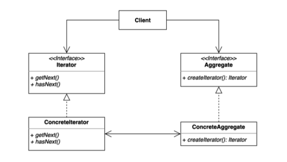
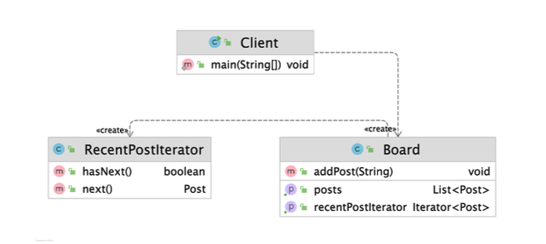
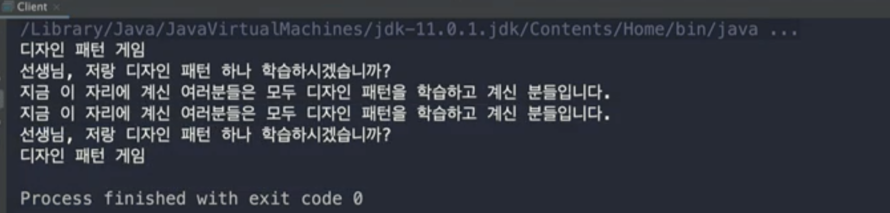
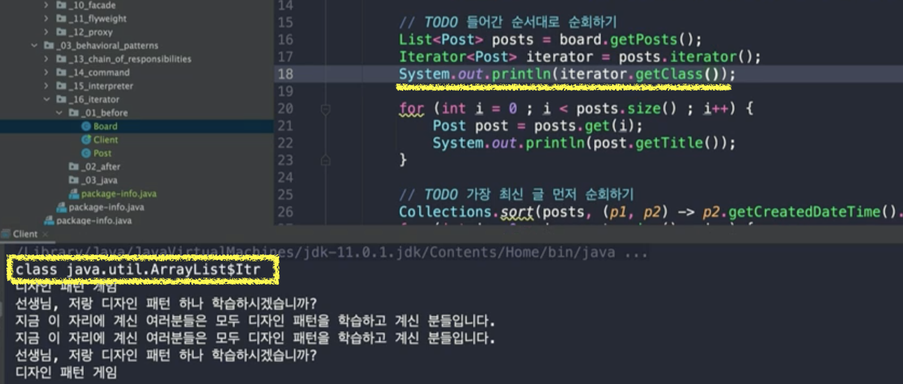
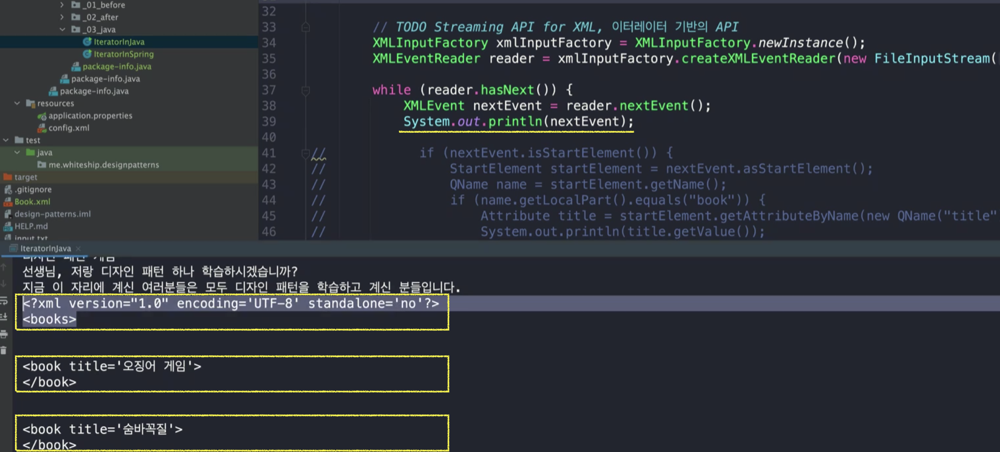
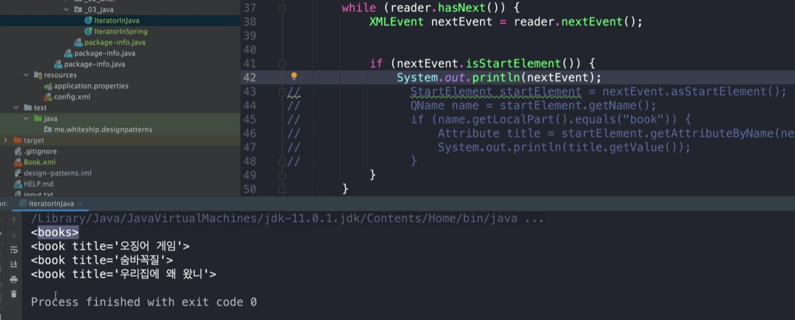
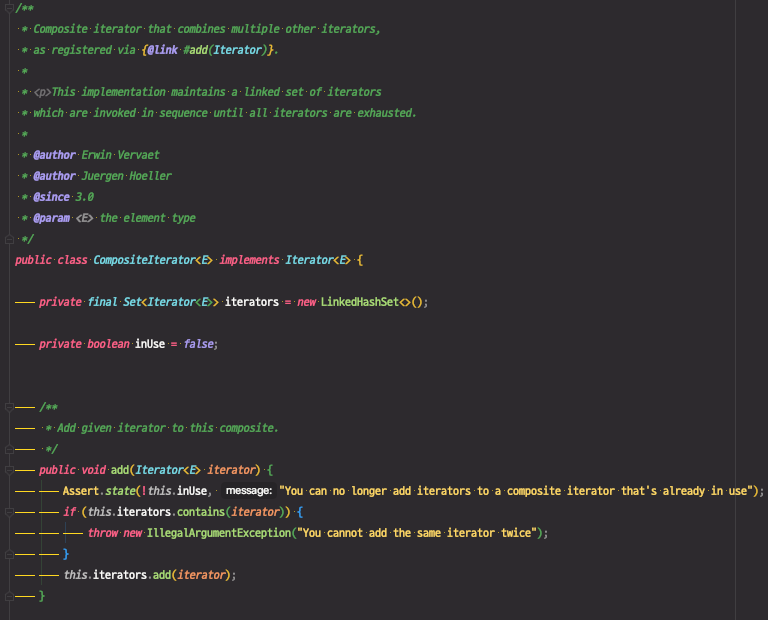

# 이터레이터 (Interator) 패턴

집합 객체 내부 구조를 노출시키지 않고 순회 하는 방법을 제공하는 패턴.

집합 객체를 순회하는 클라이언트 코드를 변경하지 않고 다양한 순회 방법을 제공할 수 있다.



* Iterator Interface
  * Client가 사용하는 인터페이스
  * 어떻게 순회할지에 대한 방법을 가지고 있다.
  * getNext() : 다음 Element로 넘어간다.
  * hasNext() : 다음 Element가 있는지 확인한다.
* ConcreteIterator
  * Iterator를 구현한 구현체
  * 구체적인 로직을 구현
* Aggregate Interface
  * 있을 수도 있고, 없을 수도 있다.
* ConcreteAggregate
  * Aggregate 구현체




* RecentPostIterator : ConcreteIterator
* Board : ConcreteAggregate


## 적용할 수 있는 코드

* Client
  * Board에 여러 Post를 추가
  * Board 내에 있는 Post를 순회한다.

```java
public class Client {

    public static void main(String[] args) {
        Board board = new Board();
        board.addPost("디자인 패턴 게임");
        board.addPost("선생님, 저랑 디자인 패턴 하나 학습하시겠습니까?");
        board.addPost("지금 이 자리에 계신 여러분들은 모두 디자인 패턴을 학습하고 계신 분들입니다.");

        // TODO 들어간 순서대로 순회하기
        List<Post> posts = board.getPosts();
        for (int i = 0 ; i < posts.size() ; i++) {
            Post post = posts.get(i);
            System.out.println(post.getTitle());
        }

        // TODO 가장 최신 글 먼저 순회하기
        Collections.sort(posts, (p1, p2) -> p2.getCreatedDateTime().compareTo(p1.getCreatedDateTime()));
        for (int i = 0 ; i < posts.size() ; i++) {
            Post post = posts.get(i);
            System.out.println(post.getTitle());
        }
    }

}
```




* Board
  * Post를 가지고 있는 집합 객체

```java
public class Board {

    List<Post> posts = new ArrayList<>();

    public List<Post> getPosts() {
        return posts;
    }

    public void setPosts(List<Post> posts) {
        this.posts = posts;
    }

    public void addPost(String content) {
        this.posts.add(new Post(content));
    }
}
```


* Post

```java
public class Post {

    private String title;

    private LocalDateTime createdDateTime;

    public Post(String title) {
        this.title = title;
        this.createdDateTime = LocalDateTime.now();
    }
	// getter, setter
}
```


### 문제점

* Board에 들어간 Post를 순회할 때, Board가 어떠한 구조로 이루어져 있는지를 Client가 알게된다.

  ex) Board에 Post가 List로 담겨있다는 정보 등..

* Board가 자료구조를 List에서 Set이나 Array로 바꾸게 되면 Client 코드도 변경에 영향을 받게 된다.


## 이터레이터 패턴 적용

아래 예제에서 `List`는 `Aggregate Interface`, `Iterator`는  `Iterator Interface`가 된다.

posts의 실제 구현체인 `ArrayList`가 `ConcreteAggregate`, 그리고 Iterator에 실질적으로 넘어올 수 있는 여러 타입들이 `ConcreteIterator`가 된다. 

출력해서 확인해보면 `ArrayList의 Iterator`가 `ConcreteIterator`이다.

```java
List<Post> posts = board.getPosts(); // List<Post> posts = new ArrayList<>();
Iterator<Post> iterator = posts.iterator();
```




자바에서 제공하는 `Iterator` 인터페이스를 사용할 수 있다.

* Board 내부에서 Post를 어떤 자료구조로 사용하고 있는지 알 필요가 없어진다.

```java
public class Client {

    public static void main(String[] args) {
        Board board = new Board();
        board.addPost("디자인 패턴 게임");
        board.addPost("선생님, 저랑 디자인 패턴 하나 학습하시겠습니까?");
        board.addPost("지금 이 자리에 계신 여러분들은 모두 디자인 패턴을 학습하고 계신 분들입니다.");

        // TODO 들어간 순서대로 순회하기
        Iterator<Post> iterator = board.getPosts().iterator();
        while(iterator.hasNext()) {
          System.out.println(iterator.next().getTitle());
        }
    }

}
```


더 좋은 방법은 Board에 Iterator를 반환해주는 기능을 추가하는 것이다.

```java
public class Board {

    List<Post> posts = new ArrayList<>();

    public List<Post> getPosts() {
        return posts;
    }

    public void addPost(String content) {
        this.posts.add(new Post(content));
    }

  // Iterator 제공
    public Iterator<Post> getDefaultIterator() {
        return posts.iterator();
    }

}
```


그러면, 클라이언트는 `getDefaultIterator()`로 Iterator를 받아와서 사용할 수 있다.

```java
public class Client {

    public static void main(String[] args) {
        Board board = new Board();
        board.addPost("디자인 패턴 게임");
        board.addPost("선생님, 저랑 디자인 패턴 하나 학습하시겠습니까?");
        board.addPost("지금 이 자리에 계신 여러분들은 모두 디자인 패턴을 학습하고 계신 분들입니다.");

        // TODO 들어간 순서대로 순회하기
        Iterator<Post> iterator = board.getDefaultIterator;
        while(iterator.hasNext()) {
          System.out.println(iterator.next().getTitle());
        }
    }

}
```


지금은 `Book`이라는 ConcreteAggregate 뿐이지만 Interface가 있으면 더 유연해진다.

기본 Iterator를 ConcreateAggregate에 따라서 각기 다른 Iterator를 넘겨줄 수 있다.


### 1. Iterator 구현체를 생성

Iterator 인터페이스는 자바에서 제공하고 있으므로 구현체만 생성하면 된다.

* 자바의 Iterator를 내부적으로 사용한다. → `internalIterator`
* `RecentPostIterator()` 로 Iterator를 반환한다.
  * Board를 받아서 posts를 꺼내서 써도 되고, posts를 바로 전달받아도 된다.
  * 이를 기준에 맞게 정렬한 뒤, Iterator를 반환한다.

```java
public class RecentPostIterator implements Iterator<Post> {

    private Iterator<Post> internalIterator;

    public RecentPostIterator(List<Post> posts) { //Board로 받아도 된다. (선택사항)
      //최신 글 목록이 먼저 오도록 정렬
        Collections.sort(posts, (p1, p2) -> p2.getCreatedDateTime().compareTo(p1.getCreatedDateTime()));
        this.internalIterator = posts.iterator();
    }

    @Override
    public boolean hasNext() {
        return this.internalIterator.hasNext(); //위임
    }

    @Override
    public Post next() {
        return this.internalIterator.next(); //위임
    }
}
```


### 2. Board에서 앞서 만든 ConcreteIterator를 제공하도록 추가

* `getRecentPostIterator()` 추가

```java
public class Board {

    List<Post> posts = new ArrayList<>();

    public List<Post> getPosts() {
        return posts;
    }

    public void addPost(String content) {
        this.posts.add(new Post(content));
    }

  //Iterator 반환
    public Iterator<Post> getRecentPostIterator() {
        return new RecentPostIterator(this.posts); //this로 Board를 넘겨줘도 되고, posts를 넘겨줘도 된다. (선택)
    }

}
```


### 3. Client에서 Board의 Iterator를 꺼내서 사용

```java
public class Client {

    public static void main(String[] args) {
        Board board = new Board();
        board.addPost("디자인 패턴 게임");
        board.addPost("선생님, 저랑 디자인 패턴 하나 학습하시겠습니까?");
        board.addPost("지금 이 자리에 계신 여러분들은 모두 디자인 패턴을 학습하고 계신 분들입니다.");

        // TODO 가장 최신 글 먼저 순회하기
        Iterator<Post> recentPostIterator = board.getRecentPostIterator(); //Iterator 받아와서 사용
        while(recentPostIterator.hasNext()) {
            System.out.println(recentPostIterator.next().getTitle());
        }
    }

}
```


## 장점

* 집합 객체가 가지고 있는 객체들에 손쉽게 접근할 수 있다.
* 일관된 인터페이스를 사용해 여러 형태의 집합 구조를 순회할 수 있다.

## 단점

* 클래스가 늘어나고 복잡도가 증가한다.

  이터레이터를 만드는 것이 유용한 상황인지 판단할 필요가 있다.

  다양한 방법으로 순회하는 방법이 필요하고 내부의 집합 구조가 객체가 변경될 가능성이 있다면, 내부 구조를 클라이언트 쪽에게 숨기는 방법으로 이터레이터 패턴을 적용하는 것이 좋은 방법이 될 수 있다.


## 실무 사용 예

* 자바
  * java.util.Enumeration과 java.util.Iterator
  * Java StAX (Streaming API for XML)의 Iterator 기반 API
    * XmlEventReader, XmlEventWriter

* 스프링
  * CompositeIterator


### 1. 자바 - java.util.Enumeration

* Iterator가 만들어지기 전 java 1.0부터 있었던 API

* `hasMoreElements()`, `nextElement()`

* Iterator로 거의 대체되었다.

* java 9 에서는 Iterator로 변환해주는 코드가 추가되었다.


### 2. 자바 - java.util.Iterator

* `hasNext()`, `next()`, `remove()`, `forEachRemainint()`
  * remove() : Iterator에서 `next()`로 받았던 해당 엘리먼트를 삭제해준다.
    * 모든 이터레이터에서 다 지원하는 것은 아니다. → `UnsupportedOperationException()`을 던지는 경우가 많다.
    * 보통 이 기능은 Concurrent Modification 동시에 다발적으로 같은 오퍼레이션을 수행해도 안전한 컬렉션에서 제공한다.
  * forEachRemainint()
    * 순회를 좀 더 쉽게 해주도록 도와준다.
    * Consumer이라는 Functional Interface를 파라미터로 받아서 컬렉션을 순회하면서 다 적용해준다.

```java
public class IteratorInJava {

    public static void main(String[] args) throws FileNotFoundException, XMLStreamException {
        Enumeration enumeration;
        Iterator iterator;

        Board board = new Board();
        board.addPost("디자인 패턴 게임");
        board.addPost("선생님, 저랑 디자인 패턴 하나 학습하시겠습니까?");
        board.addPost("지금 이 자리에 계신 여러분들은 모두 디자인 패턴을 학습하고 계신 분들입니다.");
      
      //forEachRemaining()
        board.getPosts().iterator().forEachRemaining(p -> System.out.println(p.getTitle()));
      // 위 코드와 동일하다.
        Iterator<Post> iterator1 = board.getPosts().iterator();
        while (iterator1.hasNext()) {
          Post next = iterator1.next();
          System.out.println(next.getTitle());
        }
      

        // TODO Streaming API for XML(StAX), 이터레이터 기반의 API
        XMLInputFactory xmlInputFactory = XMLInputFactory.newInstance();
        XMLEventReader reader = xmlInputFactory.createXMLEventReader(new FileInputStream("Book.xml"));

        while (reader.hasNext()) {
            XMLEvent nextEvent = reader.nextEvent();
            if (nextEvent.isStartElement()) {
                StartElement startElement = nextEvent.asStartElement();
                QName name = startElement.getName();
                if (name.getLocalPart().equals("book")) {
                    Attribute title = startElement.getAttributeByName(new QName("title"));
                    System.out.println(title.getValue());
                }
            }
        }
    }
}
```


### 3. 자바 - Java StAX (Streaming API for XML)의 Iterator 기반 API

* 자바가 제공해주는 라이브러리

* XML을 만들거나 읽을 때 사용할 수 있다.

* 콘솔 기반의 API, 이터레이터 기반의 API를 제공

  * 이터레이터 기반의 API
    * XMl Element 당 이벤트가 지나가면서 캡쳐한다. 해당 영역을 지나가면서 그 영역을 표현하는 XMLEvent라는 인스턴스가 새롭게 만들어진다.
  * 콘솔 기반의 API
    * 하나의 인스턴스가 Element를 지나가면서 안의 내용들이 갱신되는 방식이다.

  ⇒ 콘솔 기반의 API가 메모리 리소스를 덜 사용하므로 더 효율적이다.

  만들어진 인스턴스를 재사용하거나 변경하는 등의 유연한 처리를 하기 위해서는 (안의 상태가 변경되는 것보다) Immutable하게 하나하나 제 각각의 XML Element를 표현하는 이터레이터 기반의 API가 다루기 용이하다.

  일반적으로 이터레이터 기반의  API를 사용하는 것을 권장한다.

* XmlEventReader, XmlEventWriter

※ 참고 - SAX (Simple API for XML)와 다른 것임. XML을 읽어들이기만 가능


이터레이터 기반의 API를 사용. XML을 읽어들이는 예제

Book.xml의 title만 읽어들인다.

`hasNext()`, `nextEvent()` XMl 엘리먼트를 쭉 순회한다. → `isStartElement()` 시작하는 태그만  → `nextEvent.asStartElement().getName().getLocalPart().equals("book")` 태그 이름이 "book"인 것만 → 그 중 "title" 속성값만 출력

```java
public class IteratorInJava {

    public static void main(String[] args) throws FileNotFoundException, XMLStreamException {

        // TODO Streaming API for XML(StAX), 이터레이터 기반의 API를 사용. XML을 읽어들이는 예제
        XMLInputFactory xmlInputFactory = XMLInputFactory.newInstance();
        XMLEventReader reader = xmlInputFactory.createXMLEventReader(new FileInputStream("Book.xml"));

        while (reader.hasNext()) {
            XMLEvent nextEvent = reader.nextEvent();
            if (nextEvent.isStartElement()) {
                StartElement startElement = nextEvent.asStartElement();
                QName name = startElement.getName();
                if (name.getLocalPart().equals("book")) {
                    Attribute title = startElement.getAttributeByName(new QName("title"));
                    System.out.println(title.getValue());
                }
            }
        }
    }
}
```

* Book.xml

```xml
<?xml version="1.0" encoding="UTF-8"?>
<books>
    <book title="오징어 게임"/>
    <book title="숨바꼭질"/>
    <book title="우리집에 왜 왔니"/>
</books>
```


nextEvent() 출력 확인




isStartElement() 출력 확인




### 4. 스프링 - CompositeIterator

* 기존의 Interator에 기능만 하나 추가한 것이다.
* `add()`
  * 여러 Iterator들을 Composite(조합)해서 사용할 수 있다.

```java
public class IteratorInSpring {

    public static void main(String[] args) {
        CompositeIterator iterator;
    }
}
```




