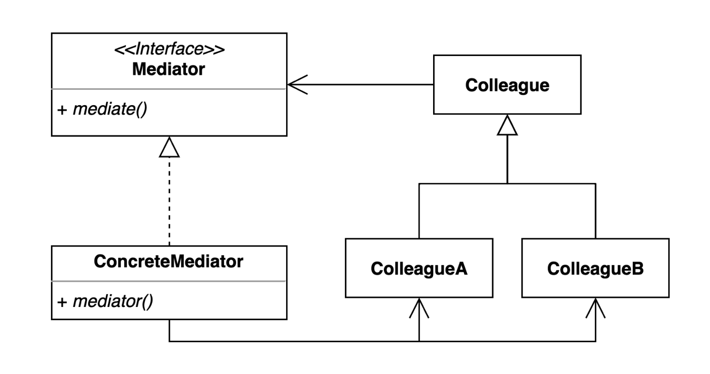
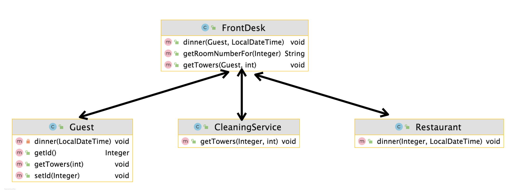
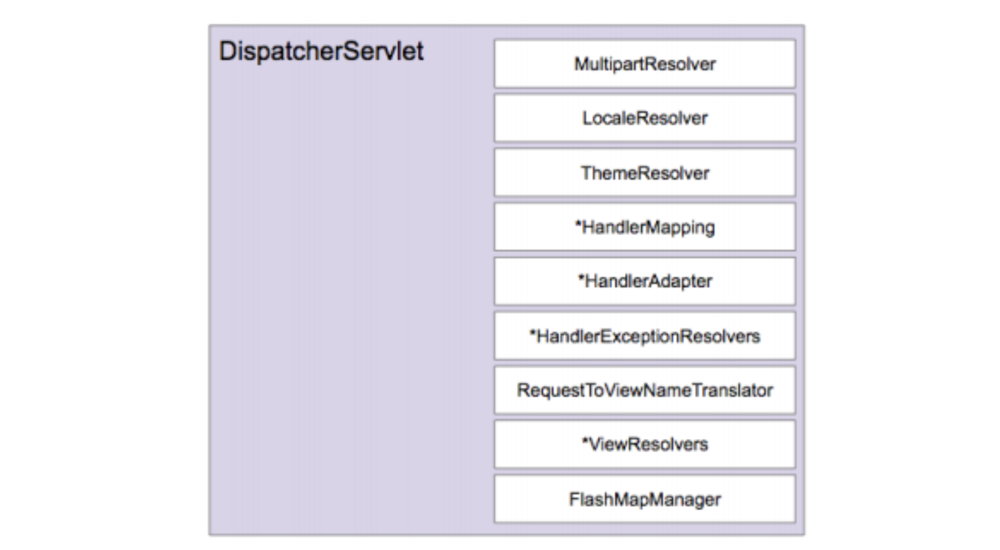

# 중재자 (Mediator) 패턴

여러 객체들이 소통하는 방법을 캡슐화하는 패턴.

여러 컴포넌트간의 결합도를 중재자를 통해 낮출 수 있다.



여러 각각의 컴포넌트들이 서로 직접 의사소통한다면 각각의 컴포넌트들이 타이트하게 결합되어있다.

이런 상황에는 코드를 구현/변경하기 어렵다. 또한, 테스트 및 재사용이 어렵다.

실생활 예 ) 비행기A ←→ 관제탑 ←→ 비행기B, 101호 ←→ 관리사무실 ←→ 201호

**구조**

* 중재자 패턴은 여러가지 형태로 구성될 수 있다.

  (고정적인 모양이 중요한 것이 아니다. 앞서 UML 구조는 중재자 패턴을 구현한 하나의 예시이다.)

* Mediator와 Colleague를 나타내는 일종의 추상클래스(인터페이스)가 있다.

* 모든 Colleague들은 Mediator 인터페이스를 참조한다. ★

  "Colleague가 직접 다른 Colleague를 참조하는 경우는 없다"는 것이 중요한 포인트이다. ★

* Mediator(중재자)
  * 모든 컴포넌트들로 부터 요청을 받아들이고 요청을 처리해주는 중재자 역할을 한다.
* 상황에 맞게 구조를 가져가면 된다.
  * Mediator 인터페이스 없이 ConcreteMediator만 사용할 수 있다.
  * 모든 Colleague가 모두 공통의 인터페이스를 구현하거나 클래스를 상속받는 구조로 만들지 않을 수 있다.




* 호텔을 이용하는 각 Colleague(Cuest, CleaningService, Restaurant)는 FrontDest라는 Mediator를 통해서 소통(서비스를 요청)한다.


## 적용할 수 있는 코드

호텔 서비스 애플리케이션 예제

* Hotel
* Guest : 손님은 식당, 체육시설, Cleaning 서비스를 이용할 수 있다.
* CleaningService
* Gym : 체육시설 / Cleaning 서비스를 이용할 수 있다.
* Restaurant : 식당 / 저녁을 제공한다. / Cleaning 서비스를 이용할 수 있다.


**Hotel**

```java
public class Hotel {

    public static void main(String[] args) {
        Guest guest = new Guest();
        guest.getTower(3);
        guest.dinner();

        Restaurant restaurant = new Restaurant();
        restaurant.clean();
    }
}
```


**CleaningService**

* 체육관이나 레스토랑 등 청소 서비스를 제공한다.
* 손님이 요청은 타워를 가져다 준다.

```java
public class CleaningService {
    public void clean(Gym gym) {
        System.out.println("clean " + gym);
    }

    public void getTower(Guest guest, int numberOfTower) {
        System.out.println(numberOfTower + " towers to " + guest);
    }

    public void clean(Restaurant restaurant) {
        System.out.println("clean " + restaurant);
    }
}
```


**Guest**

* 손님은 식당에서 저녁을 먹을 수 있다.
* 체육시설을 이용할 수 있다.
* Cleaning 서비스를 이용할 수 있다.

```java
public class Guest {

    private Restaurant restaurant = new Restaurant();

    private CleaningService cleaningService = new CleaningService();

    public void dinner() {
        restaurant.dinner(this);
    }

    public void getTower(int numberOfTower) {
        cleaningService.getTower(this, numberOfTower);
    }

}
```


**Gym**

* 체육시설은 Cleaning 서비스를 이용할 수 있다.

```java
public class Gym {

    private CleaningService cleaningService;

    public void clean() {
        cleaningService.clean(this);
    }
}
```


**Restaurant**

* 저녁을 제공한다.
* Cleaning 서비스를 이용할 수 있다.

```java
public class Restaurant {

    private CleaningService cleaningService = new CleaningService();
  
    public void dinner(Guest guest) {
        System.out.println("dinner " + guest);
    }

    public void clean() {
        cleaningService.clean(this);
    }
}
```


새로운 기능(예 - 예약 서비스)를 추가하기 어렵다. 다른 여러 의존성을 고려해서 만들어야 한다.

코드를 변경하거나 테스트할 때마다 클래스(객체)와 연결된 다른 객체도 준비되어있어야 하기때문에 테스트가 어려워진다.

코드를 재사용하기 위해서는 재사용하려는 대상이 참조하고 있는 다른 의존성도 가져가야한다.


## 중재자 패턴 적용

* 호텔을 이용하는 각 Colleague(Cuest, CleaningService, Restaurant)는 FrontDest라는 Mediator를 통해서 소통(서비스를 요청)한다.

### 1. Mediator - FrontDest 구현

* Mediator에서는 모든 Colleague(컴포넌트)를 알고 있어도 된다.
  * 여기서 생기는 의존성은 당연한 것.. 어쩔 수 없다. 모든 의존성을 Mediator로 모으는 것이다.

* `getTowers()`

  * 타월 요청을 `CleaningService`에게 위임해서 일을 처리한다.

  * 이 때 주의해야하는 중요한 점은 `CleaningService`에게 `Guest` 자체를 넘기면 안된다.

    * 컴포너트들 간의 의존성(결합도)을 낮추기 위함이기 때문
    * 일을 처리하기 위해 필요한 최소한의 정보만 넘긴다.

    ```java
    public void getTowers(Guest guest, int numberOfTowers) {
            cleaningService.getTowers(guest, numberOfTowers); // X - 잘못된 방법
    		   cleaningService.getTowers(guest.getId(), numberOfTowers); //최소한의 정보만 넘긴다.
    }
    ```

* `dinner()`

  * 저녁 요청은 `Restaurant`에게 위임해서 일을 처리한다.
  * Guest에 대한 최소한의 정보인 `Guest의 id`과 `저녁 요청 시간`을 넘겨준다.

```java
public class FrontDesk {

    private CleaningService cleaningService = new CleaningService();

    private Restaurant restaurant = new Restaurant();

    public void getTowers(Guest guest, int numberOfTowers) {
        cleaningService.getTowers(guest.getId(), numberOfTowers);
    }

    public String getRoomNumberFor(Integer guestId) {
        return "1111";
    }

    public void dinner(Guest guest, LocalDateTime dateTime) {
        restaurant.dinner(guest.getId(), dateTime);
    }
}
```


### 2. Guest는 FrontDest를 통해서 다른 Colleague 서비스를 이용

* Mediator인 `FrontDesk`만 알고있어야 한다.
  * `FrontDesk` 필드외에 다른 Colleague를 직접적으로 알고있지 않다.
* `getTowers()`
  * `CleaningService`에 직접 요청하지 않고, `FrontDesk`에 요청한다.
* `dinner()`
  * `Restaurant`에 직접 요청하지않고, `FrontDesk`에 요청한다.

```java
public class Guest {

    private Integer id;

    private FrontDesk frontDesk = new FrontDesk();

    public void getTowers(int numberOfTowers) {
        this.frontDesk.getTowers(this, numberOfTowers);
    }

    private void dinner(LocalDateTime dateTime) {
        this.frontDesk.dinner(this, dateTime);
    }

    public Integer getId() {
        return id;
    }

    public void setId(Integer id) {
        this.id = id;
    }
}
```


### 3. CleaningService - Mediator로 부터 최소한의 정보를 받아서 일을 처리

* Mediator인 `FrontDesk`만 알고있어야 한다.

* 기존 Guest와의 의존성을 끊어낸다.
* `Guest` 객체를 파라미터로 받지않고, 최소한의 정보인 `Guest의 id`값만 전달 받는다.
* 필요한 정보(ex. roomNumber)는 `FrontDesk`를 통해서 알아낸다.

```java
public class CleaningService {

    private FrontDesk frontDesk = new FrontDesk();

    public void getTowers(Integer guestId, int numberOfTowers) {
        String roomNumber = this.frontDesk.getRoomNumberFor(guestId);
        System.out.println("provide " + numberOfTowers + " to " + roomNumber);
    }
}
```


### 4. Restaurant  - Mediator로 부터 최소한의 정보를 받아서 일을 처리

```java
public class Restaurant {
    public void dinner(Integer id, LocalDateTime dateTime) {
      // 저녁 준비
      // room charge
    }
}
```


## 장점

* 컴포넌트 코드를 변경하지 않고 새로운 중재자를 만들어 사용할 수 있다.
* 각각의 컴포넌트 코드를 보다 간결하게 유지할 수 있다.

## 단점

* 중재자 역할을 하는 클래스의 복잡도와 결합도가 증가한다.
* Mediator를 변경하면 이를 사용하고 있는 Colleague들의 코드의 변경도 많이 일어난다.
  * Mediator 인터페이스를 쓰면 최소한 메서드 변경은 막을 수 있다.


## 실무 사용 예

* 자바
  * ExecutorService
  * Executor
* 스프링
  * DispatcherServlet


### 스프링 - DispatcherServlet

* DispatcherServlet을 일종의 Mediator라고 볼 수 있다.
  * 여러 컴포넌트 XXXResolver 들을 연결시킨다.
  * XXXResolver 인터페이스와 List\<HandlerXXX> 들을 가지고 있다.



* HandlerMapping

  * 핸들러 찾는 방법을 맵핑
  * `@GetMapping` 애노테이션을 기반으로 `/hello` 요청이 들어왔을 때 처리할 핸들러를 찾는다. 

  ```java
  @Controller
  public class HelloController {
  
      @GetMapping("/hello")
      public String hello() {
          return "hello";
      }
  }
  ```

* HandlerAdapter
  * 찾은 핸들러를 어떻게 실행할 것인지 실행방법을 알고 있는 인터페이스
* ViewResolvers
  * 핸들러에서 리턴하는 문자열을 보고 문자열에 해당하는 실제 뷰 객체를 찾아주는 인테페이스

⇒ DispatcherServlet을 각 컴포넌트를 어떻게 사용하는지 doDispatch()등 메소드를 읽어보면 알 수 있다.


```java
public class MediatorInSpring {

    public static void main(String[] args) {
        DispatcherServlet dispatcherServlet;
    }
}
```


