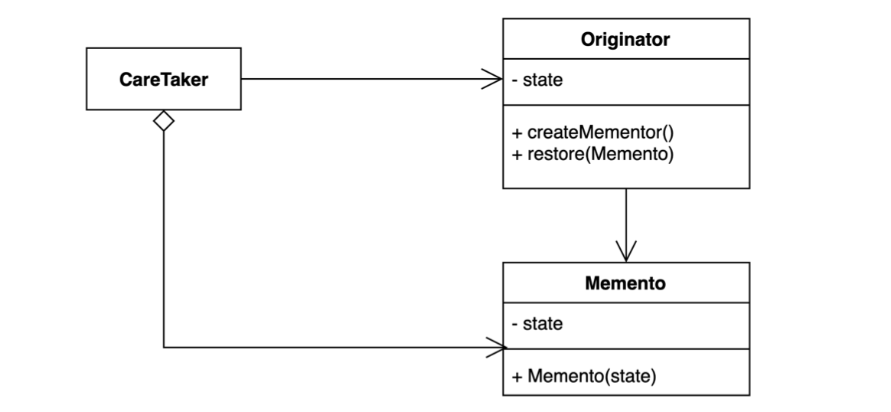
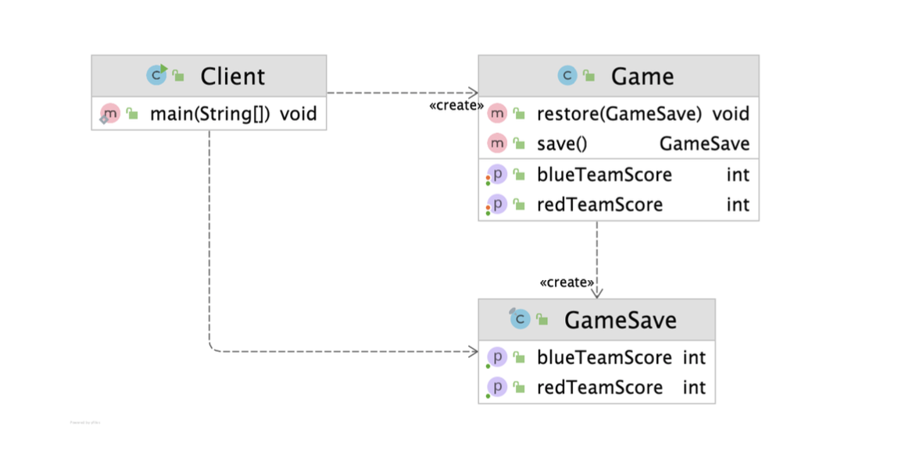
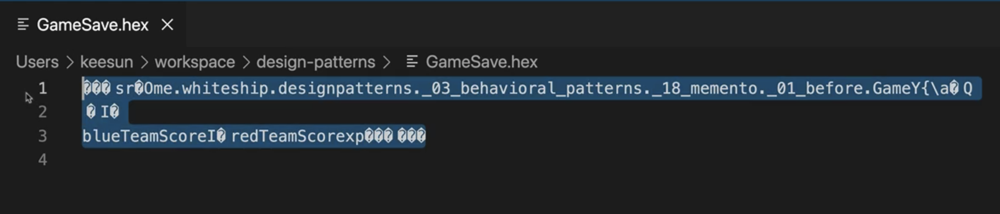
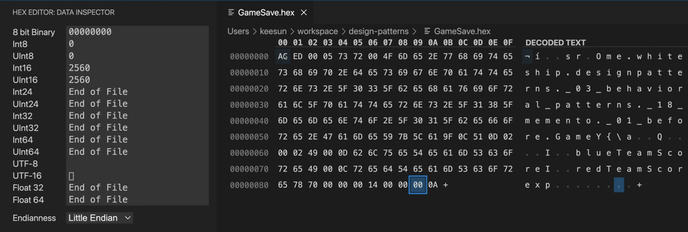

# 메멘토 (Memento) 패턴

캡슐화를 유지하면서 객체 내부 상태를 외부에 저장하는 방법.

객체 상태를 외부에 저장했다가 해당 상태로 다시 복구할 수 있다.



* 객체의 정보(필드값 등등)를 외부에 노출시키지 않고 캡슐화를 유지한다는 것이 특징
* 예제
  * 모든 에디터들은 Undo(언두, 되돌리기) 기능
  * 게임이 진행되다가 일시정지하고 다시 시작하는 기능

**구조**

* Originator
  * 본래 상태를 저장하고 있는(복원하고 싶은 데이터를 가지고 있는) 클래스
  * 두 가지 기능을 제공해야 한다.
    * `createMementor()`
      * Originator의 내부정보를 Memento라는 클래스로 추상화해서 전달해준다.
    * `restore(Memento)`
      * 외부에서 전달받은 Memento 정보를 가지고 자신의 정보로 복원한다.
* Memento
  * 내부정보를 Memento라는 객체로 추상화한다.
  * CareTaker가 Originator의 상세한 상태정보를 가지고 있지 않고, CareTaker는 Originator의 내부정보를 Memento타입으로 가지고 있다.
  * **Immutable(불변)**한 객체로 구성한다.

* CareTaker

  * Originator의 내부정보를 Memento로 감싸서 CareTaker가 전달받아 저장하고 있고, 필요한 시점에 Memento를 가지고 Origin 데이터 상태를 복원할 수 있는 일종의 외부 클래스이다.

  



## 적용할 수 있는 코드

예제 - 게임이 진행되다가 일시정지하고 해당 시점을 저장해두었다가 다시 시작할 때 일시정지했던 값을 복원해서 시작하는 기능

가장 간단한 방법은 Client에서 레드 팀 점수(redTeamScore)와 블루 팀 점수(blueTeamScore)을 변수로 기억해두고 게임을 다시 시작할 때 해당 값을 가지고 게임을 다시 셋팅해서 사용하는 방법이다.

* Client

```java
public class Client {

    public static void main(String[] args) {
        Game game = new Game();
        game.setRedTeamScore(10);
        game.setBlueTeamScore(20);

        int blueTeamScore = game.getBlueTeamScore();
        int redTeamScore = game.getRedTeamScore();

        Game restoredGame = new Game();
        restoredGame.setBlueTeamScore(blueTeamScore);
        restoredGame.setRedTeamScore(redTeamScore);
    }
}
```

* Game
  * red 팀과 blue 팀의 점수를 저장한다.

```java
import java.io.Serializable;

public class Game implements Serializable {

    private int redTeamScore;

    private int blueTeamScore;

   // getter, setter ...
}
```


**문제점**

* 캡슐화가 깨진 것이라고 볼 수 있다.

  클라이언트가 Game에 있는 내부정보로 어떤 것이 있는지 알고있어야 한다.

  "bludeTeamScore와 redTeamScore가 Game을 구성하는 정보이다."

  ⇒ Game에서 내부정보를 변경하면? 새로운 정보가 추가된다거나 기존 정보가 삭제된다거나?

  ⇒ Clinet 코드는 Game에 있는 디테일한 내용에 의존하고 있기 때문에 Game의 변경의 여파가 Client 코드에도 미치게 된다.

  ⇒ 내부 정보의 의존성을 끊어줘야 Game 코드가 변경되어도 Client 코드는 변경되지 않을 수 있다.


## 메멘토 패턴 적용

* Client - CareTaker로 사용
* Game - Originator
* GameSave - Memento


### 1. Memento 구현

* Game에서 저장할 데이터를 필드로 가지고 있는다.
* ★ **Memento 클래스는 저장된 시점 값을 그대로 변경되지 않고 유지하기 위해서 불변으로 만든다.** ★ 
  * 모든 필드를 `final` 접근제한자로 지정
  * 클래스 상속을 막기 위해 class에 `final` 키워드 지정
* 값은 생성자를 통해서만 저장할 수 있다.
* 값은 Getter를 통해서 불러올 수 있다.

```java
public final class GameSave {

    private final int blueTeamScore;

    private final int redTeamScore;

    public GameSave(int blueTeamScore, int redTeamScore) {
        this.blueTeamScore = blueTeamScore;
        this.redTeamScore = redTeamScore;
    }

    public int getBlueTeamScore() {
        return blueTeamScore;
    }

    public int getRedTeamScore() {
        return redTeamScore;
    }
}
```


### 2. Originator는 Memento로 값을 저장할 방법과 복원할 방법을 제공

* `save()`
  * Originator의 내부정보를 GameSave라는 클래스로 추상화해서 전달해준다.
* `restore(GameSave)`
  * 외부에서 전달받은 GameSave 정보를 가지고 자신의 정보로 복원한다.

```java
public class Game {

    private int redTeamScore;

    private int blueTeamScore;

   // getter, setter ...

    public GameSave save() {
        return new GameSave(this.blueTeamScore, this.redTeamScore);
    }

    public void restore(GameSave gameSave) {
        this.blueTeamScore = gameSave.getBlueTeamScore();
        this.redTeamScore = gameSave.getRedTeamScore();
    }

}
```


### 3. CareTaker에서는 Memento를 이용해서 상태정보를 저장 & 복원

Game의 내부 상태정보를 GameSave로 감싸서 CareTaker가 전달받아 저장하고 있고, 필요한 시점에 GameSave를 가지고 Game 데이터 상태를 복원한다.

```java
public class Client {

    public static void main(String[] args) {
        Game game = new Game();
        game.setBlueTeamScore(10);
        game.setRedTeamScore(20);

        GameSave save = game.save(); // 이 시점에서 Game의 내부 상태 정보를 GameSave로 저장 (스냅샷)

      // game을 계속 진행
        game.setBlueTeamScore(12);
        game.setRedTeamScore(22);

        game.restore(save); //이전에 저장했던 시점의 게임 상태 정보로 복원

        System.out.println(game.getBlueTeamScore()); //20
        System.out.println(game.getRedTeamScore()); //10
    }
}
```


## 장점

* 캡슐화를 지키면서 상태 객체 상태 스냅샷을 만들 수 있다.

* 객체 상태 저장하고 또는 복원하는 역할을 CareTaker에게 위임할 수 있다.

  Originator가 이 일을 할 수도 있지만 별도의 책임으로 CareTaker에게 위임한 것이다.

  ⇒  `SRP(단일 책임 원칙)` 객체지향 원칙을 따른다.

* 객체 상태가 바뀌어도(Originator의 정보가 변경되더라도) 클라이언트 코드는 변경되지 않는다.

  (Memento는 어쩔 수 없이 Originator의 정보가 변경되면 따라서 변경될 수 밖에 없다.)

  ⇒ `OCP(개방 폐쇄 원칙)` 객체지향 원칙을 따른다.

## 단점

* 많은 정보를 저장하는 Mementor를 자주 생성하는 경우 메모리 사용량에 많은 영향을 줄 수 있다.

  ⇒ Memento 객체를 일정량만 유지하고, 오래된 Memento 객체를 정리해주는 역할을 CareTaker가 해야 할 수도 있다.


## 실무 사용 예

* 자바

  * 객체 직렬화, java.io.Serializable 

  * java.util.Date

    * `long`이라는 데이터 타입을 직접적으로 외부에서 알고이어야 하기 때문에 메멘토 패턴이라고 볼 수 없을 수도 있지만, 메몬토 패턴을 사용하는 목적과 비슷해서 메멘토 예로 볼 수도 있다.
    * `long` 데이터 타임의 타임 정보 하나만 있기 때문에 어짜피 다른 클래스로 감싼다 하더라고 그 안에 long만 있을 것이다.

    ```java
    Date date = new Date();
    long time = date.getTime();
    date.setTime(time);
    ```


### 1. 자바의 직렬화/역직렬화

* 직렬화 : 객체 → 바이트 스트림
* 역직렬화 : 바이트 스트림 → 객체

1. 직렬화/역직렬화를 하려는 클래스는 `java.io.Serializable` 인터페이스를 구현해줘야 한다.

    ```java
    import java.io.Serializable;
    
    public class Game implements Serializable {
    
        private int redTeamScore;
    
        private int blueTeamScore;
    
       // getter, setter ...
    }
    ```

2. Game 객체를 직렬화해서 파일로 저장
   * GameSave라는 파일명으로 저장하는데 여기서 지정한 확장자는 참고용이지 코드상에 특별한 역할을 하지 않는다.

3. 직렬화한 파일(GameSave.hex)를 역직렬화해서 객체 상태 정보로 복원

```java
public class MementoInJava {

    public static void main(String[] args) throws IOException, ClassNotFoundException {
        // TODO Serializable
        Game game = new Game();
        game.setRedTeamScore(10);
        game.setBlueTeamScore(20);

        // TODO 직렬화
        try(FileOutputStream fileOut = new FileOutputStream("GameSave.hex");
        ObjectOutputStream out = new ObjectOutputStream(fileOut))
        {
            out.writeObject(game);
        }

        game.setBlueTeamScore(25);
        game.setRedTeamScore(15);

        // TODO 역직렬화
        try(FileInputStream fileIn = new FileInputStream("GameSave.hex");
            ObjectInputStream in = new ObjectInputStream(fileIn))
        {
            game = (Game) in.readObject();
            System.out.println(game.getBlueTeamScore()); //20
            System.out.println(game.getRedTeamScore()); //10
        }
    }
}
```


※ 참고

* 에디터에서 그냥 hext 파일로 열어서 확인



* 에디터에서 그냥 hex 파일로 열어서 확인




※ 역/직렬화 예제 한계

* 추상클래스를 만들지 않고도 일종의 메멘토 패턴을 적용해볼 수 있는 기능이긴 하지만, 제약사항이 있다.
* 바이트 스트림을 CareTaker에서 가지고 있어야한다.
* Serializable을 Originator가 지원해야 이 기능을 사용할 수 있다.
* 직렬화를 사용하고 있다면 이러한 기능 사용을 고려해볼 수 있지만, 굳이 save 기능 때문에 객체의 직렬화로 문제를 해결할 것인지는 고민해볼 문제이다. (역직렬화는 보안이슈가 생길 수도 있다. 직렬화를 많이 공부해보고 사용하는 것이 좋다.)
