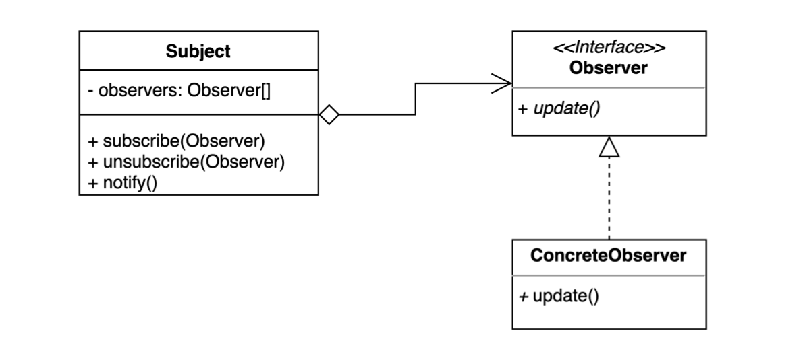
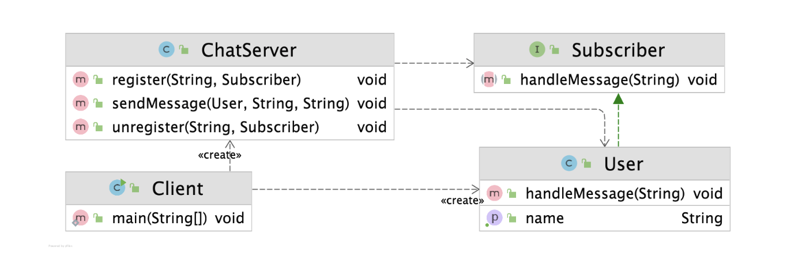
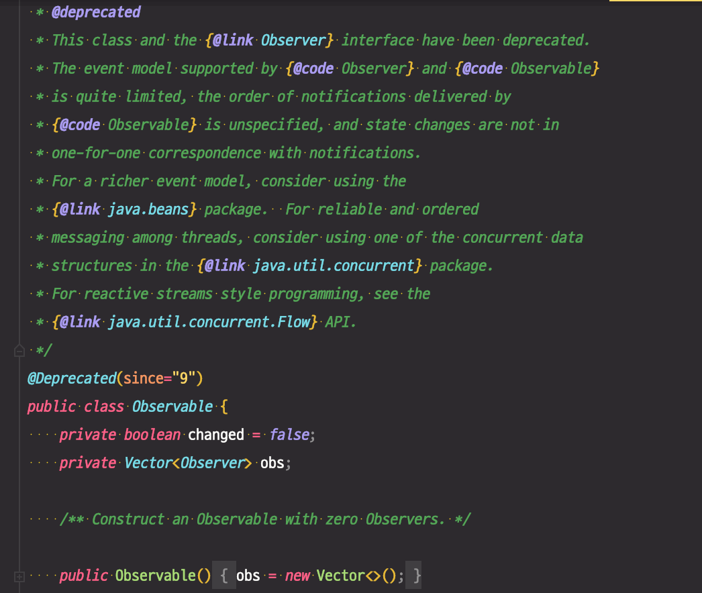
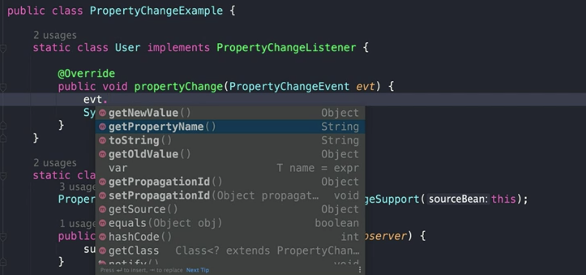
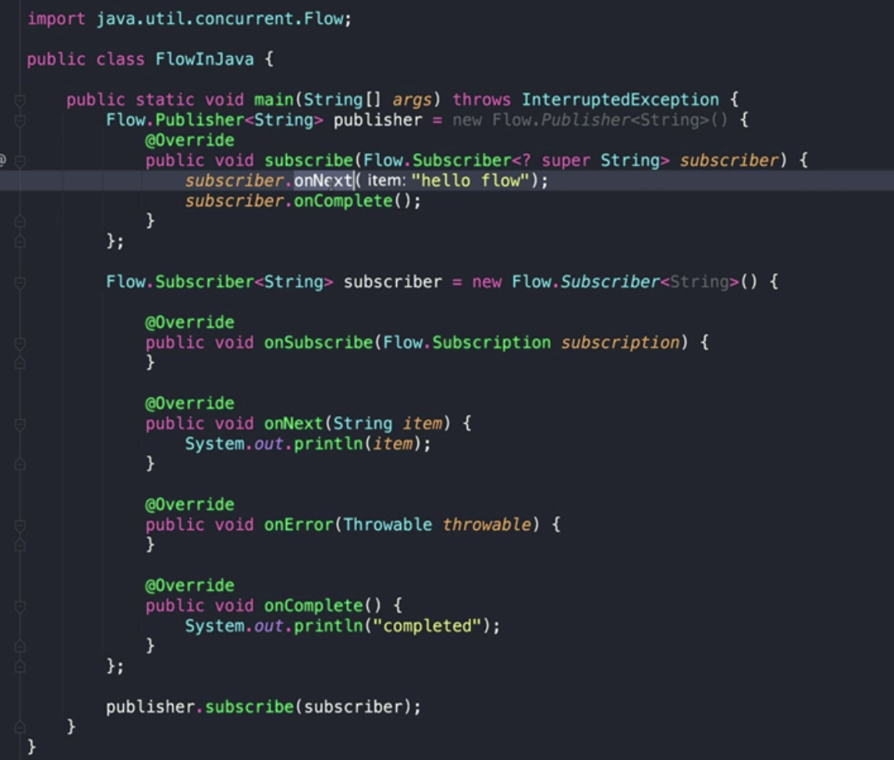
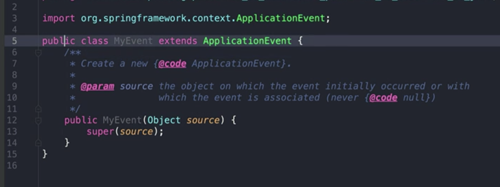
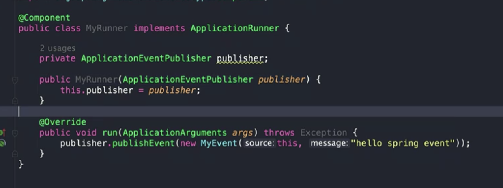

# 옵저버 (Observer) 패턴

다수의 객체가 특정 객체 상태 변화를 감지하고 알림을 받는 패턴.

발행(publish)-구독(subscribe) 패턴을 구현할 수 있다.



**구조**

* Subject

  * **여러 옵저버를 등록/해지할 수 있는 기능을 제공한다.**
  * 클라이언트 애플리케이션은 Subject를 사용해서 여러 옵저버들을 특정 Subject에 등록해둔다.
  * Subject가 제공하는 특정한 메소드를 사용해서 Subject 상태를 변경할 수 있다.
  * Subject의 상태가 변경되면 자신에게 등록되어있는 모든 옵저버들을 순회하면서 옵저버가 제공하는 특정한 메소드를 모두 호출해준다.

* Observer

  * 공통된 인터페이스를 제공한다.

  * 인터페이스에서 이벤트가 발생했을 때, 옵저버에서 호출해 줘야하는 메소드가 하나가 필요하다.

  * 이벤트가 담고있는 정보 또는 이벤트 자체를 옵저버에게 전달하면서 특정 메소드를 호출시키고, 

    해당 메소드 내에서 실제로 옵저버가 해야할 일을 하도록 한다.

  * 이 때 일종의 규약을 인터페이스로 만드는 것이다.

    "어떤 메소드를 어떠한 정보(파라미터, 데이터)를 가지고 호출해라"

* ConcreteObserver

  * 여러 Observer 인터페이스 구현체들
  * 실제로 옵저버가 해야할 일을 구현한다.


* Observer 인터페이스를 사용하지 않고 구현할 수도 있다. Subject가 Object타입으로 가지고 있으면 된다.

  하지만, 그렇게되면 어떤 메소드를 호출해야하는지 명확하지 않기 때문에 인터페이스를 제공하는 것이 조금 더 직관적일 수 있다.

  "옵저버 인터페이스의 메소드 하나를 호출하면 된다."고 알 수 있기 때문에

  * 인터페이스를 사용하지 않고, 자바가 제공하는 리플렉션 API를 사용하여 구현할 수도 있다.

    오브젝트가 가지고 있는 특정 타입정보를 알아낼 수 있고, 타입이 들고 있는 메소드 중에서 특정한 애노테이션을 가지고 있는 대상 메소드를 호출할 수 있다.





## 적용할 수 있는 코드

* 채팅 애플리케이션 예제

* 사용자들은 특정 주제에 대해 메시지를 보낼 수 있다.

* 사용자가 특정 주제에 대해 조회하는 순간에 해당 주제에서 나눴던 채팅메시지들을 조회할 수 있다.

  사용자가 조회하기 전까지는 앞서 다른 사용자가 보낸 메시지가 전달되지 않는다.

* 사용자들은 특정 주제의 메시지를 받고 싶으면 본인이 직접 getter를 호출해서 주기적으로 메시지를 가져와야한다. ⇒ "폴링(Polling) 메커니즘"

  주기적으로 가져오는 동작의 리소스가 유용할까?

  중간에 메시지가 있으면 유용하겠지만 메시지가 변경되지 않으면 불필요한 작업이 계속 발생하게 된다. (리소스 낭비)

  ⇒ 이 애플리케이션의 동작방식에 폴링(Polling) 메커니즘은 적절하지 않다.

* 옵저버 디자인 패턴을 적용해서 "발행(publish)-구독(subscribe)" 구조로 변경한다.


* Client

```java
public class Client {

    public static void main(String[] args) {
        ChatServer chatServer = new ChatServer();

        User user1 = new User(chatServer);
        user1.sendMessage("디자인패턴", "이번엔 옵저버 패턴입니다.");
        user1.sendMessage("롤드컵2021", "LCK 화이팅!");

        User user2 = new User(chatServer);
        System.out.println(user2.getMessage("디자인패턴"));

        user1.sendMessage("디자인패턴", "예제 코드 보는 중..");
        System.out.println(user2.getMessage("디자인패턴"));
    }
}
```

* ChatServer

```java
public class ChatServer {

    private Map<String, List<String>> messages;

    public ChatServer() {
        this.messages = new HashMap<>();
    }


    public void add(String subject, String message) {
        if (messages.containsKey(subject)) {
            messages.get(subject).add(message);
        } else {
            List<String> messageList = new ArrayList<>();
            messageList.add(message);
            messages.put(subject, messageList);
        }
    }

    public List<String> getMessage(String subject) {
        return messages.get(subject);
    }
}
```

* User

```java
public class User {

    private ChatServer chatServer;

    public User(ChatServer chatServer) {
        this.chatServer = chatServer;
    }


    public void sendMessage(String subject, String message) {
        chatServer.add(subject, message);
    }

    public List<String> getMessage(String subject) {
        return chatServer.getMessage(subject);
    }
}
```


## 옵저버 패턴 적용

### 1. 옵저버 인터페이스 생성 - Subscriber

* `handleMessage()` : 메시지를 받을 수 있다.

```java
public interface Subscriber {

    void handleMessage(String message);
}
```


### 2. 옵저버 구현체 구현 - User

* 옵저버 인터페이스 `Subscriber`를 implements한다.
* `handleMessage()` 메시지를 오버라이드하여 메시지를 전달받았을 때 수행할 실제 동작을 구현한다.

```java
public class User implements Subscriber {

    private String name;

    public User(String name) {
        this.name = name;
    }

    public String getName() {
        return name;
    }

    @Override
    public void handleMessage(String message) {
        System.out.println(message);
    }
}
```


### 3. Subject 구현 - ChatServer

* 각 Subject는 여러 옵저버들을 등록/해지할 수 있는 기능을 제공한다.

* 옵저버들을 특정한 주제별로 묶어 놓을 것이기 때문에 `Map`을 사용한다.

  * 주제별로 Subscriber들의 목록을 가지고 있게 된다.

* `register()`

  * 옵저버를 등록할 수 있는 기능

  * 특정 주제(subject)를 구독할 구독자(Subscriber) 정보를 받아서 

    subscribers에 해당 주제가 있다면 구독자 목록에 추가, 해당 주제가 없다면 새롭게 주제를 만들고 구독자 목록 추가

  ※ 코드 작성 시 주의 사항

  * ` List.of()`는 ImmutableCollection 을 반환한다. 이렇게 만든 컬렉션에 새로운 인스턴스를 추가할 수 없어서 이후에 추가하려고 하면 에러가 발생한다.

  ```java
  // 올바른 코드
  List<Subscriber> list = new ArrayList<>();
  list.add(subscriber);
  this.subscribers.put(subject, list);
  
  // 잘못된 코드 - 위의 코드를 줄이고자 이렇게 작성하면 Immutable 컬렉션이 반환되기 때문에 안 된다.
  this.subscribers.put(subject, List.of(subscriber));
  ```

* `unregister()`

  * 옵저버를 해지할 수 있는 기능

  * 특정 주제(subject)를 구독하고 있는 구독자(Subscriber) 정보를 받아서 

    `subscribers`에 해당 주제가 있다면 구독자 목록에서 해당 구독자 정보를 삭제한다.

* `sendMessage()`
  * ChatServer(Subject)는 자신(ChatServer, Subject)의 상태를 변경할 수 있는 기능을 제공해야 한다.
  * 예제에서는 ChatServer가 데이터를 저장해놓지 않을 것이지만, 사용자가 메시지를 보내는 행위를 상태를 변경하는 행위로 보고 해당 메시지를 여러 Subscriber 들에게 전파시키는 기능을 제공한다.
  * 파라미터 정보
    * User user - 메시지를 보내는 사용자
    * String subject - 주제
    * String message - 보내는 메시지
  * 전달하려는 메시지  : 메시지를 보낸 사용자 이름 + 메시지 내용
  * 전달 대상 : 해당 주제(subject)를 구독하고 있는 구독자
  * 구독자 목록을 순회하면서 subscriber가 가지고 있는 `handleMessage()` 를 호출해서 메시지(`userMessage`)를 전달한다.

```java
public class ChatServer {

    private Map<String, List<Subscriber>> subscribers = new HashMap<>();

    public void register(String subject, Subscriber subscriber) {
        if (this.subscribers.containsKey(subject)) { //이미 해당 주제가 있는 경우
            this.subscribers.get(subject).add(subscriber);
        } else { //새로운 주제인 경우
            List<Subscriber> list = new ArrayList<>();
            list.add(subscriber);
            this.subscribers.put(subject, list);
        }
    }

    public void unregister(String subject, Subscriber subscriber) {
        if (this.subscribers.containsKey(subject)) {
            this.subscribers.get(subject).remove(subscriber);
        }
    }

    public void sendMessage(User user, String subject, String message) {
        if (this.subscribers.containsKey(subject)) { //해당 subject를 구독하고 있는 구독자들을 대상으로
            String userMessage = user.getName() + ": " + message; //전달하려는 메시지
            this.subscribers.get(subject).forEach(s -> s.handleMessage(userMessage)); //구독자들에게 메시지 전달
        }
    }

}
```


### 4. Client

```java
public class Client {

    public static void main(String[] args) {
        ChatServer chatServer = new ChatServer();
        User user1 = new User("keesun");
        User user2 = new User("whiteship");

      //특정 주제에 구독자 등록
        chatServer.register("오징어게임", user1);
        chatServer.register("오징어게임", user2);

        chatServer.register("디자인패턴", user1);

      //상태 변경 - 메시지 전달
        chatServer.sendMessage(user1, "오징어게임", "아.. 이름이 기억났어.. 일남이야.. 오일남");
      	// -> user1, user2가 메시지를 수신하게 된다.
        chatServer.sendMessage(user2, "디자인패턴", "옵저버 패턴으로 만든 채팅");
      	// -> user1가 메시지를 수신하게 된다.
      
      //런타임에 옵저버를 추가하거나 제거할 수 있다.
        chatServer.unregister("디자인패턴", user2);
        chatServer.sendMessage(user2, "디자인패턴", "옵저버 패턴 장, 단점 보는 중");
    }
}
```


## 장점

* 상태를 변경하는 객체(publisher)와 변경을 감지하는 객체(subsriber)의 관계를 느슨하게 유지할 수 있다.
* Subject의 상태 변경을 주기적으로 조회하지 않고 자동으로 감지할 수 있다.
* 런타임에 옵저버를 추가하거나 제거할 수 있다.

## 단점

* 복잡도가 증가한다.

* 다수의 Observer 객체를 등록 이후 해지 않는다면 memory leak이 발생할 수도 있다.

  * 예제에서 ChatServer의 subscribers에 등록하고 해지하지 않으면 (아무도 쓰지 않아도 Map에 담겨있다는 이유로) 레퍼런스를 계속해서 가지고 있게 되고, GC의 대상이 되지 않게된다.

  * 가장 좋은 대안은 명시적으로 해지(unregister)를 잘 하는 것이다. (최우선적인 방법)

  * 자바의 **WeakReference**을 이용할 수도 있다. (명시적으로 해지하기 어려운 경우에 사용)

    보통 HashMap에 WeakReference를 적용하는 경우가 많다. 다른 곳에서 참조하는 경우가 없으면 unregister를 호출하지 않아도 알아서 해당 레퍼런스를 해지해준다.

    WeakReference 동작 방식에 따라 참조하지 않는 경우에만 없어지는 것이므로 언제 없어지는지 보장하지 않는다. 따라서 해결책은 아니다.


## 실무 사용 예

* 자바

  * Observable과 Observer (자바 9부터 deprecated)
  * 자바 9 이후 부터는
    * PropertyChangeListener, PropertyChangeEvent
    * Flow API
  * SAX (Simple API for XML) 라이브러리

* 스프링

  * ApplicationContext와 ApplicationEvent

  

### 1. 자바 - Observable과 Observer

자바에서 옵저버 패턴을 구현하기위해 제공하는 Observer 인터페이스, Observable 클래스 (자바 9부터 deprecated)

* `            setChanged();`를 호출하지 않으면 메시지를 받을 수 없다. 상태가 변경되었다고 해야지 알림을 받을 수 있다.

* 알림을 받는 주체의 순서는 예측할 수 없다.

* 한 번 변경되었을 때 여러 번 노티해야한다면 `notifyObservers(message);`를 연속해서 호출한다고 되지 않는다.

  무조건 `setChanged();` 한 뒤에 한 번 `notifyObservers(message);`가 호출된다.

  ```java
  static class Subject extends Observable {
    public void add(String message) {
      setChanged(); //상태가 변경되었다고 알림
      notifyObservers(message);
      notifyObservers(message); //호출 안됨
      
      setChanged();
      notifyObservers(message); //이렇게 먼저 setChanged()가 호출된 후에 알림을 보낼 수 있다
    }
  }
  ```

  

```java
public class ObserverInJava {

    static class User implements Observer {
        @Override
        public void update(Observable o, Object arg) {
            System.out.println(arg);
        }
    }

    static class Subject extends Observable {
        public void add(String message) {
            setChanged(); //상태가 변경되었다고 알림
            notifyObservers(message);
            notifyObservers(message);
        }
    }

    public static void main(String[] args) {
        Subject subject = new Subject();
        User user = new User();
        subject.addObserver(user);
        subject.add("Hello Java, Observer");
    }

}
```


오래된 코드이고 유지보수도 잘 안되고, 사용성이 떨어지는 등... 여러 이유로 Deprecated 된 것 같다.

`java.beans` 패키지 내의 `PropertyChangeListener`  또는 `java.util.concurrent` 패키지 내의 `Flow API`를 사용하라고 알려준다.




### 2. 자바 - PropertyChangeListener, PropertyChangeEvent

* `PropertyChangeListener`와 `PropertyChangeSupport` 클래스를 활용

* 옵저버를 구현하는 방법은 `PropertyChangeListener` 인터페이스를 구현하면 된다.

* `propertyChange()`에서 `PropertyChangeEvent` 이벤트를 받아서 처리할 수 있다.

  * 이벤트에 대해 좀 더 많은 정보를 알 수 있다.
  * getNewValue() : 이벤트에서 값을 꺼내기
  * getPropertyName() : 어떤 프로퍼티가 바뀌었는지 이름을 가져온다.
  * getOldValue() : 변경 전에 어떤 값이었는지 확인

  

* `firePropertyChange()` : 이벤트 publish

  * firePropertyChange(propertyName, oldValue, newValue)

    PropertyChangeEvent에 들어갈 값을 파라미터로 넣어줘야 한다.

  * fireIndexedPropertyChange() : 우선순위를 줄 수 있다.

* `addPropertyChangeListener()` : 옵저버를 등록 

  * `propertyName`을 가지고 특정한 관심사에 있는 옵저버만 메시지를 받도록 할 수 있다.

  

```java
import java.beans.PropertyChangeEvent;
import java.beans.PropertyChangeListener;
import java.beans.PropertyChangeSupport;

public class PropertyChangeExample {

    static class User implements PropertyChangeListener {

        @Override
        public void propertyChange(PropertyChangeEvent evt) { //이벤트 받아서 처리
            System.out.println(evt.getNewValue()); //이벤트에 대한 다양한 정보를 확인할 수 있다.
        }
    }

    static class Subject {
        PropertyChangeSupport support = new PropertyChangeSupport(this);

        public void addObserver(PropertyChangeListener observer) { //옵저버 등록
            support.addPropertyChangeListener(observer);
        }

        public void removeObserver(PropertyChangeListener observer) { //옵저버 해제
            support.removePropertyChangeListener(observer);
        }

        public void add(String message) {
            support.firePropertyChange("eventName", null, message); //이벤트 publish
        }
    }

    public static void main(String[] args) {
        Subject subject = new Subject();
        User observer = new User();
        subject.addObserver(observer);
        subject.add("자바 PCL 예제 코드");
        subject.removeObserver(observer);
        subject.add("이 메시지는 볼 수 없지..");
    }

}
```


###  3. 자바 - Flow API

자바 9에 처음 도입된 API

리액티브 스트림을 구현할 수 있도록 자바에서 제공해주는 인터페이스 목록

* Publisher
* Subscriber
* Subscription
* Processor : Subscriber와 Publisher 일을 둘 다 수행하는 인터페이스


#### 가장 기초적인 동기 방식의 pub-sub 구조 예제

Publisher

* Publisher에서 subscribe하면 subscriber.onNext()를 호출해서 메시지를 전달한다.

* onComplete() 호출해서 완료

Subscriber

* onNext()로 메시지를 전달받는다.
* onComplete()이 호출되었으므로 onComplete()에 구현한 동작 수행 후 종료




#### 비동기 방식의 pub-sub 구조 예제 - SubmissionPublisher

비동기적으로 이벤트를 처리하게 할 수 있도록 자바에서 기능을 제공해준다. → "**SubmissionPublisher**"

비동기적으로 Flow API를 사용할 수 있도록 기능을 제공해주는 publisher이다.

`onSubscribe()`가 호출되면 `Subscription`을 저장해두고, 바로 요청을 처리해야되기 때문에 `subscription.request(n)`를 호출해서 publisher에게 n개 이벤트를 요청해서 꺼내오게 된다. 

publisher가 n개를 꺼내서 알아서 `onNext()`를 호출해준다.

* onNext() 스레드는 `SubmissionPublisher` 가 만들어주는 스레드풀에서 하나의 스레드를 사용하게 된다.

리액티브 스트림 API의 주요 목적 중 하나는 비동기 처리 뿐만 아니라 비동기 처리하면서 백프레셔를 관리하는 것이다. 흐름양을 조절한다. 구독하는 쪽에서 처리하면서 n개씩 달라고 하면서 배압을 조절할 수 있다.

```java
import java.util.concurrent.Flow;
import java.util.concurrent.SubmissionPublisher;

public class FlowInJava {

    public static void main(String[] args) throws InterruptedException {
        Flow.Publisher<String> publisher = new SubmissionPublisher<>();

        Flow.Subscriber<String> subscriber = new Flow.Subscriber<String>() {

            private Flow.Subscription subscription;

            @Override
            public void onSubscribe(Flow.Subscription subscription) {
                System.out.println("sub!");
                this.subscription = subscription; //저장
                this.subscription.request(1); //publisher에게 1개 요청
            }

            @Override
            public void onNext(String item) {
                System.out.println("onNext called");
                System.out.println(Thread.currentThread().getName()); //비동기로 처리되는지 확인하기 위해 스레드명 출력
                System.out.println(item);
            }

            @Override
            public void onError(Throwable throwable) {
            }

            @Override
            public void onComplete() {
                System.out.println("completed");
            }
        };

        publisher.subscribe(subscriber); //구독

        ((SubmissionPublisher)publisher).submit("hello java");

        System.out.println("이게 먼저 출력될 수도 있습니다.");
    }
}
```


### 4. 스프링 - ApplicationContext와 ApplicationEvent

ApplicationContext - 스프링 IoC의 대표 Container

ApplicationContext가 이벤트 Publisher이다.


##### 1. 이벤트 클래스 구현

* 이벤트를 통해 전달하고 싶은 데이터를 필드로 추가하면 된다.
  * 전달하려는 데이터는 생성자로 받아오면 된다.
* 굳이 스프링이 제공해주는 `ApplicationEvent`  타입을 쓰지 않고 임의의 타입도 이벤트로 전달할 수 있다.

```java
public class MyEvent {

    private String message; //전달하려는 데이터

    public MyEvent(String message) {
        this.message = message;
    }

    public String getMessage() {
        return message;
    }
}
```


* ApplicationEvent 클래스를 상속받아서 구현할 수 있다.

* source : 이벤트를 제공하는 publisher 정보를 지칭




##### 2. 이벤트 발생

여러 방법이 있지만 ApplicationRunner을 이용

※ ApplicationRunner

* 스프링 부트가 제공하는 기능
* 스프링 부트가 애플리케이션을 띄웠을 때 자동으로 실행해주는 코드를 넣고 싶으면 ApplicationRunner을 구현하면 된다.


ApplicationContext를 이용해서 이벤트를 publish할 수 있다. 구체적으로는 ApplicationContext가 구현하고 있는 ApplicationEventPublisher를 사용해도 된다.

* `publishEvent(이벤트)` : 이벤트를 만들어서 publish

```java
@Component
public class MyRunner implements ApplicationRunner {

    private ApplicationEventPublisher publisher; //가장 구체적인 인터페이스 타입

    public MyRunner(ApplicationEventPublisher publisher) {
        this.publisher = publisher;
    }

    @Override
    public void run(ApplicationArguments args) throws Exception {
        publisher.publishEvent(new MyEvent("hello spring event")); //이벤트를 만들어서 publish한다.
    }
}
```




##### 3. 이벤트 리스너 구현

* ApplicationListener를 구현하지 않아도 된다.
* `@EventListener(MyEvent.class)` 애노테이션을 활용해서 리스닝하려는 이벤트 클래스를 선언해주면 된다.
* 이벤트 클래스 타입 그대로 파라미터로 전달받으면 된다.

```java
@Component
public class MyEventListener {

    @EventListener(MyEvent.class)
    public void onApplicationEvent(MyEvent event) {
        System.out.println(event.getMessage());
    }
}
```


* ApplicationListener를 구현해서 만들 수 있다.

* 제네릭 타입으로 전달받고자 하는 이벤트 타입을 적어준다.

* 빈으로 등록이 되어있어야 스프링이 알아서 연결해주므로 `@Component` 애노테이션을 붙여서 빈으로 등록한다.


실행결과


