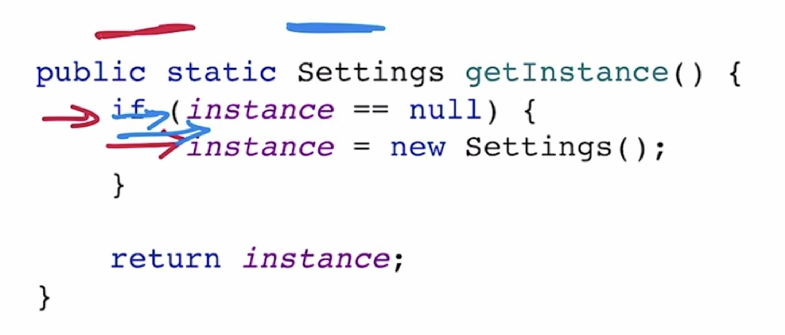
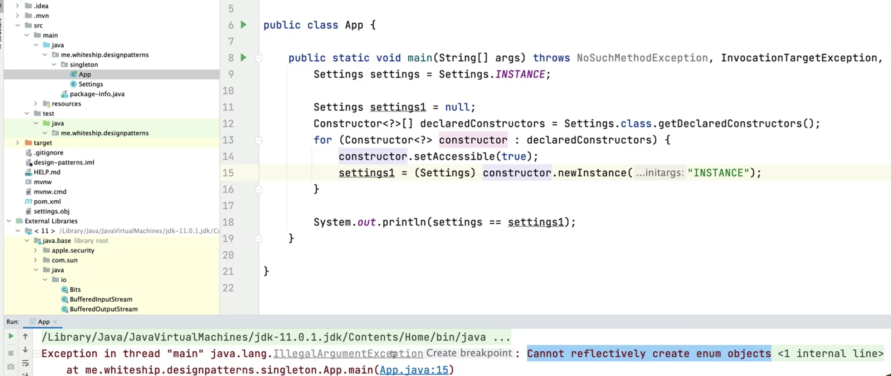

# 싱글톤 (Singleton) 패턴

## 1. private 생성자에 static 메소드 사용

* 싱글톤 패턴을 가장 단순히 구현하는 방법

1. new를 사용해서 인스턴스를 만들 수 있도록 하면 안된다.

   → private 생성자로 만든다.

2. Settings 클래스 내에 글로벌하게 인스턴스를 획득할 수 있는 메서드를 만들어준다.

    ```java
    public Class Settings {
      private Settings() {}

      public static Settings getInstance() {
        return new Settings;
      }
    }
    ```

    여기서 문제점은 getInstance를 할 때마다 매번 새로운 객체를 생성해서 반환한다.

    그렇다면 호출하는 곳에서 매번 다른 인스턴스를 얻게되고 하나의 인스턴스가 아니게 된다.

3. 클래스 내에 인스턴스를 내부 변수로 선언해서 사용하도록 한다.

    ```java
    public class Settings {
      private static Settings instance; 

      private Settings() { }

      public static Settings getInstance() { 
        if (instance == null) {
          instance = new Settings(); 
        }
          return instance; 
      }
    }
    ```


#### 단점

* **쓰레드 세이프 하지 않은 방법**이다.

* 예) 빨간색 스레드가 if문을 지나 new를 해서 빠져나가기 전에 파란색 스레드 또한 if문을 통과해 new를 호출하려고 하는 경우 두 개의 인스턴스가 생기게 된다.

  


> 1. 생성자를 private으로 만든 이유?
> 2. getInstance() 메소드를 static으로 선언한 이유?
>
> 3. getInstance()가 멀티쓰레드 환경에서 안전하지 않은 이유?


## 멀티 쓰레드 환경에서 안전하게 구현하는 방법

## 1. 동기화(synchronized)를 사용

* 가장 쉬운 방법은 메서드를 동기화 시키는 방법이다.

* 메서드에 한 번에 하나의 스레드만 들어올 수 있도록 처리한다.
* 멀티스레드 환경에서 하나의 인스턴스만 보장할 수 있다.

#### 단점

* getInstance()를 호출할 때마다 "동기화"를 처리하기 위한 작업 때문에 성능에 불이익이 생길 수 있다.

* 동기화 매커니즘이 lock을 잡아서 lock을 가지고 있는 스레드만 이 영역에 접근할 수 있기 때문이다. 이런 매커니즘을 처리하기 위한 과정이 필요하기 때문에 부가적인 성능 부하가 생길 수 있다.

```java
public class Settings {
  private static Settings instance; 

  private Settings() { }

  public static synchronized Settings getInstance() { 
    if (instance == null) {
      instance = new Settings(); 
    }
      return instance; 
  }
}
```


> 1. 자바의 동기화 블럭 처리 방법은?
>
> 2. getInstance() 메소드 동기화시 사용하는 락(lock)은 인스턴스의 락인가 클래스의 락인가? 그 이유는?


## 2. 이른 초기화 (eager initialization)을 사용

* 객체를 나중에 만들지 않아도 된다면, 미리 만들어두고 사용하면 된다.
* (+) final 키워드를 붙여서 변하지 않도록 해준다.

```java
public class Settings {
  private static final Settings INSTANCE = new Settings(); 

  private Settings() { }

  public static Settings getInstance() { 
      return INSTANCE; 
  }
}
```

* getInstance()를 여러 쓰레드에서 동시에 접근해도 이미 만들어둔 인스턴스를 반환하기만 하므로 쓰레드 세이프 하다. 
* 인스턴스는 클래스가 로딩되는 시점에 static 변수들이 초기화된다.

#### 단점

* 미리 만들어 둔다는 것 자체가 단점이 될 수 있다.

* 인스턴스를 만드는 과정이 오래걸리고 메모리를 많이 사용한다면 만들어놓고 사용지않는 경우

  애플리케이션 로딩 시점에 많은 리소스를 써서 만들어 뒀음에도 불구하고 안쓰게 되는 것이다.


> 1. 이른 초기화가 단점이 될 수도 있는 이유?
>
> 2. 만약에 생성자에서 checked 예외를 던진다면 이 코드를 어떻게 변경해야 할까요?


## 3. double checked locking으로 효율적인 동기화 블럭 만들기

* 추후 사용될 시점에 인스턴스를 만들면서도 동기화 처리의 비효율을 없애는 방법
* 먼저 체크를 한번 한 뒤에, synchronized 블럭 내에서 한번 더 체크를 하는 방식 → "double checked"
* `volatile` 키워드를 써줘야 java 1.5 이상 부터 동작하는 double checked locking 기법이 된다.

```java
public class Settings3 {
    private static volatile Settings3 instance;

    private Settings3() { }

    public static Settings3 getInstance() {
        if (instance == null) {
            synchronized (Settings3.class) { //인스턴스가 만들어지지 않은 경우에만 동기화시킨다.
                if (instance == null) {
                    instance = new Settings3();
                }
            }
        }
        return instance;
    }
}
```

#### 장점

* 인스턴스를 필요로 하는 시점에 만들 수 있다.

* getInstance()를 호출할 때마다 매번 동기화가 걸리는 것이 아니라 인스턴스가 만들어지지 않은 경우에만 동기화시키기 때문에 효율적이다.

#### 단점

* 복잡한 방식이다. 왜 `volatile`  키워드를 쓰는지 이해하려면 java 1.4 이하가 멀티스레드 환경에서 메모리를 다루는 방법까지 이해해야 한다.
* 이 방식은 java 1.5부터 동작한다.


> 1. double check locking이라고 부르는 이유?
>
> 2. instacne 변수는 어떻게 정의해야 하는가? 그 이유는?


## 4. static inner 클래스를 사용

* 권장하는 방법 중 하나이다.

1. 필드 자체가 필요없다.
   * lazy하게 만들면서 `volatile` 키워드는 필요없다.
2. private static inner class를 만든다.

```java
public class Settings4 {

    private Settings4() { }

    private static class Settings4Holder {
        private static final Settings4 INSTANCE = new Settings4();
    }

    public static Settings4 getInstance() {
        return Settings4Holder.INSTANCE;
    }

}
```

#### 장점

* 멀티스레드 환경에서 안전
* getInstance()가 호출될 때, `Settings4Holder` 클래스가 로딩이 되고, 그 때 `INSTANCE` 를 만들기 때문에 lazy 로딩도 가능한 코드이다.


> 1. 이 방법은 static final를 썼는데도 왜 지연 초기화 (lazy initialization)라고 볼 수 있는가?


★ 하지만 지금까지 살펴본 방법들을 깨트릴 수 있는 코딩 방법들이 존재한다.


## **싱글톤** **(Singleton)** 패턴 구현 깨트리는 방법

### 1. 리플렉션을 사용한다면?

정상적으로 싱글톤을 사용한다면 `getInstance()`로 만들어놓은 인스턴스를 가져다 사용하는 방법밖에 없다.

하지만, 리플렉션을 사용하면 새로운 인스턴스를 만들 수 있다.

`setAccessible(true)` 를 이용해서 private으로 만든 생성자에 접근할 수 있다.

```java
Settings settings = Settings.getInstance();

Constructor<Settings> declaredConstructor = Settings.class.getDeclaredConstructor(); declaredConstructor.setAccessible(true);
Settings settings1 = declaredConstructor.newInstance(); //new를 이용해 새로운 인스턴스를 만든 것과 같다.

System.out.println(settings == settings1); //false
```


> 1. 리플렉션에 대해 설명하세요.
> 2. setAccessible(true)를 사용하는 이유는?


### 2. 직렬화 & 역직렬화를 사용한다면?

* 직렬화 : Object → File형태로 저장 & 네트워크 전송을 위한 형태로 변환
* 역직렬화 : File이나 네트워크 전송으로 전달받은 데이터를 Object로 변환

자바에서 역/직렬화를 위해 `Serializable` 인터페이스를 구현(implement)할 수 있다.

그말인 즉슨, 이 객체를 File로 저장해뒀다가 다시 로딩할 수 있다는 의미이다.

**<u>역직렬화를 하면, 반드시 생성자를 사용해서 다시 한번 인스턴스를 만들어주게 된다.</u>**

```java
Settings settings = Settings.getInstance();

Settings settings1 = null;
// 직렬화 : 파일로 저장
try (ObjectOutput out = new ObjectOutputStream(new FileOutputStream("settings.obj"))) {
	out.writeObject(settings); 
}

// 역직렬화 : 파일을 읽어들여서 Object로 만든다.
try (ObjectInput in = new ObjectInputStream(new FileInputStream("settings.obj"))) { 
	settings1 = (Settings) in.readObject();
}

System.out.println(settings == settings1); //false
```


#### 역직렬화 대응 방안

* `readResolve()` 라는 메서드가 있다. (Serializable에 명시적으로 이 메서드가 정의되어있지는 않다.)

* 이 시그니처 (`protected Object readResolve()`)를 가지고 있으면 역직렬화시 이 메서드를 반드시 사용하게 된다.
* (참고 - 이 방법으로는 리플랙션을 방지할 수는 없다.)

```java
protected Object readResolve() {
  // 원래는 new Settings(); 를 하게 된다. 
  // 하지만 이를 getInstance()를 호출하도록 재정의한다.
  return getInstance();
}
```


> 1. 자바의 직렬화 & 역직렬화에 대해 설명하세요. 
> 2. SerializableId란 무엇이며 왜 쓰는가?
> 3. try-resource 블럭에 대해 설명하세요.


## 5. enum을 사용

* enum을 이용해서 property와 method를 정의할 수 있기 때문에 얼마든지 사용가능하다.

```java
public enum Settings { 
  INSTANCE;
}
```

```java
//사용(호출) 코드
Settings settings = Settings.INSTANCE;
```


#### 장점

* 리플렉션에 안전하다.

바이트코드를 확인해보면 해당 enum에 String 하나를 인자로 받는 생성자가 하나 있는 것을 확인할 수 있다. 이를 리플렉션을 사용해서 생성자를 호출할 수 있지 않을까? → 안된다.

enum은 유일하게 리플렉션으로 인스턴스를 만들 수 없도록 막아놨다.

 


* 역/직렬화에 안전하다.

enum은 기본적으로 `Serializable` 을 구현하고 있다. (Enum클래스를 상속받기 때문에 이를 확인해보면 된다.)


enum의 역/직렬화는 개발자가 별다른 조치를 취하지않아도 안전하게 동일한 인스턴스로 역직렬화가 된다.

```java
Settings settings = Settings.INSTANCES; //enum 사용

Settings settings1 = null;
// 직렬화 : 파일로 저장
try (ObjectOutput out = new ObjectOutputStream(new FileOutputStream("settings.obj"))) {
	out.writeObject(settings); 
}

// 역직렬화 : 파일을 읽어들여서 Object로 만든다.
try (ObjectInput in = new ObjectInputStream(new FileInputStream("settings.obj"))) { 
	settings1 = (Settings) in.readObject();
}

System.out.println(settings == settings1); //true
```


#### 단점

* 클래스를 로딩하는 순간 미리 만들어진다. 

  이것이 크게 문제가 되지 않는다면 가장 안전한 방법이다.

* 상속은 쓰지 못한다.

  enum은 오로지 ENUM만 상속받을 수 있다. (그것도 컴파일할 때 상속받는 것이지 명시적으로 선언하는 것이 아니다.)

  * 싱글톤으로 만들어야하는 클래스가 특정 클래스를 상속받아서 만들어야 한다면, **static inner 클래스(Holder)를 사용**하는 방법을 써야한다.

  * Lazy Loading 까지 써야한다면, **static inner 클래스(Holder)를 사용**하는 방법을 쓰는 것이 무난하다.


> 1. enum 타입의 인스턴스를 리팩토링을 만들 수 있는가?
> 2. enum으로 싱글톤 타입을 구현할 때의 단점은?
> 3. 직렬화 & 역직렬화 시에 별도로 구현해야 하는 메소드가 있는가?


## 복습

* 자바에서 enum을 사용하지 않고 싱글톤 패턴을 구현하는 방법은? 
* private 생성자와 static 메소드를 사용하는 방법의 단점은? 
* enum을 사용해 싱글톤 패턴을 구현하는 방법의 장점과 단점은? 
* static inner 클래스를 사용해 싱글톤 패턴을 구현하라.


## 실무에서 어떻게 쓰이나?

### 1. 스프링에서 빈의 스코프 중에 하나로 싱글톤 스코프

SpringConfig라는 설정파일을 만들고 해당 설정파일로 ApplicationContext를 만들면 여기서 `getBean()` 으로 가져오는 인스턴스는 항상 같다. (기본이 싱글톤 스코프이기 때문에)

```java
public class SpringExample {
    public static void main(String[] args) {
        ApplicationContext applicationContext = new AnnotationConfigApplicationContext(SpringConfig.class);
        String hello = applicationContext.getBean("hello", String.class);
        String hello2 = applicationContext.getBean("hello", String.class);
        System.out.println(hello == hello2); //true 항상 같은 인스턴스가 반환된다.
    }
}
```

* SpringConfig라는 빈을 정의

```java
@Configuration
public class SpringConfig {
    @Bean
    public String hello() {
        return "hello";
    }
}
```


싱글톤 스코프와 싱글톤 패턴은 다르지만, 인스턴스를 ApplicationContext 내부에서 유일한 인스턴스로 관리해주는 것이다.

엄밀히 따지면, String은 싱글톤이 아니고, 얼마든지 String을 여러개의 다른 인스턴스를 만들 수 있다. 

즉, 싱글톤 패턴이 쓰인 것은 아니지만 실제로 업무를 할 때 유일한 객체가 필요한 경우, 스프링을 사용하고 있다면 '싱글톤 스코프'로 빈을 등록해서 사용하는 경우가 많다.


### 2. 자바 java.lang.Runtime

`Runtime.getRuntime()` 을 통해서만 인스턴스를 얻을 수 있다. (new 키워드 사용불가)

애플리케이션이 실해되고 있는 환경, 문맥정보에 대한 것을 얻을 수 있다.

ex) 메모리 정보

```java
public class RuntimeExample {
    public static void main(String[] args) {
        Runtime runtime = Runtime.getRuntime();
        System.out.println(runtime.maxMemory());
        System.out.println(runtime.freeMemory());
    }
}
```


### 3. 다른 디자인 패턴(빌더, 퍼사드, 추상 팩토리 등) 구현체의 일부로 쓰이기도 한다.


※ Intellij에서 ByteCode 보는 방법

* shift + shift → 'show bytecode' 검색

* [view] > [show bytecode]

