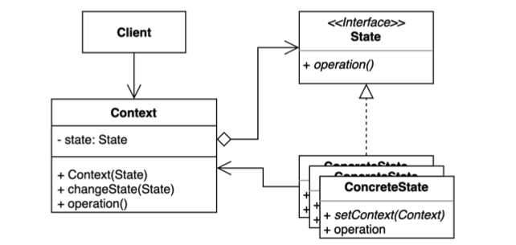
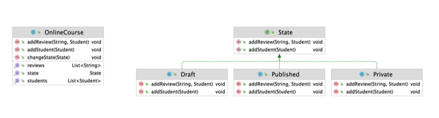

# 상태 (State) 패턴

객체 내부 상태 변경에 따라 객체의 행동이 달라지는 패턴.

상태에 특화된 행동들을 분리해 낼 수 있으며, 새로운 행동을 추가하더라도 다른 행동에 영 향을 주지 않는다.



* 예) TV가 켜져있는지, 꺼져있는지 상태에 따라 채널변경 버튼의 동작이 달라진다. (꺼져있으면 동작하지 X)
* 예) 블로그에 글을 작성할 때, draft상태이면 다른 사람들에게 공개되지 않고, 댓글도 달 수 없다. published상태이면 다른사람들에게 공개되고, 댓글을 달 수 있게 된다.

**구조**

* Context
  * **상태에 따라 달라지는 행위**를 가지고 있는 Original 클래스
  * "상태에 따라 달라지는 행위"는 State로 추출했다.
  * 그 외에 상태 변경을 위한 메소드 등 원래 Context가 담고 있어야하는 고유 정보를 가지고 있다.
  * 행동에 따라 달라지는 오퍼레이션을 `State`를 통해 위임을 한다.
* State Interface
  * Context가 변경될 수 있는 여러가지 상태에 대한 공통된 인터페이스
  * 거의 반드시 필요하다. ★
  * (추상클래스를 써도 되긴 함.)
* ConcreteState
  * 특정 상태에 따라 달라지는 오퍼레이션이 실제 구현된다.



* OnlineCourse → `Context`
* State → `State Interface`
* Draft, Publised, Private → `ConcreateState`


## 적용할 수 있는 코드

* Client
  * 학생이 OnlineCourse를 수강하거나 리뷰를 단다.

```java
public class Client {

    public static void main(String[] args) {
        Student student = new Student("whiteship");
        OnlineCourse onlineCourse = new OnlineCourse();

        Student keesun = new Student("keesun");
        keesun.addPrivateCourse(onlineCourse); //private 코스에 가입해야 PRIVATE 상태 이후에 학생으로 등록할 수 있다.

        onlineCourse.addStudent(student);
        onlineCourse.changeState(OnlineCourse.State.PRIVATE);

        onlineCourse.addStudent(keesun); // keesun이 addPrivateCourse()로 선행되어야 한다. 직전에 OnlineCourse가 PRIVATE상태가 되었으므로

        onlineCourse.addReview("hello", student);

        System.out.println(onlineCourse.getState());
        System.out.println(onlineCourse.getStudents());
        System.out.println(onlineCourse.getReviews());
    }
}
```

```tex
PRIVATE
[Student{name='whiteship'}, Student{name='keesun'}]
[hello]
```

* Student

```java
public class Student {

    private String name;

    public Student(String name) {
        this.name = name;
    }

    private List<OnlineCourse> privateCourses = new ArrayList<>();

    public boolean isEnabledForPrivateClass(OnlineCourse onlineCourse) {
        return privateCourses.contains(onlineCourse);
    }

    public void addPrivateCourse(OnlineCourse onlineCourse) { //PRIVATE 상태의 OnlineCourse를 수강할 수 있게 하기 위한 조건
        this.privateCourses.add(onlineCourse);
    }

    @Override
    public String toString() {
        return "Student{" +
                "name='" + name + '\'' +
                '}';
    }
}
```

* OnlineCourse
  * 온라인 강의
  * OnlineCourse에는 3가지 상태가 있다. - `DRAFT`, `PUBLISHED`, `PRIVATE`
  * 학생이 수강할 수 있다.
    * `addStudent(Student student)`
    * 조건(**OnlineCourse의 상태**)에 따라 달라진다.
      * DRAFT, PUBLISHED 상태이면 어떤 학생이든 추가 가능
      * PRIVATE 상태이면 해당 강의를 수강할 수 있는 학생만 추가 가능
      * 그 외, 학생 추가 불가능
  * 리뷰를 달 수 있다.
    * `addReview(String review, Student student)`
    * 조건(**OnlineCourse의 상태**)에 따라 달라진다.
      * PUBLISHED 상태이면 누구든 리뷰를 달 수 있다.
      * PRIVATE 상태이면 수강중인 학생들만 리뷰를 달 수 있다.
      * 그 외, 리뷰 작성 불가능

```java
public class OnlineCourse {

  //OnlineCourse에는 3가지 상태가 있다.
    public enum State {
        DRAFT, PUBLISHED, PRIVATE
    }

    private State state = State.DRAFT;

    private List<String> reviews = new ArrayList<>();

    private List<Student> students = new ArrayList<>();

    public void addReview(String review, Student student) {
        if (this.state == State.PUBLISHED) {     
					// PUBLISHED 상태이면 누구든 리뷰를 달 수 있다.
            this.reviews.add(review);
        } else if (this.state == State.PRIVATE && this.students.contains(student)) {
          	// PRIVATE 상태이면 수강중인 학생들만 리뷰를 달 수 있다.
            this.reviews.add(review);
        } else {
            throw new UnsupportedOperationException("리뷰를 작성할 수 없습니다.");
        }
    }

    public void addStudent(Student student) {
        if (this.state == State.DRAFT || this.state == State.PUBLISHED) {
          // DRAFT, PUBLISHED 상태이면 어떤 학생이든 추가 가능
            this.students.add(student);
        } else if (this.state == State.PRIVATE && availableTo(student)) {
          // PRIVATE 상태이면 해당 강의를 수강할 수 있는 학생만 추가 가능
            this.students.add(student);
        } else {
            throw new UnsupportedOperationException("학생을 해당 수업에 추가할 수 없습니다.");
        }

      // 학생수가 특정 인원을 넘으면 온라인코스가 PRIVATE상태로 변경된다. -> 특정 상태의 기능으로 넣어주면 된다.
        if (this.students.size() > 1) {
            this.state = State.PRIVATE;
        }
    }

    public void changeState(State newState) {
        this.state = newState;
    }

    public State getState() {
        return state;
    }

    public List<String> getReviews() {
        return reviews;
    }

    public List<Student> getStudents() {
        return students;
    }

    private boolean availableTo(Student student) {
        return student.isEnabledForPrivateClass(this); //학생의 privateCourses에 이 코스가 들어가있는지 확인
    }

}
```

⇒ **문제점**

코드를 읽기 쉽지 않다. 한눈에 들어오지 않고, 코드를 읽다가 헷갈린다.

특정한 상태마다 다르게 동작하는 오퍼레이션이 있을 때 상태패턴을 적용하기 적당하다.


## 상태 패턴 적용

### 1. Student 리팩토링

```java
public class Student {

    private String name;

    public Student(String name) {
        this.name = name;
    }

    private Set<OnlineCourse> onlineCourses = new HashSet<>();

    public boolean isAvailable(OnlineCourse onlineCourse) {
        return onlineCourses.contains(onlineCourse);
    }

    public void addPrivate(OnlineCourse onlineCourse) {
        this.onlineCourses.add(onlineCourse);
    }

    @Override
    public String toString() {
        return "Student{" +
                "name='" + name + '\'' +
                '}';
    }
}
```


### 2. OnlineCourse(Context) 리팩토링

* 상태정보(`State`)를 참조해야 한다.
* `addStudent()`, `addReview()` 이전 코드를 살펴보면 조건문 분기처리가 많다. ⇒ `State` 인터페이스로 이동해야하는 메소드임을 판별할 수 있다.
  * Context에서는 State 인터페이스의 메소드를 이용하도록 한다.
* changeState() - 상태변경 가능한 메소드 제공

```java
public class OnlineCourse {

    private State state = new Draft(this); //기본적으로 Draft 상태

    private List<Student> students = new ArrayList<>();

    private List<String> reviews = new ArrayList<>();

  //상태에 따라 분기처리가 많았던 코드(1) - 학생 추가
    public void addStudent(Student student) {
        this.state.addStudent(student);
    }

  //상태에 따라 분기처리가 많았던 코드(2) - 리뷰 추가
    public void addReview(String review, Student student) {
        this.state.addReview(review, student);
    }

    // getter ...

  // 상태변경 가능한 메소드 제공
    public void changeState(State state) {
        this.state = state;
    }
}
```


### 3. State 인터페이스 정의

* `addStudent()`, `addReview()` 이전 코드를 살펴보면 조건문 분기처리가 많다. ⇒ `State` 인터페이스로 이동해야하는 메소드임을 판별할 수 있다.

```java
public interface State {

    void addReview(String review, Student student);

    void addStudent(Student student);
}
```


### 4. 3개의 Concrete State 구현 - Draft, Published, Private

* 각각의 Concrete State는 State 인터페이스의 2가지 기능(`addReview()`, `addStudent()`)을 구현해야 한다.
* Context인 OnlineCourse를 가지고 있어야 한다.

#### (1) Private

* addReview() - OnlineCourse에 수강생이 등록되어있어야 리뷰를 남길 수 있다.
* addStudent() - student가 OnlineCourse를 수강할 수 있는 상태에만 수강 가능하다.

```java
public class Private implements State {

    private OnlineCourse onlineCourse;

    public Private(OnlineCourse onlineCourse) {
        this.onlineCourse = onlineCourse;
    }

    @Override
    public void addReview(String review, Student student) {
        if (this.onlineCourse.getStudents().contains(student)) { //OnlineCourse에 수강생이 등록되어있어야 한다.
            this.onlineCourse.getReviews().add(review);
        } else {
            throw new UnsupportedOperationException("프라이빗 코스를 수강하는 학생만 리뷰를 남길 수 있습니다.");
        }
    }

    @Override
    public void addStudent(Student student) {
        if (student.isAvailable(this.onlineCourse)) { //student가 OnlineCourse를 수강할 수 있는 상태에만 수강 가능
            this.onlineCourse.getStudents().add(student);
        } else {
            throw new UnsupportedOperationException("프라이빛 코스를 수강할 수 없습니다.");
        }
    }
}
```

**※ 코드 악취**

* `this.onlineCourse.getStudents().contains(student)` 

  ⇒ dot(`.`)이 3번 이상 연결되었다. 

  ⇒ 냄새가 나는 부분

  ⇒ 리팩토링을 고려해야 한다.

  ⇒ `getStudents().contains(student)` 부분을 메소드 하나 (ex. `contains()`)로 줄인다.

  OnlineCourse가 제대로된 기능을 제공해주도록 한다. 명시적인 이름으로 기능을 제공해주면 사용자가 getter을 이용해서 메소드를 체이닝하여 사용하지 않을 수 있다.


#### (2) Draft

* addReview() - 누구든 리뷰를 남길 수 없다.
* addStudent() - 누구든 수강할 수 있다.
  * 학생수가 특정 인원을 넘으면 온라인코스가 PRIVATE상태로 변경된다.

```java
public class Draft implements State {

    private OnlineCourse onlineCourse;

    public Draft(OnlineCourse onlineCourse) {
        this.onlineCourse = onlineCourse;
    }

    @Override
    public void addReview(String review, Student student) {
        throw new UnsupportedOperationException("드래프트 상태에서는 리뷰를 남길 수 없습니다.");
    }

    @Override
    public void addStudent(Student student) {
        this.onlineCourse.getStudents().add(student);
        if (this.onlineCourse.getStudents().size() > 1) { //학생수가 특정 인원을 넘으면 온라인코스가 PRIVATE상태로 변경된다.
            this.onlineCourse.changeState(new Private(this.onlineCourse));
        }
    }
}
```


#### (3) Published

* addReview() - 누구든 리뷰를 남길 수 있다.
* addStudent() - 누구든 수강할 수 있다.
  * 학생수가 특정 인원을 넘으면 온라인코스가 PRIVATE상태로 변경된다.

```java
public class Published implements State {

    private OnlineCourse onlineCourse;

    public Published(OnlineCourse onlineCourse) {
        this.onlineCourse = onlineCourse;
    }

    @Override
    public void addReview(String review, Student student) {
        this.onlineCourse.getReviews().add(review);
    }

    @Override
    public void addStudent(Student student) {
        this.onlineCourse.getStudents().add(student);
        if (this.onlineCourse.getStudents().size() > 1) { //학생수가 특정 인원을 넘으면 온라인코스가 PRIVATE상태로 변경된다.
          this.onlineCourse.changeState(new Private(this.onlineCourse));
        }
    }
}
```


### 5. Client 

* 테스트코드를 작성해보자

```java
public class Client {

    public static void main(String[] args) {
        OnlineCourse onlineCourse = new OnlineCourse();
        Student student = new Student("whiteship");
        Student keesun = new Student("keesun");
        keesun.addPrivate(onlineCourse); //addPrivate으로 onlineCourse을 넣어줘야 이후에 onlineCourse가 PRIVATE 상태가 된 후에 addStudect로 등록될 수 있다.

        onlineCourse.addStudent(student);

        onlineCourse.changeState(new Private(onlineCourse));

        onlineCourse.addReview("hello", student);

        onlineCourse.addStudent(keesun);

        System.out.println(onlineCourse.getState());
        System.out.println(onlineCourse.getReviews());
        System.out.println(onlineCourse.getStudents());
    }
}
```


## 장점

* 상태에 따른 동작을 개별 클래스로 옮겨서 관리할 수 있다.

  * 가장 큰 장점이다. ★
  * 클래스가 늘어났다고 안 좋은 것이 아님
  * 기존 코드에서 조건에 따라 테스트 코드를 짜려고하면 너무 힘들다.
  * 상태 패턴을 적용해서 클래스를 나누면 Concrete 클래스마다 작게 단위테스트를 작성하기 수월해진다.

* 기존의 특정 상태에 따른 동작을 변경하지 않고 새로운 상태에 다른 동작을 추가할 수 있다.

  * 작성하는 방법에 따라 다르지만 의존성을 없앨 수 있는 부분이다.
  * Context가 State라는 인터페이스를 참조하기 때문에 Context 코드를 변경하지 않고도 새로운 상태에 다른 동작을 추가할 수 있다.

  ⇒ `OCP(개방 폐쇄 원칙)` 객체지향 원칙을 따른다.

* 코드 복잡도를 줄일 수 있다.

## 단점

* 복잡도가 증가한다. (오버엔지니어링이 될 수도 있다.)

  (그래도 클래스로 나눠서 코드를 읽는게 수월해진다면 감수할 수도 있다.)


