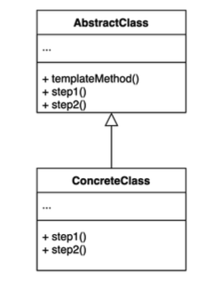
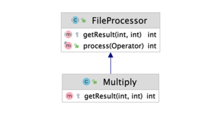
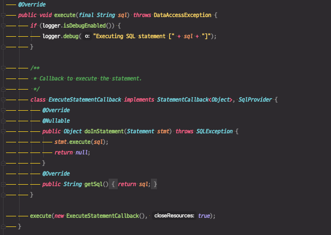
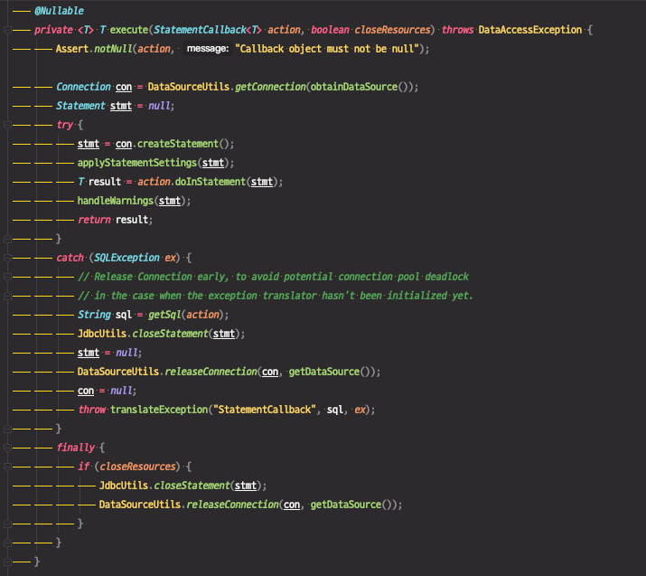
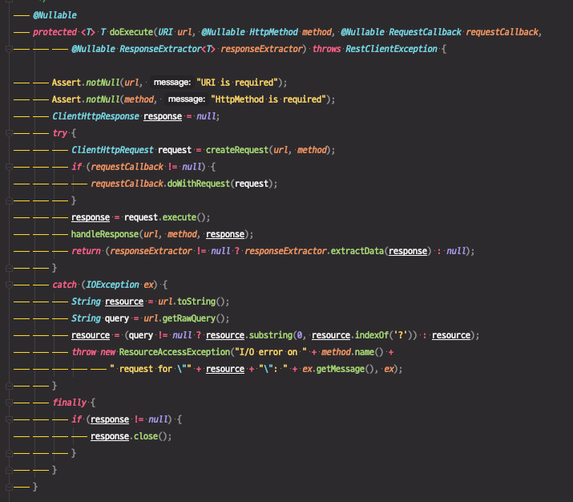
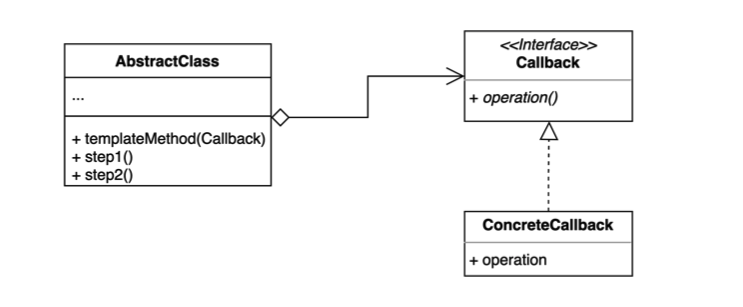

# 템플릿 메소드 패턴

알고리듬 구조를 서브 클래스가 확장할 수 있도록 템플릿으로 제공하는 방법.

추상 클래스는 템플릿을 제공하고 하위 클래스는 구체적인 알고리듬을 제공한다.




* 데이터를 읽고 → 처리 → 출력 등의 일련의 과정인 알고리듬 구조가 있을 때, 
  구조를 템플릿으로 제공한다, 그 중 구체적인 방법(데이터를 가져오는 방법, 처리 방법, 출력 방법 등)을 이 템플릿을 상속받는 서브 클래스가 구체적으로 구현할 수 있도록 하는 패턴이다.

* 상속을 사용한다.

* 구조
  * AbstractClass 하나와 이를 구현한 하나 이상의 ConcreteClass가 존재한다.
  * AbstractClass에 템플릿 메소드 역할을 하는 메소드가 있어야 한다.
  * 템플릿 메소드는 알고리듬의 구조를 표현한 메소드라고 볼 수 있다.


## 패턴이 필요해지는 상황

* Client

  FileProcessor로 number.txt 파일(한 줄에 하나의 숫자가 적혀있는 파일)을 읽어서 모든 숫자의 합을 구해주는 `process()`를 통해 결과값을 받아와서 출력

```java
public class Client {
    public static void main(String[] args) {
        FileProcessor fileProcessor = new FileProcessor("number.txt");
        int result = fileProcessor.process();
        System.out.println(result);
    }
}
```

* FileProcessor

  `process()` : 파일의 라인에 있는 모든 숫자를 합한 결과를 반환

```java
public class FileProcessor {

    private String path;
    public FileProcessor(String path) {
        this.path = path;
    }

    public int process() {
        try(BufferedReader reader = new BufferedReader(new FileReader(path))) {
            int result = 0;
            String line = null;
            while((line = reader.readLine()) != null) {
                result += Integer.parseInt(line);
            }
            return result;
        } catch (IOException e) {
            throw new IllegalArgumentException(path + "에 해당하는 파일이 없습니다.", e);
        }
    }
}
```


> 만약 모든 숫자를 곱한 결과가 필요하다면?
>
> 또는 다른 연산을 할 수 있다는 요구사항이 추가된다면?

앞서 FileProcessor와 같이 MultiplyFileProcessor를 구현할 수도 있다. 상당 부분의 코드가 기존의 FileProcessor와 중복된다. 이 때 템플릿 메소드 패턴을 적용해서 개선할 수 있다.

```java
public class MultiplyFileProcessor {

    private String path;
    public FileProcessor(String path) {
        this.path = path;
    }

    public int process() {
        try(BufferedReader reader = new BufferedReader(new FileReader(path))) {
            int result = 0;
            String line = null;
            while((line = reader.readLine()) != null) {
                result *= Integer.parseInt(line); //달리진 부분
            }
            return result;
        } catch (IOException e) {
            throw new IllegalArgumentException(path + "에 해당하는 파일이 없습니다.", e);
        }
    }
}
```

예제에서는 파일에서 한 라인씩 읽어오고, 처리하고 ,반환하는 3가지 역할을 하고 있다. 이 중 특정 단계(step)를 하위 클래스에서 재정의하여 만들 수 있게끔하고 싶다면 해당 부분을 추상화할 수 있도록 추상 메서드로 분리해서 템플릿 메서드 내에서 호출해주는 방식으로 구조를 제공해준다.

ConcreteClass에서는 Abstract Method만 구현하면 된다.

전체적인 로직은 상위 클래스인 템플릿 메소드에 정의되어 있지만 특정 단계의 구체적인 로직은 하위 클래스에서 제공해주는 것이다.

⇒ 하위 클래스에서 제공한 코드가 상위 클래스에 정의한 코드의 흐름 그대로 호출되기 때문에 이러한 방식의 구조를 일종의 IoC(Inversion of Control)라고 볼 수 있다. 제어권이 역전되어있다.


## 패턴 적용하기



### 1. 템플릿 메소드 정의

FileProcessor의 `process()`가 알고리듬을 담고 있는 템플릿 메소드가 된다.

템플릿에서 바꾸게끔 허용하고 싶은 로직은 `result += Integer.parseInt(line);` 이 부분이다.

이 부분을 어떻게 메소드로 추출할지 고민이 될 때, Intellij의 `Extract Method` 기능을 사용하면 좋다.

```java
public abstract class FileProcessor { //추상 클래스로 선언

    private String path;
    public FileProcessor(String path) {
        this.path = path;
    }

    public final int process() {
        try(BufferedReader reader = new BufferedReader(new FileReader(path))) {
            int result = 0;
            String line = null;
            while((line = reader.readLine()) != null) {
                result = getResult(result, Integer.parseInt(line)); //메소드로 추출
            }
            return result;
        } catch (IOException e) {
            throw new IllegalArgumentException(path + "에 해당하는 파일이 없습니다.", e);
        }
    }

  //하위 클래스에서 접근할 수 있어야 하므로 protected 접근자 사용
    protected abstract int getResult(int result, int number);

}
```


### 2. 추상 메소드를 구현한 ContreteClass 구현

구현체에서는 자신이 신경써야하는 로직만 담게 된다.

* Plus

  ```java
  public class Plus extends FileProcessor {
    
  	 public Plus(String path) {
       super(path);
     }
    
      @Override
      public int getResult(int result, int number) {
          return result += number;
      }
  }
  ```

* Multiply

  ```java
  public class Multiply extends FileProcessor {
    
  	 public Plus(String path) {
       super(path);
     }
    
      @Override
      public int getResult(int result, int number) {
          return result *= number;
      }
  }
  ```

* Client

  * Plus와 Multiply를 호출해서 사용하면 된다.

  ```java
  public class Client {
      public static void main(String[] args) {
  //        FileProcessor fileProcessor = new Plus("number.txt");
  	     FileProcessor fileProcessor = new Multiply("number.txt");
          int result = fileProcessor.process();
          System.out.println(result);
      }
  }
  ```


## 장점

* 템플릿 코드를 재사용하고 중복 코드를 줄일 수 있다.
* 템플릿 코드를 변경하지 않고 상속을 받아서 구체적인 알고리듬만 변경할 수 있다.

## 단점

* 리스코프 치환 원칙을 위반할 수도 있다.

  * 예제에서 만약 FileProcessor를 상속받은 클래스에서 `process()`를 Override해서 예기치 못한 동작을 수행하게 만들 수 도 있다. 

    → 이런 위험을 없애기 위해서 `process()` 메소드의 접근 제한자를 `final`로 해서 막을 수도 있다.

  * 하지만, 템플릿 메서드에서 구현하고자 하는 step에 해당하는 Operation은 특정 의도가 있는 메소드 인데, 상속은 언제든지 그 의도를 깨트릴 수 있는 가능성이 있다.

* 알고리듬 구조가 복잡할 수록 템플릿을 유지하기 어려워진다.

  * 하위 클래스에서 알고리즘을 변경할 수 있도록 허용하는 부분이 많아질수록 템플릿 메소드 코드가 복잡해줄 수 있다.


> 리스코프 치환 원치?

상속 구조에서 상위 클래스 타입으로 사용하는 코드에서 (상위 타입이 아닌) 상위 타입을 상속받은 임의의 클래스 중 어떠한 것으로 바꾸더라도 코드가 의도했던 대로 동작해야한다.

상속을 받은 자식 클래스가 부모가 원래 가지고 있던 오퍼레이션 의도를 그대로 수행해야 한다.

도형이라는 부모 클래스가 있고, "도형을 돌린다."라는 오퍼레이션이 있을 때, 상위 클래스에서 "돌린다."라고 했는데 하위 클래스에서 도형을 돌리는 것이라 hide 시켜버린다. 라고 했을 때 원래의 의도를 벗어나므로 리스코프 치환원칙을 벗어나게 된다.


## 실무 사용 예

* 자바
  * HttpServlet
* 스프링
  * 템플릿 메소드 패턴
    * Configuration
  * 템플릿 콜백 패턴
    * JdbcTemplate
    * RestTemplate 
    * ...


### HttpServlet

* HttpServlet을 상속받아서 필요로 하는 메소드만 Override한다.
* doGet() : GET요청이 들어왔을 때 해야할 일을 작성
* 이 코드는 코드 스스로가 로직을 실행하는 것이 아니라 서블릿 컨테이너 엔진이 서블릿을 (요청이 처음들어오면) 초기화하고, 만들어 놓은 인스턴스를 요청이 들어오면 요청의 메소드(GET, POST..)를 보고, 이 때 해당하는 요청에 따라 doGet, doPost에 정의한 메소드를 실행한다.

⇒ IoC(Inversion of Control) 코드이다. 

코드를 제어하는 제어권이 본인 스스로에게 없고 외부(서블릿 컨테이너 엔진)에 있는 것

```java
public class MyHello extends HttpServlet {

    @Override
    protected void doGet(HttpServletRequest req, HttpServletResponse resp) throws ServletException, IOException {
        super.doGet(req, resp);
    }

    @Override
    protected void doPost(HttpServletRequest req, HttpServletResponse resp) throws ServletException, IOException {
        super.doPost(req, resp);
    }
}
```


### Configuration

* 스프링 설정 파일을 만들 때, 보통 특정 클래스를 상속 받아서 만든다. 상속받는 클래스가 제공하는 일부 메소드를 구현한다.

* 이렇게 구현한 부분이 어딘가 특정 객체를 구성할 때 쓰이게 된다.

* 예제

  `WebSecurityConfigurerAdapter`의 `init()`에서 시큐리티 필터에 필요한 구성을 만들게 된다. 필터 체인 중 일부 메소드를 커스터 마이징한 것이다.

  거대한 `init()`이라는 템플릿 메소드의 일부 알고리듬을 `configure()`에서 재정의했다고 볼 수 있다.

```java
public class TemplateInSpring {

    @Configuration
    class SecurityConfig extends WebSecurityConfigurerAdapter {

        @Override
        protected void configure(HttpSecurity http) throws Exception {
            http.authorizeRequests().anyRequest().permitAll();
        }
    }
}
```


### JdbcTemplate

* `JdbcTemplate`의 `execute()`를 통해서 쿼리를 실행한다.

```java
public class TemplateInSpring {

    public static void main(String[] args) {
        // JdbcTemplate
        JdbcTemplate jdbcTemplate = new JdbcTemplate();
        jdbcTemplate.execute("insert 쿼리");

        // RestTemplate
        RestTemplate restTemplate = new RestTemplate();

        HttpHeaders headers = new HttpHeaders();
        headers.setAccept(Arrays.asList(MediaType.APPLICATION_JSON));
        headers.set("X-COM-PERSIST", "NO");
        headers.set("X-COM-LOCATION", "USA");

        HttpEntity<String> entity = new HttpEntity<String>(headers);
        ResponseEntity<String> responseEntity = restTemplate
                .exchange("http://localhost:8080/users", HttpMethod.GET, entity, String.class);
    }
}
```

* `execute()`를 확인해보면 Callback으로 감싸서 넘겨준다.



아래 호출되는 `execute()`를 확인해보면 템플릿 메소드가 정의되어있다.



* 상황에 따라 `execute()` , `query()` 등등의 템플릿을 가져다 사용하면 된다.
* 템플릿이 복잡해지면 하나로 관리하기 어려워지기 때문에 이처럼 템플릿을 나누는 것도 하나의 방법이 된다.


### RestTemplate

* RestAPI 클라이언트 코드로서 HTTP 요청을 보내주는 편의성 메소드를 제공해준다.

```java
public class TemplateInSpring {

    public static void main(String[] args) {
        // RestTemplate
        RestTemplate restTemplate = new RestTemplate();

        HttpHeaders headers = new HttpHeaders();
        headers.setAccept(Arrays.asList(MediaType.APPLICATION_JSON));
        headers.set("X-COM-PERSIST", "NO");
        headers.set("X-COM-LOCATION", "USA");

        HttpEntity<String> entity = new HttpEntity<String>(headers);
        ResponseEntity<String> responseEntity = restTemplate
                .exchange("http://localhost:8080/users", HttpMethod.GET, entity, String.class);
    }
}
```

* `exchange()` 확인 → `execute()` 실행 → `doExcute()` 실행


* `doExcute()` 확인

  Request를 만들고, 보내고, 응답 받아서 파상해서 리턴해주고 예외처리해주는 일련의 오퍼레이션이 구현되어있다.




---

# 템플릿 콜백(Template-Callback) 패턴

※ GoF에서 정의하지 않은 패턴이다.

콜백으로 상속 대신 위임을 사용하는 템플릿 패턴

상속 대신 **<u>익명 내부 클래스</u>** 또는 **<u>람다 표현식</u>**을 활용할 수 있다.



* 콜백이라는 인터페이스를 사용

* 콜백 인터페이스 : 전략 패턴처럼 전략을 제공해준다.

* 템플릿 메소드 패턴에서는 계산하는 로직을 추상 메서드로 분리했는데, 그렇게 하는 것이 아니라

  계산 로직을 담고 있는 메소드 하나를 콜백이라는 인터페이스에 넣어둔다.

* 전략 패턴과 다른 점

  * 전략 패턴은 여러 개의 메소드를 가지고 있을 수 도 있다.

  * 콜백은 무조건 하나의 메소드만 담고 있어야 한다.

    만약 오퍼레이터가 여러개 필요하다면 인터페이스를 여러개 만들어야 한다.

## 장점

* 상속을 사용하지 않아도 된다.

* 전략 패턴처럼 위임을 사용할 수 있다.

* 콜백을 구현하는 방법

  * ConcreteCallback 새로운 구현체를 만든다.

  * 구현체를 만들지 않고, **<u>익명 내부 클래스</u>** 또는 **<u>람다 표현식</u>**을 활용할 수 있다.

    좀 더 코드가 간결해진다.

* 스프링에서 많이 사용되는 패턴이다.


## 패턴 적용하기

### 1. 콜백 역할을 하는 인터페이스 정의

* 하나의 추상 메소드를 담고 있다.

```java
public interface Operator {

    abstract int getResult(int result, int number);
}
```


### 2. 콜백 인터페이스를 받아서 사용

* 추상메서드가 없으므로 추상 클래스일 필요가 없어진다.
* 계산 로직을 콜백 함수를 호출을 통해서 수행한다.

```java
public class FileProcessor {

    private String path;
    public FileProcessor(String path) {
        this.path = path;
    }

    public final int process(Operator operator) { //콜백을 인자로 받는다.
        try(BufferedReader reader = new BufferedReader(new FileReader(path))) {
            int result = 0;
            String line = null;
            while((line = reader.readLine()) != null) {
                result = operator.getResult(result, Integer.parseInt(line)); //콜백으로 메서드를 호출한다.
            }
            return result;
        } catch (IOException e) {
            throw new IllegalArgumentException(path + "에 해당하는 파일이 없습니다.", e);
        }
    }
}
```


### 3. Client에서 사용

* 익명 내부 클래스로 구현

```java
public class Client {

    public static void main(String[] args) {
        FileProcessor fileProcessor = new FileProcessor("number.txt");
        int result = fileProcessor.process(new Operator() {
          
          @Override
          public int getResult(int result, int number) {
            return result += number;
          }
        });
        System.out.println(result);
    }
}
```

* 람다로 구현

```java
public class Client {

    public static void main(String[] args) {
        FileProcessor fileProcessor = new FileProcessor("number.txt");
        int result = fileProcessor.process((result1, number) -> result1 += number);
        System.out.println(result);
    }
}
```

* Opertor 구현체 정의

  만약 Opertor 구현체를 다른 곳에서도 사용한다면 이를 클래스로 만들어주면 된다.

```java
public class Plus implements Operator {
    @Override
    public int getResult(int result, int number) {
        return result += number;
    }
}
```

```java
public class Client {

    public static void main(String[] args) {
        FileProcessor fileProcessor = new FileProcessor("number.txt");
        int result = fileProcessor.process(new Plus());
        System.out.println(result);
    }
}
```


