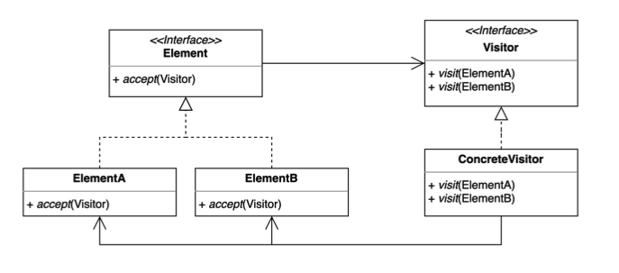
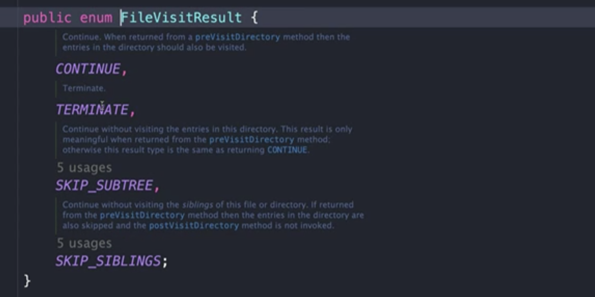
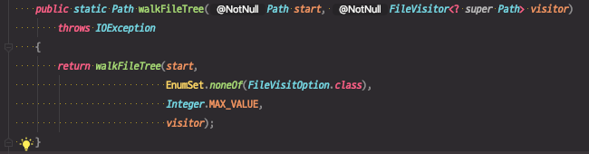
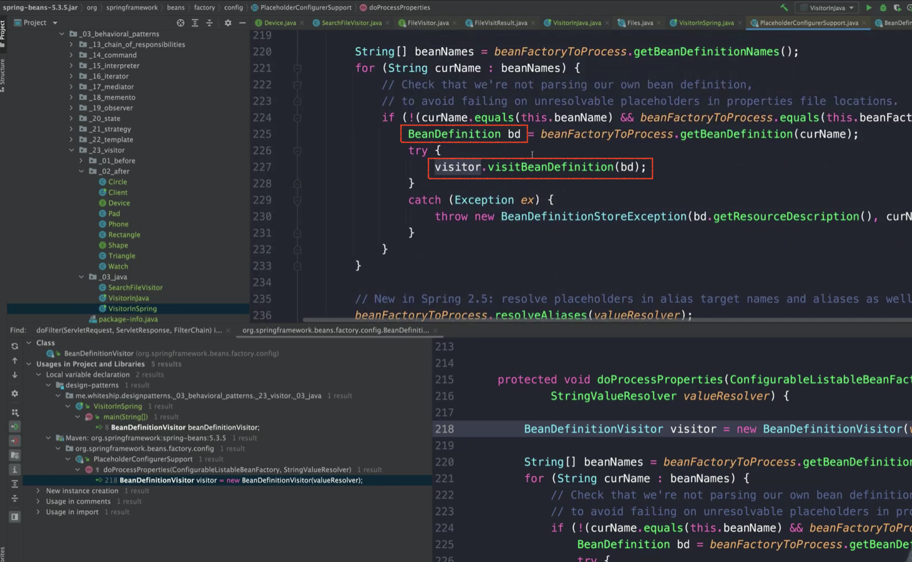
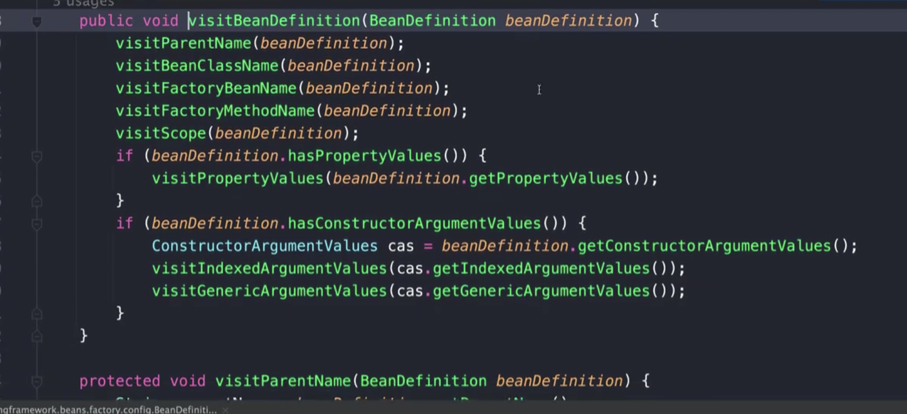

# 방문자 (Visitor) 패턴

기존 코드를 변경하지 않고 새로운 기능을 추가하는 방법.

더블 디스패치 (Double Dispatch)를 활용할 수 있다.



* SRP를 지키고 기존 클래스가 가진 책임을 늘리고 싶지 않은 경우

* 구조를 변경하면서 추가되는 코드 때문에 발생할 수 있는 버그를 막기 위해 기존 클래스에 코드를 추가하지 않고, 코드를 분리하고 싶은 경우

* 코드가 가지고있는 특성상 다른 곳에서도 적용이 될 것 같은 경우

  반복해서 비슷한 코드가 여러군데에 생길 가능성을 생각해서 코드를 한 곳에 모아두고 싶은 경우


**구조**

* Element : 본연의 기능을 가지고 있으면서 변하지 않는 클래스

* Element들에게 한 번 Dispatch가 일어난다.

  * Dispatch?

    다형성, 분배, 배치(요청이 들어오면 이를 처리할 구체적인 클래스, 메소드를 찾아서 배치)

    요청이 들어왔을 때 배치하여 위임하는 것을 디스패치라고 한다.

* Element의 accept(Visitor)

  * 이 패턴이 적용되려면 기존 클래스에 딱 한가지 `accept(Visitor)`가 추가되어야 한다.
  * Visitor가 추가하고 싶은 코드를 담고 있다.
  * accept(Visitor)를 호출하면 그 안에서 `Visitor.visit()`으로 자기자신의 타입을 넘겨준다.
  * 더블 디스패치를 위해 사용하는 장치에 해당하는 메소드

* Visitor Interface

  * 이 인터페이스를 사용하는 것이 중요하다. 그래야 새로운 기능을 추가하더라도 Element 코드의 변경을 막을 수 있다.

* ConcreteVisitor : 추가할 구체적인 로직을 담고 있는 클래스

* Visitor의 `visit()` 메소드 **오버로딩**이 적용되어있다.

  * 이름은 같은 visit()이지만 파라미터는 Visitor가 지원하는 각각의 요소들이 있어야 한다.

* 요소의 개수만큼 Visitor 인터페이스 내에는 여러개의 메소드가 있게 된다.

* 각각의 Element들이 **accept(this)**를 호출하면 해당하는 타입을 지원하는 메소드를 사용하게 된다.

  ⇒ ConcreteVisitor가 가지고 있는 특정한 visit()메소드 내로 들어오게 된다.

  **ConcreteVisitor.visit(ElementA)**, **ConcreteVisitor.visit(ElementB)** 등.. 구체적인 메소드를 사용하게 된다.

  이 안에서 구체적인 타입(ElementA, ElementB ..)을 사용할 수 있게 된다.


## 방문자 패턴을 적용할 수 있는 (original) 코드

Shape라는 인터페이스와 이를 구현한 Rectangle, Triangle 클래스가 있다.

Client는 Shape타입으로 Rectangle, Triangle을 만들 수 있다.

```java
public interface Shape { }
```

```java
public class Rectangle implements Shape { }
```

```java
public class Triangle implements Shape { }
```


```java
public class Client {
    public static void main(String[] args) {
        Shape rectangle = new Rectangle();
        Shape triangle = new Triangle();
    }
}
```


## 방문자 패턴을 적용하지 않은 코드

### 1. Device별로 다르게 모양을 출력하는 기능을 추가한다.

Device라는 여러 제품군이 있다. Phone, Watch

```java
public interface Device { }
```

```java
public class Phone implements Device{ }
```

```java
public class Watch implements Device{ }
```


Device 별로 모양을 출력하는 printTo() 기능을 추가하기 위해 Shape 인터페이스에 추상메소드를 추가한다.

```java
public interface Shape {

    void printTo(Device device);

}
```


인터페이스가 변경되었기 때문에 이를 구현한 구체 클래스들도 오버라이딩 해야한다.

디바이스 별로 다르게 출력하고 싶기 때문에 분기문이 들어간다.

비슷한 코드가 Rectangle, Triangle 클래스에 존재하게 된다.

```java
public class Rectangle implements Shape {
    @Override
    public void printTo(Device device) {
        if (device instanceof Phone) {
            System.out.println("print Rectangle to phone");
        } else if (device instanceof Watch) {
            System.out.println("print Rectangle to watch");
        }
    }
}
```

```java
public class Triangle implements Shape {
    @Override
    public void printTo(Device device) {
        if (device instanceof Phone) {
            System.out.println("print Triangle to Phone");
        } else if (device instanceof Watch) {
            System.out.println("print Triangle to Watch");
        }
    }
}
```


### 2. 새로운 Shape을 추가한다.

기존의 분기처리하던 if~else 코드를 또 추가해줘야 한다.

```java
public class Circle implements Shape {
    @Override
    public void printTo(Device device) {
        if (device instanceof Phone) {
            System.out.println("print Circle to phone");
        } else if (device instanceof Watch) {
            System.out.println("print Circle to watch");
        }
    }
}
```


### 3. Client에서 사용

```java
public class Client {
    public static void main(String[] args) {
        Shape rectangle = new Rectangle();
        Device device = new Phone();
        rectangle.printTo(device);
    }
}
```

```java
print Rectangle to Phone
```


**문제점**

* 기존 코드(Rectangle, Triangle, Circle)를 많이 수정하게 된다. 

  ⇒ `OCP(개방 폐쇄 원칙)` 객체지향 원칙이 깨진다.

* 출력하는 기능이 Shape가 가지고 있는 것이 맞는 역할이 아니다.

  ⇒ `SRP(단일 책임 원칙)` 객체지향 원칙이 깨진다.

* Shape이나 Device가 추가되면 코드가 많이 늘어난다.
  * Device별로 분기처리하는 코드가 각각의 Shape마다 추가된다.
  * `instanceof`를 누락하면 이를 처리하지 못하는 등.. 휴먼에러 가능성이 높아진다.

* 지금은 Shape에 새로운 기능인 `printTo()`를 추가한 것이다.  새로운 코드를 기존 코드에 추가하고 싶지 않다면?

* Device 별로 모양을 출력하는 코드를 Shape에 넣고 싶지 않다면 Device에 추가해야 할까?

  ⇒ Device에 넣으면 문제가 해결될까? (방문자 패턴을 적용하면서 확인)


### 4. Shape에서 구체적인 Device 타입을 받도록 리팩토링해보자 - 오버로딩의 한계

기존의 다음 코드와 같이 printTo()에서 `Device`타입을 받으면 새로운 Shape을 추가할 때, Deivce별로 분기 처리하는 코드에서 특정 Device용 기능을 놓치는 상황이 생길 수 있다.

그렇다면 구체적인 Device 타입을 지정해서 모두 구현하도록 강제하기 위해 Shape 인터페이스를 다음과 같이 **오버로딩**을 통해 구체 타입을 받도록 수정해볼 수 있다.

```java
public interface Shape {

    void accept(Phone phone);
  
    void accept(Watch watch);

}
```


각각의 구체 Shape들이 이를 구현해줘야 한다.

```java
public class Rectangle implements Shape {
    @Override
    public void printTo(Phone phone) {
            System.out.println("print Rectangle to phone");
    }

    @Override
    public void printTo(Watch watch) {
            System.out.println("print Rectangle to watch");
    }
}
```

```java
public class Triangle implements Shape {
    @Override
    public void printTo(Phone phone) {
            System.out.println("print Triangle to phone");
    }

    @Override
    public void printTo(Watch watch) {
            System.out.println("print Triangle to watch");
    }
}
```

```java
public class Circle implements Shape {
    @Override
    public void printTo(Phone phone) {
            System.out.println("print Circle to phone");
    }

    @Override
    public void printTo(Watch watch) {
            System.out.println("print Circle to watch");
    }
}
```


그런 경우 기존 Client코드가 컴파일 에러가 발생한다.

```java
public class Client {

    public static void main(String[] args) {
        Shape rectangle = new Rectangle();
        Device device = new Phone();
        rectangle.printTo(device); //device 부분 컴파일에러
    }
}
```


##### 오버로딩의 한계

printTo() 메소드가 지원하는 타입은 Phone과 Watch 밖에 없다. Device가 Phone과 Watch의 상위타입이더라도 device 변수가 컴파일 시점에 구체적으로 어떤 타입이 될지 모른다. (지원하지 않음)

**메소드 오버로딩**은 구체적인 타입을 지원하지 않는다. Static한 맵핑을 한다. 이미 컴파일 시점에 해당하는 타입을 지원하는 메소드를 호출하도록 만든다. 

**메소드 오버로딩**을 런타인시에 타입을 체크하는 것은 해당하는 타입을 지원하는 메소드가 존재하지 않을 위험도 있기 때문에 컴파일 시점에 구체적인 타입으로 맵핑(Static 맵핑)이 되어야 한다.

동적 맵핑, Late binding은 다형성, 메소드 오버라이딩에서 지원하는 기능이다.

메소드 오버로딩은 그런 기능을 지원하지 않는다.


⇒ 방문자 패턴과 더블 디스패치를 사용해서 리팩토링할 수 있다.


## 방문자 패턴 적용

* Element Interface : Shape
* Element : Rectangle, Triangle, Circle
* Visitor Interface : Device
* ConcreteVisitor : Phone, Watch


### 1. Shape(Element Interface)에서 accept()를 지원하도록 수정

* 이 패턴이 적용되려면  `accept(Visitor)`가 추가되어야 한다.

```java
public interface Shape {

    void accept(Device device);

}
```


### 2. 각 구체 Shape마다 accept()를 구현한다.

* Visitor가 추가하고 싶은 코드를 담고 있다.

* accept(Visitor)를 호출하면 그 안에서 `Visitor.visit()`으로 자기자신의 타입을 넘겨준다.

```java
public class Rectangle implements Shape {

    @Override
    public void accept(Device device) {
        device.print(this);
    }
}
```

```java
public class Triangle implements Shape {

    @Override
    public void accept(Device device) {
        device.print(this);
    }
}
```

```java
public class Circle implements Shape {

    @Override
    public void accept(Device device) {
        device.print(this);
    }
}
```

⇒ `device.print(this)` 는 오버로딩 즉, 정적인 맵핑이 자동으로 이루어진다.


### 3. printTo() 메소드를 Device로 옮긴다.

Device에서는 각 Shape을 받을 수 있는 메소드가 필요해진다. 오버로딩을 통해 print()를 구현한다.

```java
public interface Device {
    void print(Rectangle rectangle);
    void print(Triangle triangle);
    void print(Circle circle);
}
```


### 4. 각 구체 Device에서는 모든 print()를 구현한다.

* Phone

```java
public class Phone implements Device {
    @Override
    public void print(Circle circle) {
        System.out.println("Print Circle to Phone");
    }

    @Override
    public void print(Rectangle rectangle) {
        System.out.println("Print Rectangle to Phone");

    }

    @Override
    public void print(Triangle triangle) {
        System.out.println("Print Triangle to Phone");
    }
}
```

* Watch

```java
public class Watch implements Device {
    @Override
    public void print(Circle circle) {
        System.out.println("Print Circle to Watch");
    }

    @Override
    public void print(Rectangle rectangle) {
        System.out.println("Print Rectangle to Watch");
    }

    @Override
    public void print(Triangle triangle) {
        System.out.println("Print Triangle to Watch");
    }
}
```


### 5. Client 에서 appect()를 이용해서 다형성을 사용할 수 있다.

```java
public class Client {

    public static void main(String[] args) {
        Shape rectangle = new Rectangle();
        Device device = new Phone();
        rectangle.accept(device); //다형성
    }
}
```


### 6. 새로운 Device 추가

* Device 타입을 implements해서 필요한 기능을 구현해주면 된다.
* 기존 코드가 수정되지 않는다.

```java
public class Pad implements Device {
    @Override
    public void print(Circle circle) {
        System.out.println("Print Circle to Pad");
    }

    @Override
    public void print(Rectangle rectangle) {
        System.out.println("Print Rectangle to Pad");
    }

    @Override
    public void print(Triangle triangle) {
        System.out.println("Print Triangle to Pad");
    }
}
```


클라이언트에서 Pad를 출력하고 싶다면 Pad 객체만 넘기면 된다.

```java
public class Client {

    public static void main(String[] args) {
        Shape rectangle = new Rectangle();
        Device device = new Pad(); //Pad 객체만 넘기면 된다.
        rectangle.accept(device);
    }
}
```


###  패턴을 적용하지 않았을 때보다 개선된 점(장점)

* Device가 추가된다고 Concrete Shape의 코드(if~else)가 늘어나지 않는다.
* Device에서 필요로 하는 기능마다 필요한 분기문(if~else)이 존재하지 않는다.
* 새로운 Device가 추가될 때 기존 코드 수정이 없다.
* original 코드의  Element에서 `accept()`만 추가된 것 외에 변경사항이 없이 print() 기능을 추가해줬다.
  * `void accept(Device device);`
  * Visitor로 디스패치할 수 있는 기능만 추가된 것이다.


#### 더블 디스패치가 사용된다.?

디스패치가 두 번 일어난다.

1. rectangle의 `accept()`를 호출할 때

    accept() 메소드가 어느 구체 클래스에 있는 구체적인 메소드인지 찾아가기 위해 한 번의 디스패치가 일어난다.

    ```java
    public class Client {
    
        public static void main(String[] args) {
            Shape rectangle = new Rectangle();
            Device device = new Pad();
            rectangle.accept(device); //첫 번째 디스패치
        }
    }
    ```

2. device의 `print()`를 호출할 때

    print() 메소드가 구체적으로 어느 Device의 메소드인지 찾아가기 위해 한 번 더 디스패치가 일어난다.

    ```java
    public class Rectangle implements Shape {
    
        @Override
        public void accept(Device device) {
            device.print(this); //두 번째 디스패치
        }
    }
    ```


## 장점

* 기존 코드를 변경하지 않고 새로운 코드를 추가할 수 있다.
* 추가 기능을 한 곳에 모아둘 수 있다.

## 단점

* 구조 자체가 복잡하다.

* 새로운 Element를 추가하거나 제거할 때 모든 Visitor 코드를 변경해야 한다.

  ⇒ 이 패턴이 OCP와 SRP를 제공하지만, 이 것이 깨질 여지도 존재하게 된다.


## 실무 사용 예

* 자바
  * FileVisitor, SimpleFileVisitor
  * AnnotationValueVisitor
  * ElementVisitor
* 스프링
  * BeanDefinitionVisitor


### 1. 자바 - FileVisitor, SimpleFileVisitor

`startingDirectory` 경로부터 시작해서 "Triangle.java" 파일이 있는지 찾아본다.

```java
public class VisitorInJava {

    public static void main(String[] args) throws IOException {
        Path startingDirectory = Path.of("/Users/keesun/workspace/design-patterns");
        SearchFileVisitor searchFileVisitor =
                new SearchFileVisitor("Triangle.java", startingDirectory);
        Files.walkFileTree(startingDirectory, searchFileVisitor);
  		
        searchFileVisitor =
                new SearchFileVisitor("Triangle2222.java", startingDirectory);
        Files.walkFileTree(startingDirectory, searchFileVisitor);
    }
}
```

```tex
found Trianle.java
search end
```


자바가 제공하는 `FileVisitor` 인터페이스를 구현해서 SearchFileVisitor를 생성

(또는, `SimpleFileVisitor`를 상속받아서 만들 수도 있다.)

* FileVisitor는 4개의 메소드를 구현해야 한다.

  * preVisitDirectory() : 디렉토리 진입 전에

  * visitFile() : 파일을 확인(get, read)

  * visitFileFailed() : 파일 확인(get, read) 실패

  * postVisitDirectory() : 해당 디렉토리 순회를 마쳤을 때

* 모두 `FileVisitResult`를 반환한다.

* `FileVisitResult`에는 4가지 경우가 있다.
  * CONTINUE : 계속 진행
  * TERMINATE : 종료
  * SKIP_SUBTREE : Sub tree를 건너뛴다.
  * SKIP_SIBLINGS : 자매 tree를 건너뛴다.




`fileToSearch(찾을 파일명)`와 `startingDirectory(탐색시작위치)` 정보를 생성자로 받는다.

```java
public class SearchFileVisitor implements FileVisitor<Path> {

    private String fileToSearch;
    private Path startingDirectory;

    public SearchFileVisitor(String fileToSearch, Path startingDirectory) {
        this.fileToSearch = fileToSearch;
        this.startingDirectory = startingDirectory;
    }

    @Override
    public FileVisitResult preVisitDirectory(Path dir, BasicFileAttributes attrs) throws IOException {
      //디렉토리 진입 전에 따로 처리해줄 로직이 없으므로 CONTINUE를 반환해서 계속 진행
        return FileVisitResult.CONTINUE;
    }

    @Override
    public FileVisitResult visitFile(Path file, BasicFileAttributes attrs) throws IOException {
      //파일을 하나씩 볼 때는, 파일 이름을 가져와서 찾으려는 파일명과 같은지 확인한다.
      //파일을 찾은 경우, 찾은 것을 알리기 위해 출력하고, 더이상 진행하지 않도록 TERMINATE를 반환
        if (fileToSearch.equals(file.getFileName().toString())) {
            System.out.println("found " + file.getFileName());
            return FileVisitResult.TERMINATE;
        }
      //파일을 못찾은 경우, 계속해서 진행하기위해 CONTINUE를 반환
        return FileVisitResult.CONTINUE;
    }

    @Override
    public FileVisitResult visitFileFailed(Path file, IOException exc) throws IOException {
        exc.printStackTrace(System.out);
        return FileVisitResult.CONTINUE;
    }

    @Override
    public FileVisitResult postVisitDirectory(Path dir, IOException exc) throws IOException {
      //순회가 끝난 dir이 처음 순회를 시작하는 startingDirectory 디렉토리와 같다면 모든 순회가 끝난 것이므로 TERMINATE를 반환해서 순회를 종료한다.
        if (Files.isSameFile(startingDirectory, dir)) {
            System.out.println("search end");
            return FileVisitResult.TERMINATE;
        }
        return FileVisitResult.CONTINUE;
    }
}
```


####  Files.walkFileTree()

우리가 사용하는 visitor를 파리미터로 받아서 특정 상황에서 visitor에 적절한 메소드를 호출해준다.




⇒ 앞서 예제에서는 메소드 오버로딩을 사용해서 메소드 이름이 같았지만, 어짜피 오버로딩은 컴파일 타임에 Static하게 맵핑되기 때문에 이름이 다른 메소드와 아무런 차이가 없다.

따라서, preVisitDirectory, visitFile(), visitFileFailed(), postVisitDirectory() 처럼 아예 직관적으로 다른 이름을 주는 것도 좋은 방법이라고 생각한다.


### 2. 스프링 - BeanDefinitionVisitor

(사용할 일이 거의 없는 클래스로 인프라스트럭처에 가까운 코드이다.)

스프링이 내부적으로 빈 정의를 읽어들일 때 사용하는 메소드

```java
public class VisitorInSpring {

    public static void main(String[] args) {
        BeanDefinitionVisitor beanDefinitionVisitor;
    }
}
```



beanDefinition마다 필요한 visitXXX()메소드를 호출한다.


